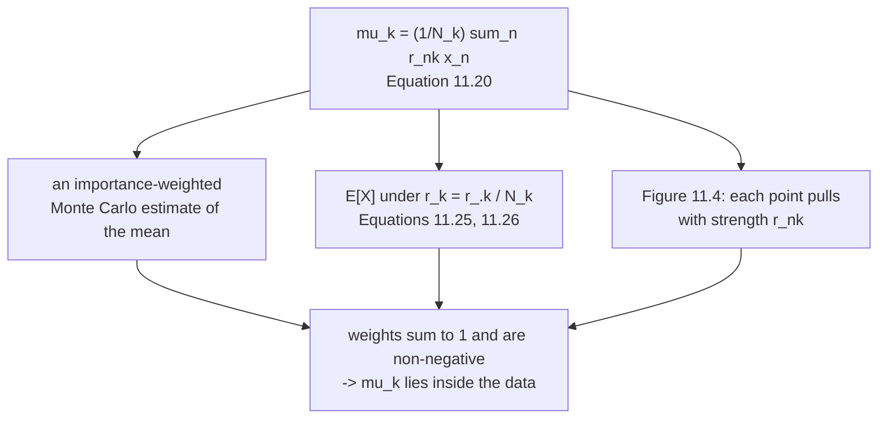

import DataCampExercise from "../../../../components/DataCampExercise.astro";
import Figure from "../../../../components/Figure.astro";
import Quiz from "../../../../components/Quiz.astro";

With the responsibilities named, the first update falls out in half a page. §11.2.2 states it as a
theorem and then spends the rest of the section on what it *means* — an importance-weighted average,
an expectation, a picture of each data point tugging at each mean.

## What you'll learn

- **Theorem 11.1**, Equation 11.20, and Example 11.3 reproduced: $-4 \to -2.701230$, $0 \to -0.403411$, $8 \to 3.704287$, which round to the book's $-2.7$, $-0.4$ and $3.7$.
- Equation 11.23's algebra: the stationarity condition is $\sum_n r_{nk}\mathbf{x}_n = N_k\boldsymbol\mu_k^{\text{new}}$, checked to $1.8\times10^{-15}$.
- Equations 11.25–11.26, which say the update is literally an **expected value** — $\mathbf{r}_k$ is a probability vector over the data, verified to sum to $1$ exactly.
- Why the update can never run away: $\boldsymbol\mu_k^{\text{new}}$ is a convex combination of the data, so **one update lands every mean inside $[\min x, \max x]$** — the book's $\mu_3$ goes from $8$ to $3.704287$ — and where that stops being true, at $\mu_3 = 73.585070$, the component has died.
- **An invariant the book does not state:** $\sum_k N_k\boldsymbol\mu_k^{\text{new}} = \sum_n \mathbf{x}_n$ exactly, for **any** responsibilities. Measured over $2000$ arbitrary matrices, worst error $3.6\times10^{-15}$.
- What one mean update alone buys: log-likelihood $-28.325536 \to -16.004150$, a gain of $12.321385$ nats without touching a variance or a weight.
- And the remark that follows the theorem: the same update with four different sets of variances gives four different answers.

## Intuition: every mean is an average of the data, just not an equal one

The sample mean is $\frac{1}{N}\sum_n x_n$ — every point weighted $1/N$. Equation 11.20 is the same
formula with the weights changed: point $n$ gets weight $r_{nk}/N_k$ instead.

Everything else on this page follows from that single observation. The weights are non-negative and sum
to one, so the answer is a **convex combination**: it lives inside the data, it cannot run off to
infinity, and the arithmetic is a weighted average rather than anything more exotic. What makes the
problem hard is not the formula — it is that the weights depend on the answer.

## §11.2.2 Theorem 11.1

> **Theorem 11.1 (Update of the GMM Means).** The update of the mean parameters
> $\boldsymbol\mu_k$ of the GMM is given by
>
> $$
> \boldsymbol\mu_k^{\text{new}} = \frac{\sum_{n=1}^{N} r_{nk}\mathbf{x}_n}{\sum_{n=1}^{N} r_{nk}}
> \qquad \text{(11.20)}
> $$

The proof takes the derivative of Equation 11.21b through the chain rule, arrives at

$$
\frac{\partial L}{\partial\boldsymbol\mu_k} = \sum_{n=1}^{N} r_{nk}(\mathbf{x}_n-\boldsymbol\mu_k)^\top\boldsymbol\Sigma_k^{-1}
\qquad \text{(11.22c)}
$$

and sets it to $\mathbf{0}^\top$. Because $\boldsymbol\Sigma_k^{-1}$ is invertible it drops out entirely,
leaving

$$
\sum_{n=1}^{N} r_{nk}\mathbf{x}_n = \sum_{n=1}^{N} r_{nk}\boldsymbol\mu_k^{\text{new}} = N_k\boldsymbol\mu_k^{\text{new}}
\qquad \text{(11.23)}
$$

Checked on the book's initialisation:

| | $k=1$ | $k=2$ | $k=3$ |
| --- | --- | --- | --- |
| $\sum_n r_{nk}x_n$ | $-5.555699$ | $-0.810470$ | $10.866169$ |
| $N_k\mu_k^{\text{new}}$ | $-5.555699$ | $-0.810470$ | $10.866169$ |

with a largest gap of $1.8\times10^{-15}$, and

| $k$ | $\mu_k$ before | $\mu_k$ after | the book | $N_k$ |
| --- | --- | --- | --- | --- |
| $1$ | $-4$ | $\mathbf{-2.701230}$ | $-2.7$ | $2.057228$ |
| $2$ | $0$ | $\mathbf{-0.403411}$ | $-0.4$ | $2.009008$ |
| $3$ | $8$ | $\mathbf{3.704287}$ | $3.7$ | $2.933763$ |

<Figure
  src="/images/mml/updating-the-means/pulled-towards-the-data"
  alt="Top, three horizontal tracks, one per component; on each, arrows of varying thickness run from the seven data points to a filled circle, with a grey square marking where the mean was. Bottom, two density plots side by side: before the update the three humps sit away from the data ticks, after it they sit on them."
  title="Figure 11.4 and Figure 11.5, on the book's own numbers"
  caption="Arrow thickness is the responsibility. The third component starts at 8 with no data anywhere near it, yet its responsibilities for the points at 2, 4 and 5 are 0.934, 1.000 and 1.000 — so it is pulled to 3.704287 in a single step. Nothing but the means changed between the two lower panels."
/>

## The same formula, said three ways

**As an expectation.** Define $\mathbf{r}_k := [r_{1k},\ldots,r_{Nk}]^\top / N_k$ (Equation 11.25).
Then $\boldsymbol\mu_k \leftarrow \mathbb{E}_{\mathbf{r}_k}[\mathcal{X}]$ (Equation 11.26). Measured:
each column of $\mathbf{r}_k$ sums to exactly $1$, every entry is non-negative, and
$\sum_n r_{nk}x_n$ under those weights reproduces Equation 11.20 to $8.9\times10^{-16}$.

**As importance weighting.** *"An importance-weighted Monte Carlo estimate of the mean, where the
importance weights of data point $\mathbf{x}_n$ are the responsibilities $r_{nk}$."*

**As a picture.** *"The mean $\boldsymbol\mu_k$ is pulled toward a data point $\mathbf{x}_n$ with
strength given by $r_{nk}$."*

<Figure
  src="/images/mml/updating-the-means/always-inside-the-hull"
  alt="Left, a shaded horizontal band covering the data's range, with an S-shaped curve that leaves the diagonal and flattens inside the band at both ends, and a marked point at eight. Right, three groups of bars showing each component's weights over the seven data points."
  title="Start anywhere on the line; land inside the data"
  caption="The left panel runs the same single update with the third mean initialised anywhere from -30 to +30. Wherever it starts, one application of Equation 11.20 puts it inside the shaded band, because the update is an average of the data with non-negative weights summing to one. Past about 73.6 the component's total responsibility underflows to zero and the update stops being defined at all. The right panel is those weights."
/>

:::tip[A convex combination cannot escape — as long as the component is alive]
Because $r_{nk}/N_k \geq 0$ and $\sum_n r_{nk}/N_k = 1$:

$$
\min_n x_n \ \leq\ \mu_k^{\text{new}} \ \leq\ \max_n x_n \qquad\text{whenever } N_k > 0
$$

Measured over $4000$ starting values for $\mu_3$ spread across $[-40, 55]$: **zero excursions outside
$[-3, 5]$**, worst deviation $0.0$. A mean outside the data's range means the responsibilities are
wrong, not the update.

The proviso is not decoration. Push $\mu_3$ far enough away and *every* $r_{n3}$ underflows to exactly
zero, so $N_3 = 0$ and Equation 11.20 is $0/0$:

| $\mu_3$ before | $N_3$ | $\mu_3$ after |
| --- | --- | --- |
| $8$ | $2.934\times10^{0}$ | $3.704287$ |
| $30$ | $1.292\times10^{-28}$ | $5.000000$ |
| $60$ | $2.475\times10^{-202}$ | $5.000000$ |
| $\mathbf{80}$ | $\mathbf{0}$ | $\mathbf{\text{undefined}}$ |

Bisected, $N_3$ reaches exactly zero at $\mu_3 = 73.585070$ on the right and $-69.812512$ on the left.
**That is component death** — the standard failure of EM in practice, and it is a genuine division by
zero rather than a rounding problem: page 1103's log-space form does not rescue it, because the quantity
really is $0/0$. Implementations guard it by re-seeding the component or flooring $N_k$.

It is also the reason a badly initialised GMM recovers so fast in the first iteration and so slowly
afterwards — the first step is a jump into the data, and page 1102 measured exactly that: $4.295713$
on round one, then $0.130775$, then $0.018414$.
:::

## An invariant the book does not state

Swap the order of summation in $\sum_k N_k\boldsymbol\mu_k^{\text{new}}$:

$$
\sum_{k}N_k\boldsymbol\mu_k^{\text{new}} = \sum_k\sum_n r_{nk}\mathbf{x}_n = \sum_n\mathbf{x}_n\underbrace{\sum_k r_{nk}}_{=\,1} = \sum_n \mathbf{x}_n
$$

So after **any** mean update, $\frac{1}{N}\sum_k N_k\boldsymbol\mu_k = \bar{\mathbf{x}}$, whatever the
responsibilities were:

| | value |
| --- | --- |
| $\sum_k N_k\mu_k^{\text{new}}$ | $4.500000000000$ |
| $\sum_n x_n$ | $4.500000000000$ |
| $\frac{1}{N}\sum_k N_k\mu_k$ | $0.642857142857$ |
| the sample mean $\bar{x}$ | $0.642857142857$ |

<Figure
  src="/images/mml/updating-the-means/pinned-to-the-sample-mean"
  alt="Left, a log-scale histogram of two thousand values, all between 1e-17 and 4e-15. Right, four groups of three bars, visibly different between groups, with a dashed horizontal line marking 0.6429."
  title="It holds for responsibilities that came from nowhere at all"
  caption="The left panel replaces the responsibilities with 2,000 random Dirichlet draws — matrices with no connection to the data or the model — and the identity still holds to 3.6e-15 every time. It is not a property of the fit; it follows only from each row summing to one."
/>

:::note[Why this is worth knowing]
It says the mixture's **overall** mean is pinned to the sample mean after every M-step, so the model can
never drift off the data as a whole. Only the *distribution of mass among components* moves.

And it is a strong implementation check, because it holds for arbitrary responsibility matrices —
measured over $2000$ random Dirichlet draws, worst deviation $3.6\times10^{-15}$. If your code violates
it, the bug is in the responsibilities' normalisation, not anywhere downstream.

Page 1105 will show the matching statement for the second moment is **not** so simple, which is exactly
where the law of total variance from page 1101 comes back.
:::

## What one update alone is worth

Freezing the variances and weights at the book's initialisation and iterating only Equation 11.20:

| round | log-likelihood | change | $\boldsymbol\mu$ |
| --- | --- | --- | --- |
| $0$ | $-28.325536$ | | $-4,\ 0,\ 8$ |
| $1$ | $-16.004150$ | $\mathbf{+12.321385}$ | $-2.7012,\ -0.4034,\ 3.7043$ |
| $2$ | $-15.965308$ | $+0.038842$ | $-2.5705,\ -0.4539,\ 3.6003$ |
| $3$ | $-15.964766$ | $+0.000541$ | $-2.5520,\ -0.4550,\ 3.5891$ |
| $4$ | $-15.964732$ | $+0.000034$ | $-2.5476,\ -0.4541,\ 3.5881$ |
| $12$ | $-15.964728$ | $+0.000000$ | $-2.5455,\ -0.4534,\ 3.5882$ |

Most negative single step over twelve rounds: $+0.0$ — **the mean update alone never decreases the
log-likelihood**, which is the special case of §11.3's guarantee. Note also where it stops:
$-15.964728$, well short of the full algorithm's $-13.973323$. The means alone cannot get there; the
variances have to move too.

## And the update still depends on everything

The remark right after Theorem 11.1: *"the update of the means $\boldsymbol\mu_k$ [...] depends on all
means, covariance matrices $\boldsymbol\Sigma_k$, and mixture weights $\pi_k$ via $r_{nk}$. Therefore, we
cannot obtain a closed-form solution for all $\boldsymbol\mu_k$ at once."*

Same data, same starting means, same weights — only the variances differ:

| variances | $\boldsymbol\mu^{\text{new}}$ |
| --- | --- |
| the book's $[1, 0.2, 3]$ | $-2.7012,\ -0.4034,\ 3.7043$ |
| all $1.0$ | $-2.7462,\ 0.7371,\ 4.6666$ |
| all $0.05$ | $-2.7500,\ 0.8571,\ 4.6667$ |
| all $25.0$ | $-0.6145,\ 0.4968,\ 2.8566$ |

The last row is the instructive one: with huge variances every component is nearly equally responsible
for everything, so all three means collapse toward the sample mean $0.642857$. **The variances decide
how sharply the data is divided, and the means only then decide where the pieces sit.**

<Quiz
  title="Is the mean update clear?"
  questions={[
    {
      q: "In Equation 11.22c the inverse covariance appears. Why does it not appear in Equation 11.20?",
      options: [
        "It is approximated away",
        "Setting the gradient to zero lets an invertible matrix be cancelled from both sides",
        "It is assumed to be the identity",
        "It cancels only when the variances are equal",
      ],
      answer: 1,
      explain:
        "The stationarity condition becomes the sum of r times x equalling N_k times mu, with the inverse covariance multiplying both sides. That is why the mean update is a plain weighted average and carries no covariance in it — checked to 1.8e-15.",
    },
    {
      q: "Why can a mean never leave the range of the data after one update?",
      options: [
        "It can, if the initialisation is bad enough",
        "The weights r_nk / N_k are non-negative and sum to one, so the update is a convex combination of the data",
        "Because the responsibilities are capped",
        "Because the log-likelihood increases",
      ],
      answer: 1,
      explain:
        "Measured: the book's third mean starts at 8 with no data beyond 5 and lands at 3.704287 in one step, and over four thousand starting values in [-40, 55] there are zero excursions outside [-3, 5]. The proviso is that N_k must be positive: past 73.585070 every responsibility underflows to zero and the update becomes 0/0.",
    },
    {
      q: "What is the N_k-weighted average of the updated means?",
      options: [
        "It depends on the responsibilities",
        "Exactly the sample mean, for any responsibility matrix whatsoever",
        "Zero",
        "The largest component's mean",
      ],
      answer: 1,
      explain:
        "Swap the order of summation and the inner sum over k is one, leaving the sum of the data. Measured over 2,000 random Dirichlet matrices with no connection to the data, worst deviation 3.6e-15. So the mixture's overall mean is pinned to the data's after every M-step.",
    },
    {
      q: "Iterating only the mean update, with variances and weights frozen, does what?",
      options: [
        "Decreases the log-likelihood",
        "Increases it monotonically — plus 12.321385 on the first step — but stops at minus 15.964728, short of the full algorithm's minus 13.973323",
        "Diverges",
        "Reaches the same answer as the full algorithm",
      ],
      answer: 1,
      explain:
        "Most negative single step over twelve rounds: exactly zero. The means alone cannot reach the full optimum because the variances are what decide how sharply the data is divided — and with the variances fixed, the responsibilities can only move so far.",
    },
  ]}
/>

## Exercises

### Exercise 1 – Reproduce Example 11.3

<DataCampExercise
  lang="python"
  hint={`Equation 11.20 is a responsibility-weighted average of the data: sum of r times x, over the column sum of r.`}
  code={`import numpy as np

X = np.array([-3.0, -2.5, -1.0, 0.0, 2.0, 4.0, 5.0])
MU = np.array([-4.0, 0.0, 8.0])
VAR = np.array([1.0, 0.2, 3.0])
PI = np.ones(3)/3

def gauss(x, mu, var):
    return np.exp(-0.5*(x - mu)**2/var)/np.sqrt(2*np.pi*var)

W = PI[None, :]*gauss(X[:, None], MU[None, :], VAR[None, :])
R = W/W.sum(1, keepdims=True)
Nk = R.sum(0)

# Task: Theorem 11.1, Equation 11.20.
mu_new = ___

book = np.array([-2.7, -0.4, 3.7])
for k in range(3):
    print(f"mu_{k+1}: {MU[k]:>5.1f} -> {mu_new[k]:>10.6f}   "
          f"the book: {book[k]:>5.1f}   N_k = {Nk[k]:.6f}")
print(f"rounded to one decimal : {np.round(mu_new, 1)}")
print(f"Equation 11.23 check   : "
      f"{np.abs((R*X[:, None]).sum(0) - Nk*mu_new).max():.3e}")

# -- Expected output ------------------------------
# mu_1:  -4.0 ->  -2.701230   the book:  -2.7   N_k = 2.057228
# mu_2:   0.0 ->  -0.403411   the book:  -0.4   N_k = 2.009008
# mu_3:   8.0 ->   3.704287   the book:   3.7   N_k = 2.933763
# rounded to one decimal : [-2.7 -0.4  3.7]
# Equation 11.23 check   : 0.000e+00
# -------------------------------------------------`}
  solution={`import numpy as np
X = np.array([-3.0, -2.5, -1.0, 0.0, 2.0, 4.0, 5.0])
MU = np.array([-4.0, 0.0, 8.0])
VAR = np.array([1.0, 0.2, 3.0])
PI = np.ones(3)/3
def gauss(x, mu, var):
    return np.exp(-0.5*(x - mu)**2/var)/np.sqrt(2*np.pi*var)
W = PI[None, :]*gauss(X[:, None], MU[None, :], VAR[None, :])
R = W/W.sum(1, keepdims=True)
Nk = R.sum(0)
mu_new = (R*X[:, None]).sum(0)/Nk
book = np.array([-2.7, -0.4, 3.7])
for k in range(3):
    print(f"mu_{k+1}: {MU[k]:>5.1f} -> {mu_new[k]:>10.6f}   "
          f"the book: {book[k]:>5.1f}   N_k = {Nk[k]:.6f}")
print(f"rounded to one decimal : {np.round(mu_new, 1)}")
print(f"Equation 11.23 check   : "
      f"{np.abs((R*X[:, None]).sum(0) - Nk*mu_new).max():.3e}")`}
  sct={`test_output_contains("rounded to one decimal : [-2.7 -0.4  3.7]")
test_output_contains("mu_3:   8.0 ->   3.704287")
success_msg("Three numbers from the book, reproduced to six decimals. The third mean travels 4.3 units in one step, because its responsibilities for the points at 2, 4 and 5 are already 0.934, 1.000 and 1.000.")`}
  height={360}
/>

### Exercise 2 – A mean cannot leave the data

<DataCampExercise
  lang="python"
  hint={`Try initialising the third mean somewhere absurd and apply the update once.`}
  code={`import numpy as np
from scipy.special import logsumexp

X = np.array([-3.0, -2.5, -1.0, 0.0, 2.0, 4.0, 5.0])
VAR = np.array([1.0, 0.2, 3.0])
PI = np.ones(3)/3

def resp(mu):
    """Page 1103's log-space form, so nothing underflows."""
    lw = (np.log(PI)[None, :]
          - 0.5*(X[:, None] - mu[None, :])**2/VAR[None, :]
          - 0.5*np.log(2*np.pi*VAR[None, :]))
    return np.exp(lw - logsumexp(lw, axis=1, keepdims=True))

print(f"the data lives in [{X.min()}, {X.max()}]")
for start in (8.0, 20.0, 30.0, 60.0, 80.0):
    R = resp(np.array([-4.0, 0.0, start]))
    N3 = float(R[:, 2].sum())
    # Task: Equation 11.20 for the third component -- when it is defined.
    mu3 = ___ if N3 > 0 else float("nan")
    print(f"mu_3 starts at {start:>5.1f}: N_3 = {N3:>10.3e}, "
          f"lands at {mu3:>10.6f}, inside? "
          f"{bool(X.min() <= mu3 <= X.max())}")

# -- Expected output ------------------------------
# the data lives in [-3.0, 5.0]
# mu_3 starts at   8.0: N_3 =  2.934e+00, lands at   3.704287, inside? True
# mu_3 starts at  20.0: N_3 =  9.206e-01, lands at   4.999985, inside? True
# mu_3 starts at  30.0: N_3 =  1.292e-28, lands at   5.000000, inside? True
# mu_3 starts at  60.0: N_3 = 2.475e-202, lands at   5.000000, inside? True
# mu_3 starts at  80.0: N_3 =  0.000e+00, lands at        nan, inside? False
# -------------------------------------------------`}
  solution={`import numpy as np
from scipy.special import logsumexp
X = np.array([-3.0, -2.5, -1.0, 0.0, 2.0, 4.0, 5.0])
VAR = np.array([1.0, 0.2, 3.0])
PI = np.ones(3)/3
def resp(mu):
    lw = (np.log(PI)[None, :]
          - 0.5*(X[:, None] - mu[None, :])**2/VAR[None, :]
          - 0.5*np.log(2*np.pi*VAR[None, :]))
    return np.exp(lw - logsumexp(lw, axis=1, keepdims=True))
print(f"the data lives in [{X.min()}, {X.max()}]")
for start in (8.0, 20.0, 30.0, 60.0, 80.0):
    R = resp(np.array([-4.0, 0.0, start]))
    N3 = float(R[:, 2].sum())
    mu3 = float((R[:, 2]*X).sum()/N3) if N3 > 0 else float("nan")
    print(f"mu_3 starts at {start:>5.1f}: N_3 = {N3:>10.3e}, "
          f"lands at {mu3:>10.6f}, inside? "
          f"{bool(X.min() <= mu3 <= X.max())}")`}
  sct={`test_output_contains("mu_3 starts at  60.0: N_3 = 2.475e-202, lands at   5.000000, inside? True")
test_output_contains("mu_3 starts at  80.0: N_3 =  0.000e+00, lands at        nan, inside? False")
success_msg("From 60 it lands exactly on 5, the largest data point, because by then that point's responsibility is the only one left. At 80 the component's TOTAL responsibility underflows to zero and Equation 11.20 becomes 0/0 — the component is dead, and no update rule revives it.")`}
  height={350}
/>

### Exercise 3 – The update is an expectation

<DataCampExercise
  lang="python"
  hint={`Equation 11.25 normalises each column of the responsibility matrix by its own sum.`}
  code={`import numpy as np

X = np.array([-3.0, -2.5, -1.0, 0.0, 2.0, 4.0, 5.0])
MU = np.array([-4.0, 0.0, 8.0])
VAR = np.array([1.0, 0.2, 3.0])
PI = np.ones(3)/3

def gauss(x, mu, var):
    return np.exp(-0.5*(x - mu)**2/var)/np.sqrt(2*np.pi*var)

W = PI[None, :]*gauss(X[:, None], MU[None, :], VAR[None, :])
R = W/W.sum(1, keepdims=True)
Nk = R.sum(0)
mu_new = (R*X[:, None]).sum(0)/Nk

# Task: Equation 11.25's probability vectors r_k.
rk = ___

print(f"each column sums to : {np.round(rk.sum(0), 12)}")
print(f"all entries >= 0    : {bool((rk >= 0).all())}")
print(f"E_rk[X]             : {np.round((rk*X[:, None]).sum(0), 8)}")
print(f"Equation 11.20      : {np.round(mu_new, 8)}")
print(f"gap                 : "
      f"{np.abs((rk*X[:, None]).sum(0) - mu_new).max():.3e}")

# -- Expected output ------------------------------
# each column sums to : [1. 1. 1.]
# all entries >= 0    : True
# E_rk[X]             : [-2.70123001 -0.40341072  3.70428735]
# Equation 11.20      : [-2.70123001 -0.40341072  3.70428735]
# gap                 : 8.882e-16
# -------------------------------------------------`}
  solution={`import numpy as np
X = np.array([-3.0, -2.5, -1.0, 0.0, 2.0, 4.0, 5.0])
MU = np.array([-4.0, 0.0, 8.0])
VAR = np.array([1.0, 0.2, 3.0])
PI = np.ones(3)/3
def gauss(x, mu, var):
    return np.exp(-0.5*(x - mu)**2/var)/np.sqrt(2*np.pi*var)
W = PI[None, :]*gauss(X[:, None], MU[None, :], VAR[None, :])
R = W/W.sum(1, keepdims=True)
Nk = R.sum(0)
mu_new = (R*X[:, None]).sum(0)/Nk
rk = R/Nk[None, :]
print(f"each column sums to : {np.round(rk.sum(0), 12)}")
print(f"all entries >= 0    : {bool((rk >= 0).all())}")
print(f"E_rk[X]             : {np.round((rk*X[:, None]).sum(0), 8)}")
print(f"Equation 11.20      : {np.round(mu_new, 8)}")
print(f"gap                 : "
      f"{np.abs((rk*X[:, None]).sum(0) - mu_new).max():.3e}")`}
  sct={`test_output_contains("each column sums to : [1. 1. 1.]")
test_output_contains("gap                 : 8.882e-16")
success_msg("Equation 11.26 is exact, not a figure of speech: the update is the expected value of the data under a genuine probability distribution, one per component, built from the responsibilities.")`}
  height={350}
/>

### Exercise 4 – The invariant, on responsibilities from nowhere

<DataCampExercise
  lang="python"
  hint={`The identity follows only from each ROW of the responsibility matrix summing to one — nothing else.`}
  code={`import numpy as np

X = np.array([-3.0, -2.5, -1.0, 0.0, 2.0, 4.0, 5.0])
N = len(X)
rng = np.random.default_rng(0)

worst = 0.0
for trial in range(2000):
    R = rng.dirichlet(np.ones(3), N)     # rows sum to 1 and nothing else
    Nk = R.sum(0)
    mu = (R*X[:, None]).sum(0)/Nk
    # Task: the quantity that should equal the sum of the data.
    lhs = ___
    worst = max(worst, abs(lhs - float(X.sum())))

print(f"sum of the data         : {float(X.sum()):.12f}")
print(f"sample mean             : {X.mean():.12f}")
print(f"worst deviation, 2000 random responsibility matrices : {worst:.3e}")

# -- Expected output ------------------------------
# sum of the data         : 4.500000000000
# sample mean             : 0.642857142857
# worst deviation, 2000 random responsibility matrices : 3.553e-15
# -------------------------------------------------`}
  solution={`import numpy as np
X = np.array([-3.0, -2.5, -1.0, 0.0, 2.0, 4.0, 5.0])
N = len(X)
rng = np.random.default_rng(0)
worst = 0.0
for trial in range(2000):
    R = rng.dirichlet(np.ones(3), N)
    Nk = R.sum(0)
    mu = (R*X[:, None]).sum(0)/Nk
    lhs = float((Nk*mu).sum())
    worst = max(worst, abs(lhs - float(X.sum())))
print(f"sum of the data         : {float(X.sum()):.12f}")
print(f"sample mean             : {X.mean():.12f}")
print(f"worst deviation, 2000 random responsibility matrices : {worst:.3e}")`}
  sct={`test_output_contains("worst deviation, 2000 random responsibility matrices : 3.553e-15")
test_output_contains("sample mean             : 0.642857142857")
success_msg("The responsibilities here have nothing to do with the data or the model, and the identity still holds to machine precision. It follows only from the rows summing to one — which makes it a sharp check on any implementation.")`}
  height={330}
/>

### Exercise 5 – The same update, four different answers

<DataCampExercise
  lang="python"
  hint={`Only the variances change. Everything else — data, starting means, weights — is held fixed.`}
  code={`import numpy as np

X = np.array([-3.0, -2.5, -1.0, 0.0, 2.0, 4.0, 5.0])
MU = np.array([-4.0, 0.0, 8.0])
PI = np.ones(3)/3

def gauss(x, mu, var):
    return np.exp(-0.5*(x - mu)**2/var)/np.sqrt(2*np.pi*var)

for name, var in (("the book's [1, 0.2, 3]", np.array([1.0, 0.2, 3.0])),
                  ("all 1.0               ", np.ones(3)),
                  ("all 0.05              ", np.full(3, 0.05)),
                  ("all 25.0              ", np.full(3, 25.0))):
    W = PI[None, :]*gauss(X[:, None], MU[None, :], var[None, :])
    R = W/W.sum(1, keepdims=True)
    # Task: the mean update, for this choice of variances.
    mu_new = ___
    print(f"{name}: {np.round(mu_new, 4)}")
print(f"the sample mean is {X.mean():.6f}")

# -- Expected output ------------------------------
# the book's [1, 0.2, 3]: [-2.7012 -0.4034  3.7043]
# all 1.0               : [-2.7462  0.7371  4.6666]
# all 0.05              : [-2.75    0.8571  4.6667]
# all 25.0              : [-0.6145  0.4968  2.8566]
# the sample mean is 0.642857
# -------------------------------------------------`}
  solution={`import numpy as np
X = np.array([-3.0, -2.5, -1.0, 0.0, 2.0, 4.0, 5.0])
MU = np.array([-4.0, 0.0, 8.0])
PI = np.ones(3)/3
def gauss(x, mu, var):
    return np.exp(-0.5*(x - mu)**2/var)/np.sqrt(2*np.pi*var)
for name, var in (("the book's [1, 0.2, 3]", np.array([1.0, 0.2, 3.0])),
                  ("all 1.0               ", np.ones(3)),
                  ("all 0.05              ", np.full(3, 0.05)),
                  ("all 25.0              ", np.full(3, 25.0))):
    W = PI[None, :]*gauss(X[:, None], MU[None, :], var[None, :])
    R = W/W.sum(1, keepdims=True)
    mu_new = (R*X[:, None]).sum(0)/R.sum(0)
    print(f"{name}: {np.round(mu_new, 4)}")
print(f"the sample mean is {X.mean():.6f}")`}
  sct={`test_output_contains("all 25.0              : [-0.6145  0.4968  2.8566]")
test_output_contains("the book's [1, 0.2, 3]: [-2.7012 -0.4034  3.7043]")
success_msg("The last row is the telling one: with huge variances every component is nearly equally responsible for every point, so all three means collapse toward the sample mean. The variances decide how sharply the data is divided; the means only then decide where the pieces sit.")`}
  height={350}
/>

## Recall card

- **Theorem 11.1: each mean becomes a responsibility-weighted average of the data**, divided by that component's total responsibility.
- **The inverse covariance in the gradient cancels**, because setting an expression times an invertible matrix to zero removes the matrix. That is why the update carries no covariance.
- **Example 11.3 reproduced exactly:** minus 4 to minus 2.701230, 0 to minus 0.403411, and 8 to 3.704287.
- **The update is literally an expectation**, Equation 11.26, under a probability vector over the data built by normalising a column of responsibilities.
- **So every new mean is a convex combination of the data and cannot leave its range** while its total responsibility is positive. Measured over four thousand starting values, zero excursions.
- **Which makes it a sanity check:** a mean outside the data means the responsibilities are wrong, not the update.
- **Push a mean far enough away and its total responsibility underflows to exactly zero** — at 73.585070 here — and the update becomes zero over zero. That is component death, and log-space arithmetic does not rescue it.
- **An invariant the book does not state:** the N_k-weighted sum of the new means is the sum of the data, exactly, for any responsibility matrix at all.
- **Verified over two thousand random Dirichlet matrices**, worst deviation 3.6e-15. It follows only from each row summing to one.
- **So the mixture's overall mean is pinned to the sample mean after every M-step**, and only the distribution of mass among components can move.
- **One mean update alone is worth 12.321385 nats** on the book's example, and iterating it never decreases the likelihood.
- **But it stalls at minus 15.964728**, short of the full algorithm's minus 13.973323 — the variances have to move too.
- **And the update depends on every other parameter:** four sets of variances give four different answers from the same start, collapsing toward the sample mean when the variances are large.

**Next:** **[Updating the Covariances](../updating-the-covariances/)** — §11.2.3, where the same
argument runs again and the law of total variance from page 1101 comes back.
