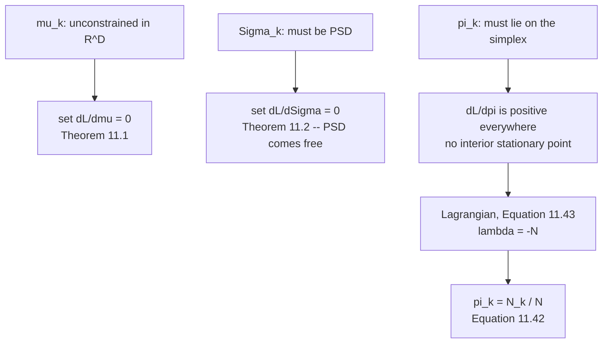

import DataCampExercise from "../../../../components/DataCampExercise.astro";
import Figure from "../../../../components/Figure.astro";
import Quiz from "../../../../components/Quiz.astro";

Two updates down, one to go — and this one is different. The means and covariances were unconstrained,
so setting a derivative to zero was enough. The weights have to stay on a simplex, so §11.2.4 is the
only place in the chapter that reaches for Chapter 7.

## What you'll learn

- **Theorem 11.3**, Equation 11.42, and Example 11.5 reproduced: $\tfrac13 \to 0.293890,\ 0.287001,\ 0.419109$, which round to the book's $0.29$, $0.29$ and $0.42$.
- The Lagrangian of Equations 11.43–11.48, and $\lambda$ solved from each component separately: **exactly $-7 = -N$**, all three agreeing to $0.0$.
- Why the constraint is not a formality: the gradient of $L$ in $\boldsymbol\pi$ is **strictly positive in every coordinate**, so unconstrained ascent sends every weight to infinity.
- Why no projection onto the simplex is ever needed afterwards: measured over $50{,}000$ random responsibility matrices, the weights sum to $1$ to $2.2\times10^{-16}$ and **none** ever leaves $[0,1]$.
- What this update alone is worth: $+0.137132$ nats, the smallest of the three.
- The complete cycle, matching the book's own figures: negative log-likelihood $\mathbf{28.325536 \to 14.410485}$, printed as $28.3 \to 14.4$.
- And the one structural thing that separates this update from the other two: **it never looks at $\mathbf{x}$**.

## Intuition: counting, not averaging

The first two updates asked *where* and *how wide*. This one asks *how much*, and the answer is the one
you would write down without any calculus: the share of the data each component ended up owning.

$N_k$ is that share — page 1103's effective count. Divide by $N$ and you have a proportion. The
Lagrange multiplier's entire job is to confirm that the obvious answer is also the optimal one, and the
multiplier it produces, $-N$, is exactly the normalising constant you would have divided by anyway.

## §11.2.4 Theorem 11.3

> **Theorem 11.3 (Update of the GMM Mixture Weights).** The mixture weights of the GMM are updated as
>
> $$
> \pi_k^{\text{new}} = \frac{N_k}{N}, \qquad k = 1,\ldots,K
> \qquad \text{(11.42)}
> $$

The proof accounts for $\sum_k\pi_k = 1$ with a Lagrange multiplier:

$$
\mathfrak{L} = L + \lambda\left(\sum_{k=1}^{K}\pi_k - 1\right)
\qquad \text{(11.43a)}
$$

$$
\frac{\partial\mathfrak{L}}{\partial\pi_k} = \frac{1}{\pi_k}\underbrace{\sum_{n=1}^{N}\frac{\pi_k\mathcal{N}(\mathbf{x}_n\mid\boldsymbol\mu_k,\boldsymbol\Sigma_k)}{\sum_j\pi_j\mathcal{N}(\mathbf{x}_n\mid\boldsymbol\mu_j,\boldsymbol\Sigma_j)}}_{=\,N_k} + \lambda = \frac{N_k}{\pi_k} + \lambda
\qquad \text{(11.44b)}
$$

Setting both partials to zero gives $\pi_k = -N_k/\lambda$ and $\sum_k\pi_k = 1$, so
$-\sum_k N_k/\lambda = 1$, and since $\sum_k N_k = N$:

$$
\lambda = -N \qquad \text{(11.48)}
$$

Measured, solving $\lambda = -N_k/\pi_k$ from each component independently:

| | $\lambda$ |
| --- | --- |
| from $k=1$ | $-7.000000000000$ |
| from $k=2$ | $-7.000000000000$ |
| from $k=3$ | $-7.000000000000$ |
| $-N$ | $-7$ |

with a largest deviation of $0.0$, and Equation 11.44b's stationarity condition $N_k/\pi_k + \lambda$
equal to $+0.0$ in every component.

| $k$ | $\pi_k$ before | $\pi_k$ after | the book | $N_k$ |
| --- | --- | --- | --- | --- |
| $1$ | $0.333333$ | $\mathbf{0.293890}$ | $0.29$ | $2.057228$ |
| $2$ | $0.333333$ | $\mathbf{0.287001}$ | $0.29$ | $2.009008$ |
| $3$ | $0.333333$ | $\mathbf{0.419109}$ | $0.42$ | $2.933763$ |

summing to $1.000000000000000$.

## The constraint is doing real work

It is tempting to treat $\sum_k\pi_k = 1$ as bookkeeping — enforce it at the end and move on. It cannot
be done that way, because **there is no unconstrained optimum to enforce it on**. From Equation 11.44a,

$$
\frac{\partial L}{\partial\pi_k} = \sum_{n=1}^{N}\frac{\mathcal{N}(\mathbf{x}_n\mid\boldsymbol\mu_k,\boldsymbol\Sigma_k)}{\sum_j\pi_j\mathcal{N}(\mathbf{x}_n\mid\boldsymbol\mu_j,\boldsymbol\Sigma_j)} > 0
$$

— a sum of positive terms, in **every** coordinate. Plain gradient ascent:

| step | $\boldsymbol\pi$ | $\sum_k\pi_k$ |
| --- | --- | --- |
| $0$ | $0.3333,\ 0.3333,\ 0.3333$ | $1.000000$ |
| $1$ | $0.4531,\ 0.4535,\ 0.5134$ | $1.420000$ |
| $2$ | $0.5411,\ 0.5418,\ 0.6304$ | $1.713336$ |
| $6$ | $0.7925,\ 0.7936,\ 0.9508$ | $2.536943$ |

<Figure
  src="/images/mml/updating-the-mixture-weights/the-constraint-does-the-work"
  alt="Left, a red curve climbing steadily away from a flat dashed blue line at one. Right, three identical bars all reaching minus seven, against a dashed line at the same level."
  title="Without the constraint there is nothing to find; with it, the answer is a count"
  caption="Every unnormalised weight makes the likelihood larger, so the unconstrained problem has no maximum — the left panel simply climbs. On the right, lambda solved separately from each of the three components gives minus seven every time, which is minus N."
/>

:::note[The multiplier is the normaliser]
$\lambda = -N$ is not a coincidence of this dataset. The stationarity condition is
$\pi_k = -N_k/\lambda$, so $\lambda$ is whatever makes the $N_k$ sum to one after division — and
$\sum_k N_k = N$ by page 1103's column-sum identity. **The Lagrange multiplier turns out to be the
normalising constant.**

That is the cleanest possible outcome of a constrained optimisation: the constraint does not distort the
answer, it only rescales it. Contrast page 1002's Lagrangian, where the multiplier came out as an
*eigenvalue* and carried real information.
:::

## And afterwards, the constraint never needs enforcing again

Because $\pi_k = N_k/N$ with $N_k \geq 0$ and $\sum_k N_k = N$:

| $50{,}000$ random responsibility matrices, $K = 4$ | value |
| --- | --- |
| worst $\lvert\sum_k\pi_k - 1\rvert$ | $2.2\times10^{-16}$ |
| weights falling outside $[0,1]$ | $\mathbf{0}$ |

No clipping, no renormalisation, no projection. This is the same kind of structural guarantee page 1105
found for positive semi-definiteness — **the update produces a valid object because of what it is, not
because anything checks it afterwards.**

## One complete cycle

Applying all three updates in §11.3's order, one at a time:

| after | negative log-likelihood | gained |
| --- | --- | --- |
| the initialisation | $28.325536$ | |
| $+$ means (§11.2.2) | $16.004150$ | $12.321385$ |
| $+$ variances (§11.2.3) | $14.547617$ | $1.456533$ |
| $+$ weights (§11.2.4) | $\mathbf{14.410485}$ | $0.137132$ |

<Figure
  src="/images/mml/updating-the-mixture-weights/one-cycle-complete"
  alt="Top, four density plots: the first has three humps well away from the data ticks, and each subsequent one sits more tightly over them. Bottom, a descending line from 28.325536 to 14.410485 with the drop at each step labelled."
  title="The book's 28.3 and 14.4, and the two steps in between"
  caption="The means do most of the work — 12.321385 of the 13.915051 nats gained — because the initialisation put them furthest from the data. The weights do the least, 0.137132, because with three roughly equal clusters there was not much to reallocate."
/>

:::tip[The order of the gains is not an accident of this example]
The means moved the likelihood by $12.32$ nats, the variances by $1.46$, the weights by $0.14$ — a
hundred-fold spread.

That ordering reflects how badly each parameter was initialised, not any intrinsic importance. The book
chose $\mu = (-4, 0, 8)$ with data in $[-3, 5]$, so the means had the furthest to travel. Page 1104
measured the same thing from the other side: the first mean update moves by $4.295713$ and the second by
$0.130775$.

What *is* general: **the weights can only ever reallocate mass between components that already exist**,
so their update is bounded by how unequal the clusters are. With $K$ balanced clusters the weight update
does almost nothing at all.
:::

## The only update that never sees the data

$\boldsymbol\mu_k$ and $\boldsymbol\Sigma_k$ are averages *of* $\mathbf{x}$. $\pi_k$ is a count. Holding
the responsibility matrix fixed and permuting the data values:

| data | $\boldsymbol\pi$ |
| --- | --- |
| $-2.5,\ 2,\ -1,\ 0,\ 5,\ 4,\ -3$ | $0.293890,\ 0.287001,\ 0.419109$ |
| $-3,\ -2.5,\ 0,\ 5,\ 2,\ -1,\ 4$ | $0.293890,\ 0.287001,\ 0.419109$ |
| the original | $0.293890,\ 0.287001,\ 0.419109$ |

Identical, because Equation 11.42 reads only the column sums of $\mathbf{r}$. The data enters the weight
update **only** through the responsibilities — which is exactly the structure §11.4.5 will formalise as
the E-step supplying sufficient statistics to the M-step.

<Quiz
  title="Is the weight update clear?"
  questions={[
    {
      q: "Why does Section 11.2.4 need a Lagrange multiplier when Sections 11.2.2 and 11.2.3 do not?",
      options: [
        "Because the weights are scalars",
        "Because the log-likelihood's gradient in pi is strictly positive in every coordinate, so there is no unconstrained stationary point to find",
        "Because the weights can be negative",
        "To make the derivation shorter",
      ],
      answer: 1,
      explain:
        "Measured: plain gradient ascent takes the weights from summing to 1 to summing to 2.54 in six steps and keeps climbing. The means and covariances have genuine interior optima; the weights only have one once the simplex constraint is imposed.",
    },
    {
      q: "What does the Lagrange multiplier come out to be?",
      options: [
        "An eigenvalue, as in Section 10.2",
        "Exactly minus N — it is the normalising constant, because the N_k already sum to N",
        "Zero",
        "It depends on the data",
      ],
      answer: 1,
      explain:
        "Solved independently from each of the three components it gives minus 7.000000000000 every time, to a deviation of 0.0. Contrast Section 10.2's Lagrangian, where the multiplier was an eigenvalue and carried real information; here the constraint only rescales.",
    },
    {
      q: "After the update, how are the weights kept on the simplex?",
      options: [
        "By clipping them to [0, 1]",
        "Nothing is needed — N_k over N is automatically non-negative and sums to one, because the responsibilities' rows sum to one",
        "By renormalising at the end of each iteration",
        "By a projection step",
      ],
      answer: 1,
      explain:
        "Measured over 50,000 random responsibility matrices with K = 4: the weights sum to 1 to 2.2e-16 and not one falls outside [0, 1]. The same kind of structural guarantee page 1105 found for positive semi-definiteness.",
    },
    {
      q: "What is structurally different about the weight update compared to the other two?",
      options: [
        "Nothing",
        "It never looks at the data values — only at the column sums of the responsibility matrix",
        "It is not derived from the likelihood",
        "It requires the covariances",
      ],
      answer: 1,
      explain:
        "Permuting the data while holding the responsibilities fixed leaves the weights identical to six decimals. The means and covariances are averages of x; the weight is a count. Section 11.4.5 formalises this as the E-step passing sufficient statistics to the M-step.",
    },
  ]}
/>

## Exercises

### Exercise 1 – Reproduce Example 11.5, and solve for lambda

<DataCampExercise
  lang="python"
  hint={`Theorem 11.3 divides each component's total responsibility by the number of data points.`}
  code={`import numpy as np

X = np.array([-3.0, -2.5, -1.0, 0.0, 2.0, 4.0, 5.0])
N = len(X)
MU = np.array([-4.0, 0.0, 8.0])
VAR = np.array([1.0, 0.2, 3.0])
PI = np.ones(3)/3

def gauss(x, mu, var):
    return np.exp(-0.5*(x - mu)**2/var)/np.sqrt(2*np.pi*var)

W = PI[None, :]*gauss(X[:, None], MU[None, :], VAR[None, :])
R = W/W.sum(1, keepdims=True)
Nk = R.sum(0)

# Task: Theorem 11.3, Equation 11.42.
pi_new = ___

for k in range(3):
    print(f"pi_{k+1}: 1/3 -> {pi_new[k]:.6f}   the book: "
          f"{[0.29, 0.29, 0.42][k]:.2f}   N_k = {Nk[k]:.6f}")
print(f"rounded : {np.round(pi_new, 2)}")
print(f"they sum to : {pi_new.sum():.15f}")
for k in range(3):
    print(f"lambda from component {k+1} : {-Nk[k]/pi_new[k]:.12f}")
print(f"minus N : {-N}")

# -- Expected output ------------------------------
# pi_1: 1/3 -> 0.293890   the book: 0.29   N_k = 2.057228
# pi_2: 1/3 -> 0.287001   the book: 0.29   N_k = 2.009008
# pi_3: 1/3 -> 0.419109   the book: 0.42   N_k = 2.933763
# rounded : [0.29 0.29 0.42]
# they sum to : 1.000000000000000
# lambda from component 1 : -7.000000000000
# lambda from component 2 : -7.000000000000
# lambda from component 3 : -7.000000000000
# minus N : -7
# -------------------------------------------------`}
  solution={`import numpy as np
X = np.array([-3.0, -2.5, -1.0, 0.0, 2.0, 4.0, 5.0])
N = len(X)
MU = np.array([-4.0, 0.0, 8.0])
VAR = np.array([1.0, 0.2, 3.0])
PI = np.ones(3)/3
def gauss(x, mu, var):
    return np.exp(-0.5*(x - mu)**2/var)/np.sqrt(2*np.pi*var)
W = PI[None, :]*gauss(X[:, None], MU[None, :], VAR[None, :])
R = W/W.sum(1, keepdims=True)
Nk = R.sum(0)
pi_new = Nk/N
for k in range(3):
    print(f"pi_{k+1}: 1/3 -> {pi_new[k]:.6f}   the book: "
          f"{[0.29, 0.29, 0.42][k]:.2f}   N_k = {Nk[k]:.6f}")
print(f"rounded : {np.round(pi_new, 2)}")
print(f"they sum to : {pi_new.sum():.15f}")
for k in range(3):
    print(f"lambda from component {k+1} : {-Nk[k]/pi_new[k]:.12f}")
print(f"minus N : {-N}")`}
  sct={`test_output_contains("rounded : [0.29 0.29 0.42]")
test_output_contains("lambda from component 3 : -7.000000000000")
success_msg("Three independent components, one multiplier, and it is minus N every time. The constraint did not distort the answer — it only supplied the normaliser you would have divided by anyway.")`}
  height={370}
/>

### Exercise 2 – Try it without the constraint

<DataCampExercise
  lang="python"
  hint={`Equation 11.44a's gradient is a sum over data points of the component density over the whole mixture density.`}
  code={`import numpy as np

X = np.array([-3.0, -2.5, -1.0, 0.0, 2.0, 4.0, 5.0])
MU = np.array([-2.70123, -0.403411, 3.704287])
VAR = np.array([0.144, 0.438492, 1.526594])

def gauss(x, mu, var):
    return np.exp(-0.5*(x - mu)**2/var)/np.sqrt(2*np.pi*var)

pi = np.ones(3)/3
G = gauss(X[:, None], MU[None, :], VAR[None, :])
for it in range(7):
    W = pi[None, :]*G
    # Task: Equation 11.44a -- dL/dpi_k, with no multiplier.
    grad = ___
    if it in (0, 1, 2, 4, 6):
        print(f"step {it}: pi = {np.round(pi, 4)}, sum = {pi.sum():.6f}, "
              f"all gradients positive? {bool((grad > 0).all())}")
    pi = pi + 0.02*grad

# -- Expected output ------------------------------
# step 0: pi = [0.3333 0.3333 0.3333], sum = 1.000000, all gradients positive? True
# step 1: pi = [0.4531 0.4535 0.5134], sum = 1.420000, all gradients positive? True
# step 2: pi = [0.5411 0.5418 0.6304], sum = 1.713336, all gradients positive? True
# step 4: pi = [0.6798 0.6807 0.8084], sum = 2.168929, all gradients positive? True
# step 6: pi = [0.7925 0.7936 0.9508], sum = 2.536943, all gradients positive? True
# -------------------------------------------------`}
  solution={`import numpy as np
X = np.array([-3.0, -2.5, -1.0, 0.0, 2.0, 4.0, 5.0])
MU = np.array([-2.70123, -0.403411, 3.704287])
VAR = np.array([0.144, 0.438492, 1.526594])
def gauss(x, mu, var):
    return np.exp(-0.5*(x - mu)**2/var)/np.sqrt(2*np.pi*var)
pi = np.ones(3)/3
G = gauss(X[:, None], MU[None, :], VAR[None, :])
for it in range(7):
    W = pi[None, :]*G
    grad = (G/W.sum(1, keepdims=True)).sum(0)
    if it in (0, 1, 2, 4, 6):
        print(f"step {it}: pi = {np.round(pi, 4)}, sum = {pi.sum():.6f}, "
              f"all gradients positive? {bool((grad > 0).all())}")
    pi = pi + 0.02*grad`}
  sct={`test_output_contains("step 6: pi = [0.7925 0.7936 0.9508], sum = 2.536943")
test_output_contains("all gradients positive? True")
success_msg("Every component wants to be bigger, always, because a larger weight raises the density at every data point. There is no interior maximum to find — which is why this is the only one of the three updates that needs Chapter 7.")`}
  height={340}
/>

### Exercise 3 – The simplex takes care of itself

<DataCampExercise
  lang="python"
  hint={`The weights come from column sums of a matrix whose rows sum to one — so their total is fixed before you divide.`}
  code={`import numpy as np

N = 7
rng = np.random.default_rng(0)
worst, outside = 0.0, 0
for _ in range(50000):
    R = rng.dirichlet(np.ones(4), N)
    # Task: Equation 11.42's weights, from this responsibility matrix.
    pi = ___
    worst = max(worst, abs(float(pi.sum()) - 1.0))
    outside += int(((pi < 0) | (pi > 1)).sum())

print(f"50,000 random responsibility matrices with K = 4")
print(f"  worst |sum pi - 1|     : {worst:.3e}")
print(f"  weights outside [0, 1] : {outside}")

# -- Expected output ------------------------------
# 50,000 random responsibility matrices with K = 4
#   worst |sum pi - 1|     : 2.220e-16
#   weights outside [0, 1] : 0
# -------------------------------------------------`}
  solution={`import numpy as np
N = 7
rng = np.random.default_rng(0)
worst, outside = 0.0, 0
for _ in range(50000):
    R = rng.dirichlet(np.ones(4), N)
    pi = R.sum(0)/N
    worst = max(worst, abs(float(pi.sum()) - 1.0))
    outside += int(((pi < 0) | (pi > 1)).sum())
print(f"50,000 random responsibility matrices with K = 4")
print(f"  worst |sum pi - 1|     : {worst:.3e}")
print(f"  weights outside [0, 1] : {outside}")`}
  sct={`test_output_contains("worst |sum pi - 1|     : 2.220e-16")
test_output_contains("weights outside [0, 1] : 0")
success_msg("Two hundred thousand weights and not one needs correcting. The simplex constraint is satisfied by the shape of the update, exactly as positive semi-definiteness was on page 1105.")`}
  height={320}
/>

### Exercise 4 – The complete cycle, and the book's two numbers

<DataCampExercise
  lang="python"
  hint={`Apply the three updates in Section 11.3's order, evaluating the log-likelihood after each.`}
  code={`import numpy as np

X = np.array([-3.0, -2.5, -1.0, 0.0, 2.0, 4.0, 5.0])
N = len(X)
PI = np.ones(3)/3
MU = np.array([-4.0, 0.0, 8.0])
VAR = np.array([1.0, 0.2, 3.0])

def gauss(x, mu, var):
    return np.exp(-0.5*(x - mu)**2/var)/np.sqrt(2*np.pi*var)

def negll(pi, mu, var):
    W = pi[None, :]*gauss(X[:, None], mu[None, :], var[None, :])
    return -float(np.log(W.sum(1)).sum())

W = PI[None, :]*gauss(X[:, None], MU[None, :], VAR[None, :])
R = W/W.sum(1, keepdims=True)
Nk = R.sum(0)
mu1 = (R*X[:, None]).sum(0)/Nk
var1 = (R*(X[:, None] - mu1[None, :])**2).sum(0)/Nk
# Task: the third update.
pi1 = ___

stages = [("initialisation", PI, MU, VAR),
          ("+ means       ", PI, mu1, VAR),
          ("+ variances   ", PI, mu1, var1),
          ("+ weights     ", pi1, mu1, var1)]
prev = None
for name, p_, m_, v_ in stages:
    cur = negll(p_, m_, v_)
    gain = "" if prev is None else f"   gained {prev-cur:.6f}"
    print(f"{name}: -L = {cur:.6f}{gain}")
    prev = cur
print("the book prints 28.3 at the start and 14.4 at the end")

# -- Expected output ------------------------------
# initialisation: -L = 28.325536
# + means       : -L = 16.004150   gained 12.321385
# + variances   : -L = 14.547617   gained 1.456533
# + weights     : -L = 14.410485   gained 0.137132
# the book prints 28.3 at the start and 14.4 at the end
# -------------------------------------------------`}
  solution={`import numpy as np
X = np.array([-3.0, -2.5, -1.0, 0.0, 2.0, 4.0, 5.0])
N = len(X)
PI = np.ones(3)/3
MU = np.array([-4.0, 0.0, 8.0])
VAR = np.array([1.0, 0.2, 3.0])
def gauss(x, mu, var):
    return np.exp(-0.5*(x - mu)**2/var)/np.sqrt(2*np.pi*var)
def negll(pi, mu, var):
    W = pi[None, :]*gauss(X[:, None], mu[None, :], var[None, :])
    return -float(np.log(W.sum(1)).sum())
W = PI[None, :]*gauss(X[:, None], MU[None, :], VAR[None, :])
R = W/W.sum(1, keepdims=True)
Nk = R.sum(0)
mu1 = (R*X[:, None]).sum(0)/Nk
var1 = (R*(X[:, None] - mu1[None, :])**2).sum(0)/Nk
pi1 = Nk/N
stages = [("initialisation", PI, MU, VAR),
          ("+ means       ", PI, mu1, VAR),
          ("+ variances   ", PI, mu1, var1),
          ("+ weights     ", pi1, mu1, var1)]
prev = None
for name, p_, m_, v_ in stages:
    cur = negll(p_, m_, v_)
    gain = "" if prev is None else f"   gained {prev-cur:.6f}"
    print(f"{name}: -L = {cur:.6f}{gain}")
    prev = cur
print("the book prints 28.3 at the start and 14.4 at the end")`}
  sct={`test_output_contains("initialisation: -L = 28.325536")
test_output_contains("+ weights     : -L = 14.410485   gained 0.137132")
success_msg("28.325536 and 14.410485 — the book's 28.3 and 14.4, from seven data points. The means supply 12.32 of the 13.92 nats gained, because that is where the initialisation was worst.")`}
  height={380}
/>

### Exercise 5 – The weights never see the data

<DataCampExercise
  lang="python"
  hint={`Equation 11.42 reads only the column sums of the responsibility matrix.`}
  code={`import numpy as np

X = np.array([-3.0, -2.5, -1.0, 0.0, 2.0, 4.0, 5.0])
N = len(X)
MU = np.array([-4.0, 0.0, 8.0])
VAR = np.array([1.0, 0.2, 3.0])
PI = np.ones(3)/3

def gauss(x, mu, var):
    return np.exp(-0.5*(x - mu)**2/var)/np.sqrt(2*np.pi*var)

W = PI[None, :]*gauss(X[:, None], MU[None, :], VAR[None, :])
R = W/W.sum(1, keepdims=True)

rng = np.random.default_rng(5)
for trial in range(3):
    Xs = rng.permutation(X)
    # Task: the weights, from the SAME responsibilities and permuted data.
    pi = ___
    mu = (R*Xs[:, None]).sum(0)/R.sum(0)
    print(f"x = {np.round(Xs, 1)}")
    print(f"   pi = {np.round(pi, 6)}   mu = {np.round(mu, 4)}")
print(f"original pi = {np.round(R.sum(0)/N, 6)}")

# -- Expected output ------------------------------
# x = [-2.5  2.  -1.   0.   5.   4.  -3. ]
#    pi = [0.29389  0.287001 0.419109]   mu = [-0.2708 -0.3045  1.9322]
# x = [-3.  -2.5  0.   5.   2.  -1.   4. ]
#    pi = [0.29389  0.287001 0.419109]   mu = [-2.6731  2.5543  1.6591]
# x = [ 5.  -1.   0.  -2.5 -3.   4.   2. ]
#    pi = [0.29389  0.287001 0.419109]   mu = [ 1.9442 -1.3431  1.0903]
# original pi = [0.29389  0.287001 0.419109]
# -------------------------------------------------`}
  solution={`import numpy as np
X = np.array([-3.0, -2.5, -1.0, 0.0, 2.0, 4.0, 5.0])
N = len(X)
MU = np.array([-4.0, 0.0, 8.0])
VAR = np.array([1.0, 0.2, 3.0])
PI = np.ones(3)/3
def gauss(x, mu, var):
    return np.exp(-0.5*(x - mu)**2/var)/np.sqrt(2*np.pi*var)
W = PI[None, :]*gauss(X[:, None], MU[None, :], VAR[None, :])
R = W/W.sum(1, keepdims=True)
rng = np.random.default_rng(5)
for trial in range(3):
    Xs = rng.permutation(X)
    pi = R.sum(0)/N
    mu = (R*Xs[:, None]).sum(0)/R.sum(0)
    print(f"x = {np.round(Xs, 1)}")
    print(f"   pi = {np.round(pi, 6)}   mu = {np.round(mu, 4)}")
print(f"original pi = {np.round(R.sum(0)/N, 6)}")`}
  sct={`test_output_contains("original pi = [0.29389  0.287001 0.419109]")
test_output_contains("pi = [0.29389  0.287001 0.419109]   mu = [-0.2708 -0.3045  1.9322]")
success_msg("The means move every time and the weights never do. That separation — the data entering only through the responsibilities — is what Section 11.4.5 formalises as the E-step handing sufficient statistics to the M-step.")`}
  height={360}
/>

## Recall card

- **Theorem 11.3: each weight becomes that component's share of the data**, its total responsibility divided by the number of points.
- **This is the only update in the chapter that needs a Lagrange multiplier**, because the weights must lie on a simplex and the other two parameters are unconstrained.
- **The constraint is not bookkeeping.** The log-likelihood's gradient in the weights is strictly positive in every coordinate, so unconstrained ascent has nothing to converge to — measured, the weights' sum reaches 2.54 in six steps and keeps climbing.
- **The multiplier comes out as exactly minus N**, solved independently from each component to a deviation of zero. It is the normalising constant, not new information.
- **Contrast Section 10.2's Lagrangian**, where the multiplier was an eigenvalue and told you the variance retained.
- **Afterwards the simplex looks after itself:** over fifty thousand random responsibility matrices the weights sum to one to 2.2e-16 and never leave the unit interval.
- **Example 11.5 reproduced:** a third becomes 0.293890, 0.287001 and 0.419109, rounding to the book's 0.29, 0.29 and 0.42.
- **The complete cycle takes the negative log-likelihood from 28.325536 to 14.410485**, which is the book's 28.3 and 14.4.
- **The means supply 12.32 of the 13.92 nats gained**, the variances 1.46, the weights 0.14 — an ordering that reflects how badly each was initialised.
- **But the weights can only ever reallocate mass between components that already exist**, so with balanced clusters their update does almost nothing whatever the initialisation.
- **And this is the only update that never reads the data values.** Permuting the data with the responsibilities held fixed leaves the weights identical and moves every mean.

**Next:** **[The EM Algorithm](../the-em-algorithm/)** — §11.3, which puts the three updates in a loop
and states the guarantee that makes the loop worth running.
