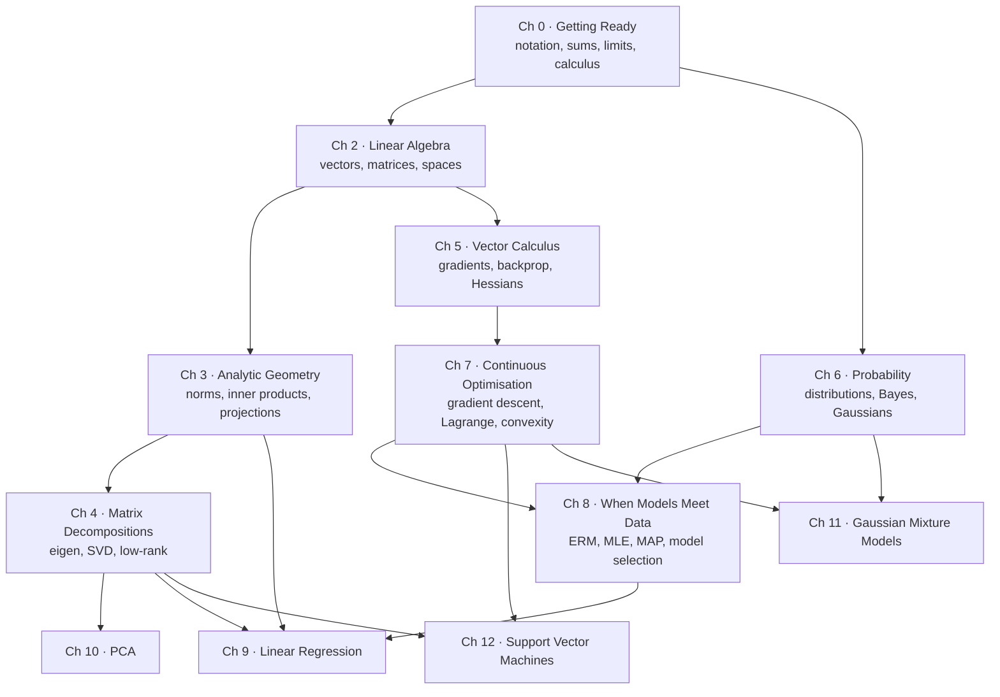

Every model you will ever train — a spam filter, a face detector, a recommender, a large language
model — is **mathematics running at scale**. Strip away the libraries and a model is a function with
knobs, and "learning" is the mathematics of turning data into good knob settings.

This module follows the open textbook **_Mathematics for Machine Learning_** (Deisenroth, Faisal &
Ong, Cambridge University Press, 2020) from its first page to its last, and adds a chapter in front
of it for readers whose calculus has gone rusty. The aim is narrow and specific: **you should never
have to leave this module to follow that book.**

## What every page gives you

- **Real mathematics**, typeset — vectors, matrices, sums, integrals, not backticked pseudo-code.
- **A worked example by hand** before any library is called, with the arithmetic shown and then
  checked against NumPy.
- **Interactive visualisations** — p5 sketches you can drag, and step-through labs where you can
  stop on the iteration you did not understand and step *backwards*.
- **Runnable NumPy**, with the printed output included. Every number these pages claim came from
  actually running the code.
- **A `From the book` box** citing the exact section, definition, theorem and equation numbers, so
  you can read the page with the PDF open beside it.
- **Pitfalls** — singular matrices, ill-conditioning, sign conventions, the traps that cost real
  debugging hours.
- **A quiz and five exercises**, easy to hard, before you move on.

## The shape of the subject

Read it as two halves, exactly as the book does. **Part I** (Chapters 2–7) is the mathematics.
**Part II** (Chapters 8–12) spends that mathematics on four algorithms, and the point of those four
is not that they are the most useful models in 2026 — it is that each one can be derived completely,
from a probabilistic assumption to a closed form or an optimiser, using only Part I.

## Three ways through

Pick one. They all end in the same place.

| path | for | order |
| --- | --- | --- |
| **Bottom-up** | you want the foundations solid before touching a model | Ch 0 → 1 → 2 → 3 → 4 → 5 → 6 → 7 → 8 → 9 → 10 → 11 → 12 |
| **Top-down** | you already fit models and want to know why they work | Ch 8 → 9, then back for whatever the derivation used → 10 → 11 → 12 |
| **Just the gradients** | you are here for deep learning | Ch 0 → 2 → 5 → 7, then Ch 6 for the loss functions |

If you have not done calculus in a while, start at **Chapter 0**. It is not filler; it is the
notation table, the Σ manipulation, the chain rule and the complex numbers that Chapters 4 and 5
assume you have.

## Part I — Mathematical foundations

### Chapter 0 · Getting Ready

Everything the book assumes you already know, in one place.

| page | the big idea |
| --- | --- |
| Getting Ready Overview | a self-test that tells you which of the pages below you can skip |
| Notation and Symbols | the book's notation table, rendered and searchable |
| Sums, Products, and Set Notation | Σ and Π index gymnastics — the skill that makes every later derivation readable |
| Functions, Limits, and Continuity | domain, image, injective/surjective, and why ReLU is continuous but not differentiable |
| Single-Variable Calculus Refresher | the derivative rules derived, not just listed, plus integration and the FTC |
| Complex Numbers in One Page | needed the moment a rotation matrix has no real eigenvalues |
| NumPy for Mathematics | `@` vs `*`, broadcasting, `np.linalg`, and why `==` is the wrong way to compare floats |

### Chapter 1 · Introduction and Motivation

| page | the big idea |
| --- | --- |
| Introduction and Motivation Overview | why a book about mathematics is the fastest route into machine learning |
| Finding Words for Intuitions | "model", "learning" and "algorithm" each mean two or three different things — sorting that out first saves confusion later |
| Two Ways to Read This Book | bottom-up versus top-down, and the dependency graph of everything that follows |

### Chapter 2 · Linear Algebra

Data is stored, moved and transformed as vectors and matrices. This is the chapter everything else
stands on.

| # | page | the big idea |
| --- | --- | --- |
| 2.1 | [Systems of Linear Equations](../chapter-02---linear-algebra/systems-of-linear-equations/) | when can we solve `Ax = b`, and how many answers exist? |
| 2.2 | [Matrices](../chapter-02---linear-algebra/matrices/) | the grid that stores data *and* transforms it |
| 2.3 | [Solving Systems of Linear Equations](../chapter-02---linear-algebra/solving-systems-of-linear-equations/) | Gaussian elimination, pivot by pivot |
| 2.4 | [Vector Spaces](../chapter-02---linear-algebra/vector-spaces/) | the container every vector lives in, and why every axiom earns its place |
| 2.5 | [Linear Independence](../chapter-02---linear-algebra/linear-independence/) | when is a vector redundant? |
| 2.6 | [Basis and Rank](../chapter-02---linear-algebra/basis-and-rank/) | the minimal set that builds everything — and how much information a matrix really carries |
| 2.7 | [Linear Mappings](../chapter-02---linear-algebra/linear-mappings/) | functions that are secretly matrices |
| 2.8 | [Affine Spaces](../chapter-02---linear-algebra/affine-spaces/) | lines and planes that miss the origin — and where the bias term comes from |

### Chapter 3 · Analytic Geometry

Length, angle and distance, built on top of Chapter 2. This is where "similarity" stops being a
metaphor.

| # | page | the big idea |
| --- | --- | --- |
| 3.1 | [Norms](../chapter-03---analytic-geometry/norms/) | how long is a vector, and why there is more than one ruler |
| 3.2 | [Inner Products](../chapter-03---analytic-geometry/inner-products/) | the generalised dot product that unlocks all the geometry |
| 3.3 | [Lengths and Distances](../chapter-03---analytic-geometry/lengths-and-distances/) | length and distance fall out of an inner product |
| 3.4 | [Angles and Orthogonality](../chapter-03---analytic-geometry/angles-and-orthogonality/) | cosine similarity and right angles |
| 3.5 | [Orthonormal Basis](../chapter-03---analytic-geometry/orthonormal-basis/) | the nicest coordinate system there is |
| 3.6 | [Orthogonal Complement](../chapter-03---analytic-geometry/orthogonal-complement/) | everything perpendicular to a subspace |
| 3.7 | [Inner Product of Functions](../chapter-03---analytic-geometry/inner-product-of-functions/) | orthogonality for functions, which is where Fourier comes from |
| 3.8 | [Orthogonal Projections](../chapter-03---analytic-geometry/orthogonal-projections/) | the closest point in a subspace — the engine under PCA and least squares |
| 3.9 | [Rotations](../chapter-03---analytic-geometry/rotations/) | transformations that move data without distorting it |

### Chapter 4 · Matrix Decompositions

Factor a matrix and its behaviour becomes readable.

| # | page | the big idea |
| --- | --- | --- |
| 4.1 | [Determinant and Trace](../chapter-04---matrix-decompositions/determinant-and-trace/) | two numbers that summarise a matrix: signed volume, and the diagonal sum |
| 4.2 | [Eigenvalues and Eigenvectors](../chapter-04---matrix-decompositions/eigenvalues-and-eigenvectors/) | the directions a matrix only stretches |
| 4.3 | [Cholesky Decomposition](../chapter-04---matrix-decompositions/cholesky-decomposition/) | a square root for covariance matrices — and how to sample correlated noise |
| 4.4 | [Eigendecomposition and Diagonalization](../chapter-04---matrix-decompositions/eigendecomposition-and-diagonalization/) | `A = PDP⁻¹`, the matrix in its own eigenbasis |
| 4.5 | [Singular Value Decomposition](../chapter-04---matrix-decompositions/singular-value-decomposition/) | `A = UΣVᵀ`, which works for *any* matrix |
| 4.6 | [Matrix Approximation](../chapter-04---matrix-decompositions/matrix-approximation/) | the best low-rank fit — compression, and the heart of PCA |
| 4.7 | [Matrix Phylogeny](../chapter-04---matrix-decompositions/matrix-phylogeny/) | the family tree of every matrix type |

### Chapter 5 · Vector Calculus

How models learn: the calculus of many variables at once.

| # | page | the big idea |
| --- | --- | --- |
| 5.1 | [Differentiation of Univariate Functions](../chapter-05---vector-calculus/differentiation-of-univariate-functions/) | the derivative as a slope; the chain rule; Taylor series |
| 5.2 | [Partial Differentiation and Gradients](../chapter-05---vector-calculus/partial-differentiation-and-gradients/) | the gradient — steepest ascent, which is what descent follows backwards |
| 5.3 | [Gradients of Vector-Valued Functions](../chapter-05---vector-calculus/gradients-of-vector-valued-functions/) | the Jacobian, and its determinant as a volume factor |
| 5.4 | [Gradients of Matrices](../chapter-05---vector-calculus/gradients-of-matrices/) | tensor derivatives and the shape bookkeeping that trips everyone |
| 5.5 | [Useful Identities for Computing Gradients](../chapter-05---vector-calculus/useful-identities-for-computing-gradients/) | the cheat sheet, plus numerical gradient checking |
| 5.6 | [Backpropagation and Automatic Differentiation](../chapter-05---vector-calculus/backpropagation-and-automatic-differentiation/) | how deep networks actually get their gradients |
| 5.7 | [Higher-Order Derivatives](../chapter-05---vector-calculus/higher-order-derivatives/) | the Hessian — curvature, and minima versus saddles |
| 5.8 | [Linearization and Multivariate Taylor Series](../chapter-05---vector-calculus/linearization-and-multivariate-taylor-series/) | approximating any function with polynomials |

### Chapter 6 · Probability and Distributions

Uncertainty, written down precisely.

| # | page | the big idea |
| --- | --- | --- |
| 6.1 | [Construction of a Probability Space](../chapter-06---probability-and-distributions/construction-of-a-probability-space/) | sample space, events, measure — and a random variable is a *function* |
| 6.2 | [Discrete and Continuous Probabilities](../chapter-06---probability-and-distributions/discrete-and-continuous-probabilities/) | pmf, pdf, cdf, and why a density value is not a probability |
| 6.3 | [Sum Rule, Product Rule, and Bayes Theorem](../chapter-06---probability-and-distributions/sum-rule-product-rule-and-bayes-theorem/) | the three rules that generate all of probabilistic modelling |
| 6.4 | [Summary Statistics and Independence](../chapter-06---probability-and-distributions/summary-statistics-and-independence/) | mean, variance, covariance — and why zero correlation is not independence |
| 6.5 | [Gaussian Distribution](../chapter-06---probability-and-distributions/gaussian-distribution/) | marginals, conditionals, products, sums: the distribution that stays itself |
| 6.6 | Conjugacy and the Exponential Family | why some priors make the posterior easy, and the family where that always happens |
| 6.7 | Change of Variables and Inverse Transform | pushing a distribution through a function, and how sampling actually works |

### Chapter 7 · Continuous Optimisation

Training *is* optimisation. This chapter is the machinery.

| # | page | the big idea |
| --- | --- | --- |
| 7.1 | Optimization Using Gradient Descent | step size, convergence, and why an ill-conditioned problem crawls |
| 7.1.1 | Momentum and Stochastic Gradient Descent | momentum as a low-pass filter; the noise-for-cost trade that makes SGD win |
| 7.2 | Constrained Optimization and Lagrange Multipliers | the Lagrangian, the dual problem, and what a multiplier means |
| 7.3 | Convex Sets and Convex Functions | the property that makes an optimiser trustworthy |
| 7.3.1 | Linear Programming | standard form, the dual, the feasible polytope |
| 7.3.2 | Quadratic Programming | the KKT conditions — and the exact shape of the SVM dual |
| 7.3.3 | Legendre-Fenchel Transform and Convex Conjugate | describing a convex function by its supporting hyperplanes |

## Part II — Central machine learning problems

Four algorithms, each derived end to end from Part I. Where the [Machine Learning](/courses/machine-learning/)
module shows you how to *fit* these models, these pages show you why the estimator is what it is.

### Chapter 8 · When Models Meet Data

| # | page | the big idea |
| --- | --- | --- |
| 8.1 | Data, Models, and Learning | a model as a function, or as a distribution — and the three phases of learning |
| 8.2 | Empirical Risk Minimization | hypothesis class, loss, regularisation, generalisation |
| 8.3 | Parameter Estimation: MLE and MAP | maximum likelihood, and why MAP *is* regularised MLE |
| 8.4 | Probabilistic Modeling and Inference | the marginal likelihood, the posterior predictive, and latent variables |
| 8.5 | Directed Graphical Models | plate notation, conditional independence, d-separation |
| 8.6 | Model Selection | nested cross-validation, Bayesian evidence, Occam's razor made quantitative |

### Chapter 9 · Linear Regression

| # | page | the big idea |
| --- | --- | --- |
| 9.1 | Problem Formulation | Gaussian noise, and how least squares stops being an assumption |
| 9.2 | Parameter Estimation | the normal equations, feature maps, and MAP as ridge |
| 9.2.3 | Overfitting and Model Selection in Regression | the degree sweep, and what the test error is really telling you |
| 9.3 | Bayesian Linear Regression | a distribution over fits, and error bars that widen away from the data |
| 9.4 | Maximum Likelihood as Orthogonal Projection | Chapter 3, re-read: regression is a projection |

### Chapter 10 · Principal Component Analysis

| # | page | the big idea |
| --- | --- | --- |
| 10.1 | Problem Setting | compression as a search for a subspace |
| 10.2 | Maximum Variance Perspective | keep the directions the data actually varies along |
| 10.3 | Projection Perspective | minimise what you throw away — and the proof that this is the same objective |
| 10.4 | Eigenvector Computation and Low-Rank Approximations | power iteration, and the SVD route |
| 10.5 | PCA in High Dimensions | what to do when there are more features than data points |
| 10.6 | Key Steps of PCA in Practice | centre, standardise, decompose, project, reconstruct |
| 10.7 | Latent Variable Perspective | probabilistic PCA, and the generative story behind it |

### Chapter 11 · Gaussian Mixture Models

| # | page | the big idea |
| --- | --- | --- |
| 11.1 | Gaussian Mixture Model | one Gaussian is not enough; a weighted sum of them is |
| 11.2 | Parameter Learning via Maximum Likelihood | the responsibilities, and the circular dependency they create |
| 11.3 | EM Algorithm | E-step, M-step, and why the likelihood can only go up |
| 11.4 | Latent-Variable Perspective | the ELBO, and the link back to probabilistic PCA |

### Chapter 12 · Support Vector Machines

| # | page | the big idea |
| --- | --- | --- |
| 12.1 | Separating Hyperplanes | the margin, and the scaling convention that makes it `1/‖w‖` |
| 12.2 | Primal Support Vector Machine | hinge loss, the soft margin, and `C` as the regularisation dial |
| 12.3 | Dual Support Vector Machine | KKT and complementary slackness — why only the support vectors matter |
| 12.4 | Kernels | the feature space you never have to build |
| 12.5 | Numerical Solution | it is the quadratic program from §7.3.2, solved |

## Revision

Every chapter closes with two reference pages, and the module has one drill deck.

- **Exercises and Solutions** — one page per chapter. For Chapters 2 to 7 these are the book's own
  end-of-chapter exercises, restated in this module's notation, with full solutions and a NumPy
  verification for each. For Chapters 8 to 12, which the book leaves without exercise sets, the
  problems are written in the same style.
- **Formula Sheets** — one per chapter. Pure reference: every result, a line on when you use it, and
  a link back to the page that derives it.
- **Recall Drill** — a spaced-repetition deck built automatically from every page's recall card, so a
  prompt can never drift from the page that taught it. Filterable by chapter.

## Prerequisites

- **High-school algebra** — rearranging equations, plotting a line.
- **A little Python** — enough to read a `for` loop and call a function.
- **NumPy** helps but is not required; every code block explains itself.

You do **not** need calculus to start. Chapter 0 covers what Chapter 5 will assume.

## How to read a page

Watch the visualisation first — it is the fastest route to intuition. Then read the derivation with
the book's numbered equations beside it. Then run the code. Then, before you move on, do the quiz
and the five exercises: the exercises are where the reading turns into knowledge.

Start with **[Getting Ready](../chapter-00---getting-ready/getting-ready-overview/)** if your
calculus is rusty, or straight into
**[Linear Algebra](../chapter-02---linear-algebra/linear-algebra-overview/)** if it is not.

## Self-check

<Quiz
  questions={[
  {
    "q": "The module's four central ML problems in Part II are built on Part I. Which list is right?",
    "options": [
      "Backprop, CNNs, RNNs, transformers",
      "Only regression",
      "Regression, dimensionality reduction (PCA), density estimation (GMM), classification (SVM)",
      "Regression, clustering, reinforcement, ranking"
    ],
    "answer": 2,
    "explain": "Chapters 9 to 12 are the four pillars, and Chapter 8 supplies the shared vocabulary."
  },
  {
    "q": "Why does each page show a hand-worked example before calling NumPy?",
    "options": [
      "So you can see the arithmetic yourself and then check it against the library",
      "Because NumPy is slow",
      "For length",
      "To avoid libraries"
    ],
    "answer": 0,
    "explain": "The aim is that you never need to leave the module to follow the book."
  },
  {
    "q": "Which best describes how to use the book-citation box on each page?",
    "options": [
      "Ignore it",
      "Read the page with the PDF open beside it, matched by section, theorem and equation number",
      "Use it to skip reading",
      "It only lists prerequisites"
    ],
    "answer": 1,
    "explain": "Citations tie each page back to the exact source numbering."
  }
]}
/>
