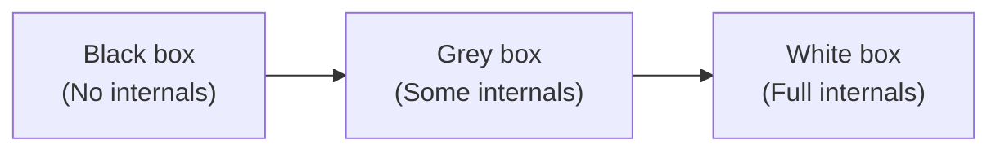

## Black box testing

You test the system by inputs/outputs without knowing internal code.

Examples:

- UI testing
- API testing
- acceptance tests

## White box testing

You test with knowledge of internal implementation.

Examples:

- unit tests
- branch/condition coverage
- code-level edge cases

## Grey box testing

You have partial knowledge of internals.

Examples:

- API tests with DB knowledge
- testing with logs/metrics

## Diagram



## When to use what

- Black box: verify user-visible behavior
- White box: verify correctness and edge cases
- Grey box: efficient end-to-end checks

## Seeing the difference in code

Take one function and look at it from both sides.

```python title="shipping.py" showLineNumbers{1}
def shipping_cost(weight_kg: float, express: bool) -> float:
    if weight_kg <= 0:
        raise ValueError("weight must be positive")
    base = 5.0 if weight_kg <= 2 else 5.0 + (weight_kg - 2) * 1.5
    return base * 2 if express else base
```

A **black box** tester reads the requirement ("up to 2 kg costs 5, each extra kg adds 1.50, express doubles the price") and picks inputs from it. They never open the file.

```python title="test_shipping_blackbox.py" showLineNumbers{1}
import pytest
from shipping import shipping_cost


def test_light_parcel_standard():
    assert shipping_cost(1, express=False) == 5.0


def test_heavy_parcel_express():
    assert shipping_cost(4, express=True) == 16.0


def test_zero_weight_rejected():
    with pytest.raises(ValueError):
        shipping_cost(0, express=False)
```

A **white box** tester reads the code and sees a branch at exactly `weight_kg <= 2`. They add a test at 2.0 and one just above it, because boundaries are where an `<=` gets typed as `<`. They also check that both sides of the `express` conditional run. That is the reasoning behind branch coverage.

## What each approach misses

- Black box tests can miss a branch the spec never mentioned, such as a hidden special case for one country code.
- White box tests can only confirm the code does what it says. If the requirement was misread, the tests pass and the feature is still wrong.

That is why teams combine them. Black box tests protect the promise made to users. White box tests protect the internals when you refactor.

## Where grey box fits

Grey box testing is common in API work. You call an endpoint like a client would (black box), then query the database directly to check that the row was written correctly (a little internal knowledge). The check is cheap, and it catches bugs a response body would hide, for example an API that returns `201` but never saved anything.

## How this connects

Unit tests are usually white box, acceptance tests are black box, and integration tests often land in between. The next lessons on verification, validation and test levels build on this split.

## Check your understanding

<Quiz
  questions={[
    {
      q: "An API test posts an order, then checks the orders table to confirm the row exists. What is this?",
      options: [
        "Black box, because it uses HTTP",
        "White box, because it reads source code",
        "Grey box, because it uses the public interface plus some knowledge of internals",
        "Regression testing",
      ],
      answer: 2,
      explain: "The request goes through the public interface, but querying the database uses knowledge of the internal design. That mix is grey box.",
    },
    {
      q: "A developer misreads the requirement and implements the wrong discount rule, then writes tests from the code. Which statement is true?",
      options: [
        "The white box tests will fail",
        "The white box tests will pass even though the feature is wrong",
        "Coverage will be low",
        "Black box tests cannot find this",
      ],
      answer: 1,
      explain: "Tests derived from the code confirm the code does what it does. Only a test derived from the requirement (black box) exposes the misreading.",
    },
    {
      q: "Which technique most directly targets an untested branch at a boundary such as weight <= 2?",
      options: [
        "White box branch and boundary testing",
        "Usability testing",
        "Exploratory UI testing",
        "Smoke testing",
      ],
      answer: 0,
      explain: "Seeing the branch in the code is what tells you to test exactly at and just above the boundary.",
    },
  ]}
/>
