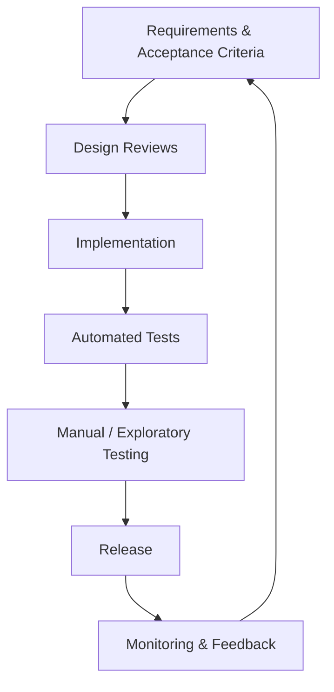

## What is Software Quality?

Quality means the product:

- works as intended (correctness)
- is easy to use (usability)
- performs well (performance)
- is secure (security)
- is reliable over time (stability)

## What is SQA?

**Software Quality Assurance (SQA)** is the set of activities that ensure quality is *planned, built, and verified*.

SQA is broader than “testing”. It includes:

- defining processes and standards
- reviews (requirements, design, code)
- test planning
- automation strategy
- continuous improvement

## QA vs QC (Quick distinction)

- **QA (Quality Assurance)**: *process-focused* — "Are we building the product the right way?"
- **QC (Quality Control)**: *product-focused* — "Does this product meet the requirements?"

Testing is mostly part of **QC**, but QA enables and improves testing.

## Where SQA fits in a team

- Developers: unit tests, code reviews, automation
- QA Engineers: test strategy, exploratory testing, automation suites
- Product/Design: acceptance criteria, usability
- DevOps: CI pipelines, quality gates

## Diagram: Quality as a lifecycle

## Key takeaway

Quality isn’t something you “add at the end”.

Quality is an engineering habit.
