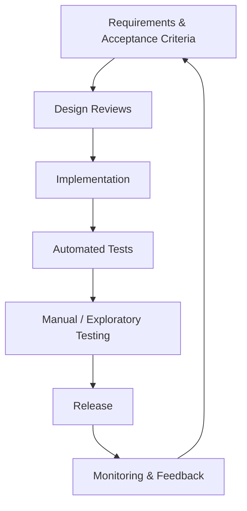

## What is Software Quality?

Quality means the product:

- works as intended (correctness)
- is easy to use (usability)
- performs well (performance)
- is secure (security)
- is reliable over time (stability)

## What is SQA?

**Software Quality Assurance (SQA)** is the set of activities that ensure quality is *planned, built, and verified*.

SQA is broader than “testing”. It includes:

- defining processes and standards
- reviews (requirements, design, code)
- test planning
- automation strategy
- continuous improvement

## QA vs QC (Quick distinction)

- **QA (Quality Assurance)**: *process-focused* — "Are we building the product the right way?"
- **QC (Quality Control)**: *product-focused* — "Does this product meet the requirements?"

Testing is mostly part of **QC**, but QA enables and improves testing.

## Where SQA fits in a team

- Developers: unit tests, code reviews, automation
- QA Engineers: test strategy, exploratory testing, automation suites
- Product/Design: acceptance criteria, usability
- DevOps: CI pipelines, quality gates

## Diagram: Quality as a lifecycle


```mermaid
graph TD
A[Requirements & Acceptance Criteria] --> B[Design Reviews]
B --> C[Implementation]
C --> D[Automated Tests]
D --> E[Manual / Exploratory Testing]
E --> F[Release]
F --> G[Monitoring & Feedback]
G --> A
```

## Key takeaway

Quality isn’t something you “add at the end”.

Quality is an engineering habit.

## Visualize it

The Software Testing Life Cycle (STLC) moves through six stages from understanding requirements to formally closing out testing.

```mermaid title="Software Testing Life Cycle" desc="The STLC flows from requirement analysis through to test closure."
flowchart LR
A["Requirement analysis"] --> B["Test planning"]
B --> C["Test case design"]
C --> D["Environment setup"]
D --> E["Test execution"]
E --> F["Test closure"]
```


## Check your understanding

<Quiz
  questions={[
    {
      q: "A team writes a coding standard, adds code review rules and sets up CI gates. Which term describes this work?",
      options: [
        "Quality control",
        "Quality assurance, because it improves the process that produces the software",
        "Regression testing",
        "UAT",
      ],
      answer: 1,
      explain: "QA is process-focused: it builds quality in. QC checks the finished product against requirements.",
    },
    {
      q: "Running the test suite and logging failures against a release candidate is mostly which activity?",
      options: [
        "QC (quality control)",
        "QA (quality assurance)",
        "Requirements gathering",
        "Deployment",
      ],
      answer: 0,
      explain: "Testing inspects the product, so it is mainly QC. QA works on the process that makes testing effective.",
    },
    {
      q: "Which is the strongest reason not to leave quality checks until the end of a project?",
      options: [
        "Testers are busy at the end",
        "Defects and ambiguity found late cost more to fix",
        "Automated tests do not run at the end",
        "Customers prefer early releases",
      ],
      answer: 1,
      explain: "Quality is an engineering habit spread across the lifecycle, because late discovery is expensive.",
    },
  ]}
/>
