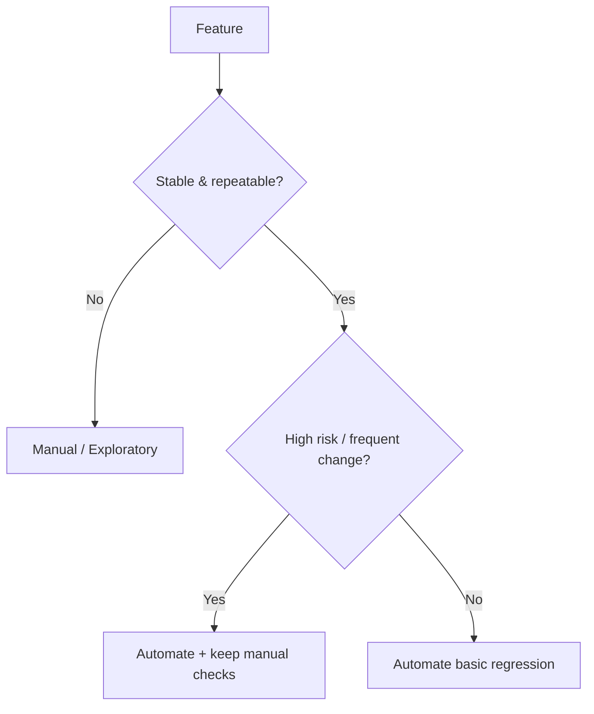

## Manual testing is best for

- exploratory testing (finding the unexpected)
- usability feedback
- rapid validation during early development
- scenarios hard to automate (visual/UI judgement)

## Automated testing is best for

- regression checks
- repeated workflows
- CI pipelines
- fast feedback for developers

## A simple decision framework

Ask:

1. Will we run this test many times?
2. Is the behavior stable enough to automate?
3. Is the test deterministic?
4. Is the automation cost worth it?

## Diagram: test strategy mix

## Key takeaway

Good teams combine both.

Automation does not replace thinking.
