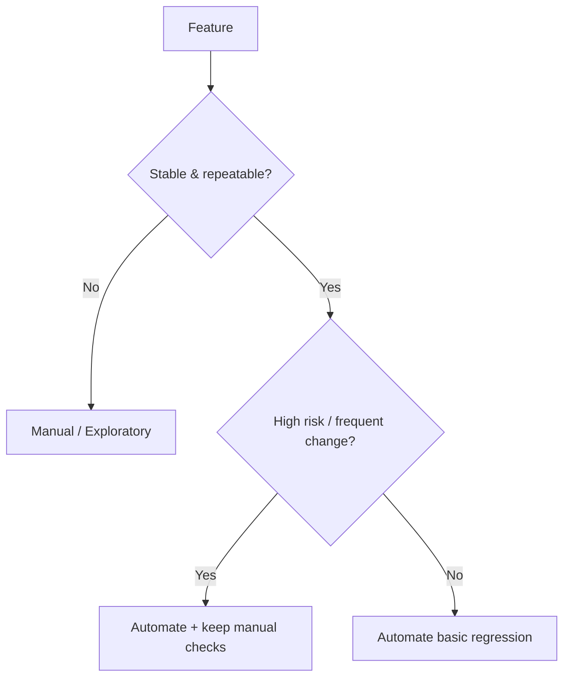

## Manual testing is best for

- exploratory testing (finding the unexpected)
- usability feedback
- rapid validation during early development
- scenarios hard to automate (visual/UI judgement)

## Automated testing is best for

- regression checks
- repeated workflows
- CI pipelines
- fast feedback for developers

## A simple decision framework

Ask:

1. Will we run this test many times?
2. Is the behavior stable enough to automate?
3. Is the test deterministic?
4. Is the automation cost worth it?

## Diagram: test strategy mix


```mermaid
graph TD
A[Feature] --> B{Stable & repeatable?}
B -- No --> C[Manual / Exploratory]
B -- Yes --> D{High risk / frequent change?}
D -- Yes --> E[Automate + keep manual checks]
D -- No --> F[Automate basic regression]
```

## Key takeaway

Good teams combine both.

Automation does not replace thinking.

## Why the choice matters

Automation is not free. A test has to be written, kept running and repaired whenever the feature changes. Manual testing is not free either, because a person repeats the same clicks on every release. The question is which cost is lower for a given check.

## A rough cost model

A manual run of a checkout flow takes about ten minutes. Writing an automated version might take two hours. If you release weekly, the automated test pays for itself after twelve runs, which is about three months. If the checkout page is redesigned every month, you keep rewriting the test and it may never pay off. That is why the first two questions in the framework are "how often will we run it" and "how stable is it".

## Example: automate the stable part

Pricing rules rarely change and are easy to check with code:

```python title="test_pricing.py" showLineNumbers{1}
import pytest

from pricing import final_price


@pytest.mark.parametrize(
    "subtotal, coupon, expected",
    [
        (100, None, 100),
        (100, "SAVE10", 90),
        (100, "EXPIRED", 100),
    ],
)
def test_final_price(subtotal, coupon, expected):
    assert final_price(subtotal, coupon) == expected
```

Whether the coupon field looks confusing on a small phone screen is a different matter. A person notices that in seconds, and an automated test cannot.

## What goes wrong in practice

- **Automating too early.** The UI changes weekly and the team spends more time fixing tests than testing.
- **Automating flaky checks.** A test that fails at random teaches the team to ignore red builds.
- **Never exploring.** A fully automated suite only finds the bugs you already thought of. This is the pesticide paradox from the principles lesson.
- **Calling it "manual" and skipping it.** Exploratory testing needs time set aside, with a goal, like any other task.

## A workable split

Automate regression checks, business rules, API contracts and anything run on every commit. Keep people on new features, usability and odd scenarios. When a manual test finds a bug, turn that scenario into an automated test so it stays fixed. This connects to the regression testing and test pyramid lessons later in the module.

## Check your understanding

<Quiz
  questions={[
    {
      q: "A checkout page is redesigned every two weeks. Should you automate a UI test for its layout right now?",
      options: [
        "Yes, automation always saves money",
        "Probably not yet, because frequent change makes the test costly to maintain",
        "Yes, because UI tests are the most reliable",
        "No, because UI tests cannot be automated",
      ],
      answer: 1,
      explain: "Instability raises the maintenance cost. Wait until the UI settles, or test the underlying logic below the UI.",
    },
    {
      q: "A test passes on one run and fails on the next with no code change. What is the best action?",
      options: [
        "Rerun until it passes",
        "Delete the CI job",
        "Fix the cause or quarantine the test, because flaky tests destroy trust in the suite",
        "Convert it to a manual test and forget it",
      ],
      answer: 2,
      explain: "Flaky tests train people to ignore failures, so real failures get missed. Fix or isolate them.",
    },
    {
      q: "Which check is best left to a human tester?",
      options: [
        "Coupon math for 50 input combinations",
        "Whether a new onboarding screen feels confusing",
        "Whether the API returns 404 for a missing id",
        "Nightly regression of login",
      ],
      answer: 1,
      explain: "Judging clarity and feel needs a person. The other three are deterministic and repeatable, so they suit automation.",
    },
  ]}
/>
