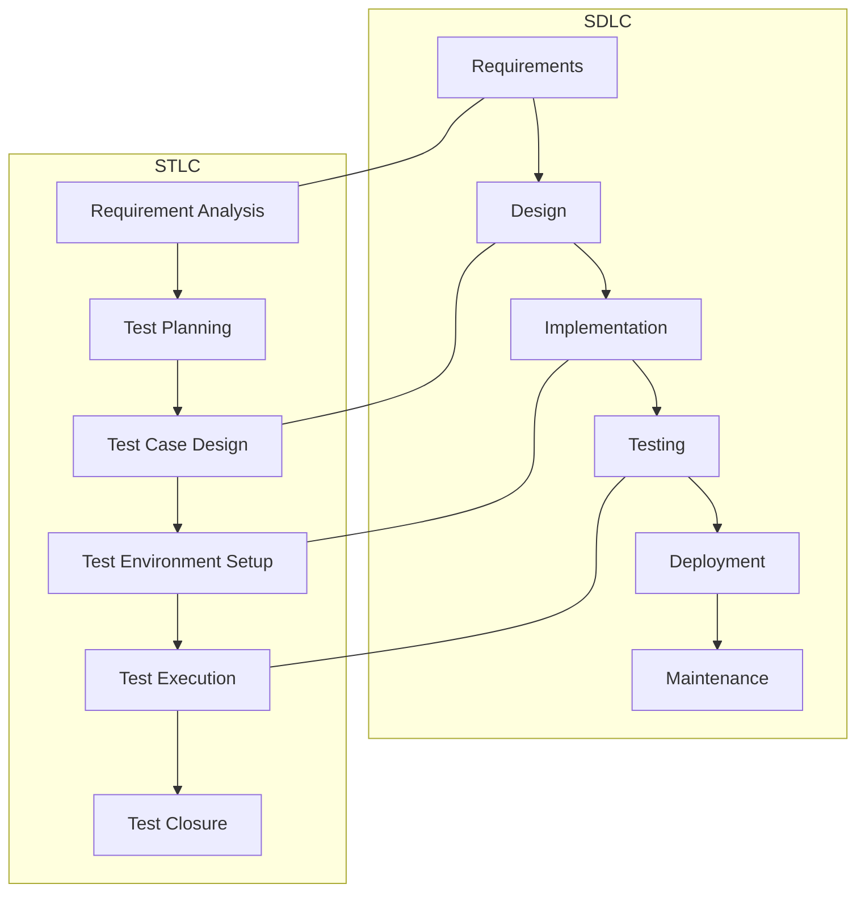

## SDLC (Software Development Life Cycle)

SDLC describes phases to build software:

1. requirements
2. design
3. implementation
4. testing
5. deployment
6. maintenance

## STLC (Software Testing Life Cycle)

STLC describes phases to plan and execute testing:

1. requirement analysis (testable acceptance criteria)
2. test planning (scope, tools, risk)
3. test case design
4. test environment setup
5. test execution
6. test closure (reports, lessons learned)

## Diagram: SDLC vs STLC alignment

## Key takeaway

SDLC builds the product.

STLC ensures the product is verified systematically.
