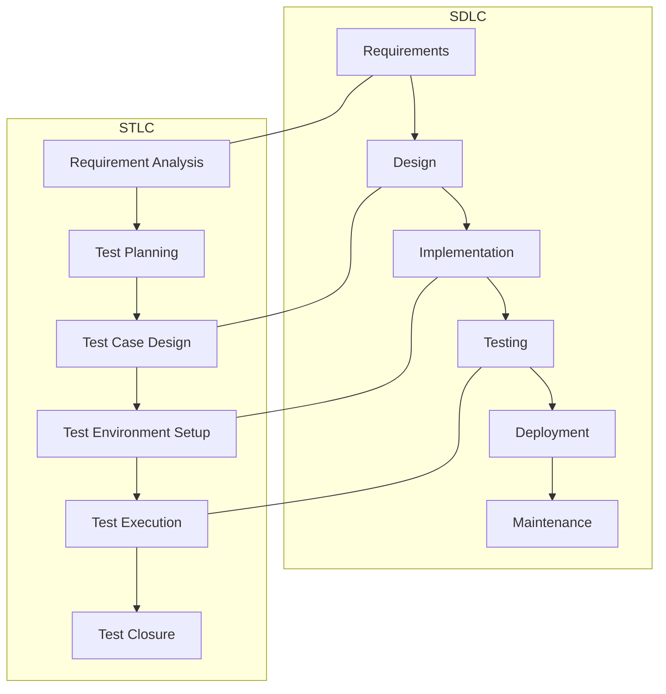

## SDLC (Software Development Life Cycle)

SDLC describes phases to build software:

1. requirements
2. design
3. implementation
4. testing
5. deployment
6. maintenance

## STLC (Software Testing Life Cycle)

STLC describes phases to plan and execute testing:

1. requirement analysis (testable acceptance criteria)
2. test planning (scope, tools, risk)
3. test case design
4. test environment setup
5. test execution
6. test closure (reports, lessons learned)

## Diagram: SDLC vs STLC alignment


```mermaid
graph TD
subgraph SDLC
S1[Requirements] --> S2[Design]
S2 --> S3[Implementation]
S3 --> S4[Testing]
S4 --> S5[Deployment]
S5 --> S6[Maintenance]
end

subgraph STLC
T1[Requirement Analysis] --> T2[Test Planning]
T2 --> T3[Test Case Design]
T3 --> T4[Test Environment Setup]
T4 --> T5[Test Execution]
T5 --> T6[Test Closure]
end

S1 --- T1
S2 --- T3
S3 --- T4
S4 --- T5
```

## Key takeaway

SDLC builds the product.

STLC ensures the product is verified systematically.

## How the two relate

SDLC answers "how do we build this?" and STLC answers "how do we check it?". The mistake is to read STLC as something that starts after implementation. In the diagram, requirement analysis runs alongside SDLC requirements, and test case design runs alongside design. Only execution waits for working code.

## A worked example

Suppose the requirement says "users can reset their password by email".

- **Requirement analysis (STLC 1).** A tester asks what "by email" means. How long is the link valid? What happens if the address is unknown? Each answer becomes a testable criterion. This is cheap here and expensive after coding.
- **Test planning (STLC 2).** Decide scope (web only, not mobile), tools (pytest plus a test mail server) and risks (account takeover is severe).
- **Test case design (STLC 3).** Write cases for a valid link, an expired link, a reused link and an unknown address.
- **Environment setup (STLC 4).** Provide a staging database and a fake mailbox, so no real emails are sent.
- **Execution (STLC 5).** Run the cases and log defects.
- **Closure (STLC 6).** Report results, remaining risks and lessons, for example "expiry logic was ambiguous in the requirements".

Test case design can be written down as tests before the feature exists:

```python title="test_password_reset.py" showLineNumbers{1}
import pytest


@pytest.mark.skip(reason="feature not built yet")
def test_expired_link_is_rejected():
    ...


@pytest.mark.skip(reason="feature not built yet")
def test_link_can_only_be_used_once():
    ...
```

Skipped tests are placeholders that record the design. They are removed as each one is implemented.

## What goes wrong

- **Testing joins late.** Requirements are ambiguous, bugs are found at the end and the release slips.
- **Environment setup is ignored.** Tests fail because staging differs from production, not because of a bug.
- **Closure is skipped.** The same lessons are relearned each release.
- **Treating STLC as a waterfall.** In agile teams the six stages happen inside every sprint, in a small form.

## Connections

The V-Model in the next lesson draws exactly this pairing between build stages and test stages. CI, later in the course, automates the execution stage.

## Check your understanding

<Quiz
  questions={[
    {
      q: "When should test case design begin?",
      options: [
        "After deployment",
        "After the code is finished",
        "As soon as requirements are clear enough to write testable criteria",
        "Only after UAT",
      ],
      answer: 2,
      explain: "STLC runs beside SDLC. Designing tests from requirements early also exposes ambiguity while it is cheap to fix.",
    },
    {
      q: "Which STLC stage decides tools, scope and risks?",
      options: [
        "Test planning",
        "Test closure",
        "Test execution",
        "Environment setup",
      ],
      answer: 0,
      explain: "Planning sets scope, approach, tools and risk priorities before cases are written.",
    },
    {
      q: "Tests fail because staging uses a different database version than production. Which stage was weak?",
      options: [
        "Test closure",
        "Environment setup",
        "Requirement analysis",
        "Test execution",
      ],
      answer: 1,
      explain: "An environment that does not match production produces misleading results.",
    },
  ]}
/>
