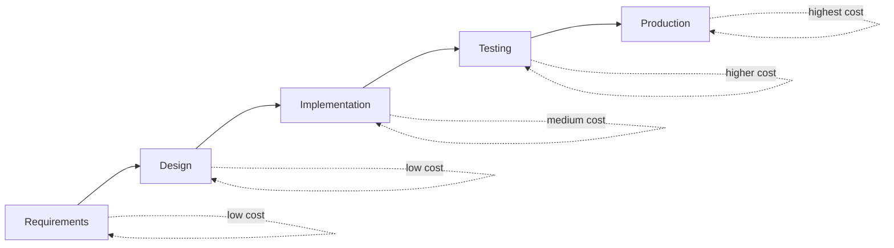

## The core idea

A bug found later costs more because:

- more users are affected
- more systems depend on the faulty behavior
- fixes require more coordination and retesting

## Typical cost curve

Bugs are cheapest to fix when caught:

- during requirements/design (clarify before coding)
- during development (unit tests)

They’re most expensive in production:

- hotfixes
- customer support
- refunds
- reputation damage

## Diagram: cost increases over time

## Real impact examples

- Checkout bug causes lost revenue
- Incorrect tax calculation causes legal risk
- Data leak causes security incidents

## Testing as risk management

Testing doesn’t prove absence of bugs.

Testing gives you:

- evidence the system behaves as expected
- confidence to ship and refactor
- faster debugging
