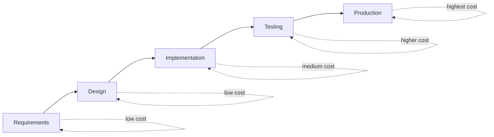

## The core idea

A bug found later costs more because:

- more users are affected
- more systems depend on the faulty behavior
- fixes require more coordination and retesting

## Typical cost curve

Bugs are cheapest to fix when caught:

- during requirements/design (clarify before coding)
- during development (unit tests)

They’re most expensive in production:

- hotfixes
- customer support
- refunds
- reputation damage

## Diagram: cost increases over time


```mermaid
graph LR
A[Requirements] --> B[Design] --> C[Implementation] --> D[Testing] --> E[Production]

A -. low cost .-> A
B -. low cost .-> B
C -. medium cost .-> C
D -. higher cost .-> D
E -. highest cost .-> E
```

## Real impact examples

- Checkout bug causes lost revenue
- Incorrect tax calculation causes legal risk
- Data leak causes security incidents

## Testing as risk management

Testing doesn’t prove absence of bugs.

Testing gives you:

- evidence the system behaves as expected
- confidence to ship and refactor
- faster debugging

## Why the curve rises

A bug caught in a requirements review costs a conversation. The same misunderstanding caught in production costs a hotfix, a rollback, support tickets, possible refunds, and the time of several people to work out what happened. Each stage adds people and systems that depend on the wrong behaviour.

Exact multipliers you may see quoted (such as "100 times more") come from old studies and vary widely. Rely on the direction, not the number. Later is dearer, and that holds in practice.

## A small example

Here is a discount function with a bug.

```python title="discount.py" showLineNumbers{1}
def apply_discount(price: float, percent: float) -> float:
    return price - price * percent  # bug: percent is 10, not 0.10
```

At the unit level the bug is found in seconds:

```python title="test_discount.py" showLineNumbers{1}
from discount import apply_discount


def test_ten_percent_off():
    assert apply_discount(100, 10) == 90
```

The test fails with `-900 != 90`. If it slips through, the same bug means customers get paid to shop. Someone has to notice, trace it to the function, patch it, refund orders and explain it to finance. The code fix is one line and the rest of the cost is everything around it.

## Hidden costs

- **Trust.** Users who meet a data-loss or billing bug do not always come back.
- **Rework.** Fixing late means retesting everything that touches the change.
- **Slower team.** Fear of breaking things makes people avoid refactoring.
- **Compliance.** A wrong tax calculation or a data leak can bring fines.

## Using this idea

Use it to choose where to put effort. Clarify requirements early, review code, run unit tests on every commit, and keep integration and end-to-end tests for what unit tests cannot see. That is the test pyramid, and CI exists so the cheap checks run automatically.

It has a limit. You cannot test everything, and testing has a cost too. Spend it in proportion to risk, as the principles lesson explains.

## Check your understanding

<Quiz
  questions={[
    {
      q: "Why does a production bug usually cost more than one found in a code review?",
      options: [
        "Production code is longer",
        "More users, systems and people are affected, and fixing needs coordination and retesting",
        "Developers work slower on production",
        "Bugs get more complex over time",
      ],
      answer: 1,
      explain: "The cost comes from what depends on the bad behaviour by then, not from the fix itself.",
    },
    {
      q: "Which practice moves defect discovery earliest?",
      options: [
        "Running system tests before release",
        "Asking clarifying questions about requirements before coding",
        "Waiting for user feedback",
        "Adding monitoring",
      ],
      answer: 1,
      explain: "Ambiguity found before code is written costs a conversation.",
    },
    {
      q: "A team decides to test everything equally deeply. What is wrong with this?",
      options: [
        "Nothing, this is ideal",
        "Testing is impossible",
        "Testing has a cost, so effort should follow risk and impact",
        "Unit tests are too slow",
      ],
      answer: 2,
      explain: "Effort is limited, so put it where failures would cost the most.",
    },
  ]}
/>
