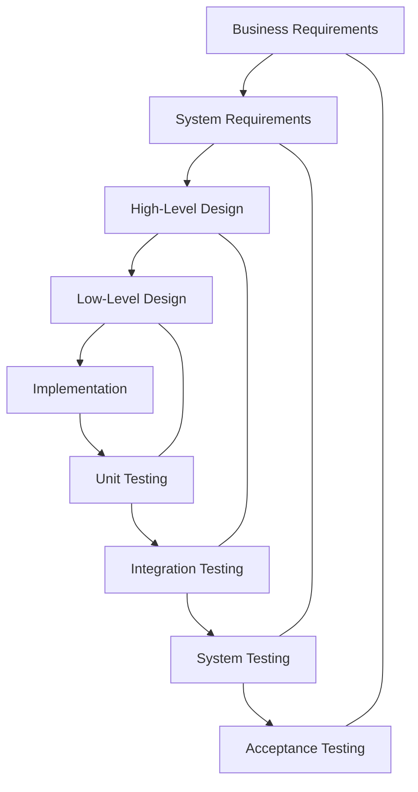

## What is the V-Model?

The **V-Model** is a testing-focused SDLC model where:

- left side: specification and design
- right side: corresponding test levels

The idea: write tests early based on specifications.

## Diagram: The V-Model

## Benefits

- clear mapping of tests to requirements
- encourages early test planning

## Drawbacks

- can be rigid for fast-moving products
- less natural for rapid iteration than agile approaches

## Where it’s used

- regulated industries
- high-risk systems (medical, automotive)
