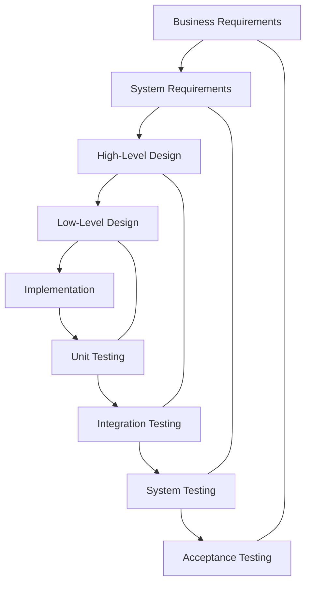

## What is the V-Model?

The **V-Model** is a testing-focused SDLC model where:

- left side: specification and design
- right side: corresponding test levels

The idea: write tests early based on specifications.

## Diagram: The V-Model


```mermaid
graph TD
A[Business Requirements] --> B[System Requirements]
B --> C[High-Level Design]
C --> D[Low-Level Design]
D --> E[Implementation]

E --> F[Unit Testing]
F --> G[Integration Testing]
G --> H[System Testing]
H --> I[Acceptance Testing]

A --- I
B --- H
C --- G
D --- F
```

## Benefits

- clear mapping of tests to requirements
- encourages early test planning

## Drawbacks

- can be rigid for fast-moving products
- less natural for rapid iteration than agile approaches

## Where it’s used

- regulated industries
- high-risk systems (medical, automotive)

## Reading the V

The left arm goes down from business needs to code. The right arm goes back up through test levels. Each horizontal line links a specification to the test level that checks it.

| Left side (what we decided) | Right side (how we check it) |
| --- | --- |
| Business requirements | Acceptance testing |
| System requirements | System testing |
| High-level design | Integration testing |
| Low-level design | Unit testing |

The value is that every test level has a source document. If you cannot say which requirement an acceptance test verifies, either the test or the requirement is unclear.

## Example

Say the business requirement is "customers can pay by card". The pairing gives you:

- **Acceptance.** A business user pays for an order on staging and receives a receipt.
- **System.** Payment works with the whole system, including stock, email and refund.
- **Integration.** The order service calls the payment gateway with the right payload.
- **Unit.** A function that validates the card number format.

```python title="test_card.py" showLineNumbers{1}
import pytest


def luhn_valid(number: str) -> bool:
    digits = [int(c) for c in number][::-1]
    total = sum(digits[0::2]) + sum(sum(divmod(d * 2, 10)) for d in digits[1::2])
    return total % 10 == 0


@pytest.mark.parametrize("number, ok", [("4111111111111111", True), ("4111111111111112", False)])
def test_luhn(number, ok):
    assert luhn_valid(number) is ok
```

This is the bottom right of the V. The same requirement also produces tests at each higher level, and those can be written before the code.

## Where it fails

- **Late feedback.** Real integration and acceptance testing happen only at the top, so a wrong requirement is discovered last.
- **Rigidity.** Changing a requirement means updating documents and tests at many levels.
- **Paperwork.** Teams sometimes produce documents to satisfy the model without improving quality.

## When to use it

It suits regulated fields such as medical devices and automotive, where traceability from requirement to test is an audit requirement. In fast-moving products, teams keep the idea (plan tests from specifications early) but work in short cycles. The levels of testing in Phase 2 are exactly the right arm of this diagram.

## Check your understanding

<Quiz
  questions={[
    {
      q: "Which test level does the V-Model pair with high-level design?",
      options: [
        "Unit testing",
        "Integration testing",
        "System testing",
        "Acceptance testing",
      ],
      answer: 1,
      explain: "High-level design defines components and their interfaces, which is what integration tests check.",
    },
    {
      q: "What is the main advantage of the V-Model?",
      options: [
        "Speed",
        "Traceability from each requirement to a test level",
        "No documentation",
        "Flexible scope",
      ],
      answer: 1,
      explain: "Every specification has a matching test level, which helps audits and planning.",
    },
    {
      q: "Which project is the best fit for a V-Model approach?",
      options: [
        "A weekly-changing startup landing page",
        "A medical device with regulatory audits",
        "A hackathon demo",
        "A personal blog",
      ],
      answer: 1,
      explain: "Regulated, high-risk systems need documented traceability and stable specifications.",
    },
  ]}
/>
