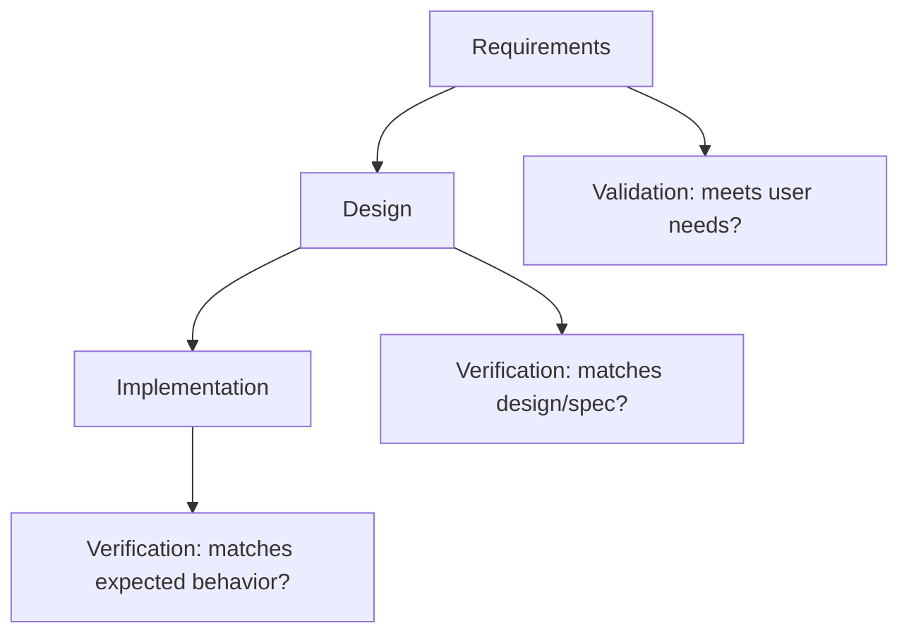

## The classic definition

- **Verification**: “Are we building the product right?”
  - checks work products against specs
  - reviews, inspections, static analysis

- **Validation**: “Are we building the right product?”
  - checks product meets user needs
  - product demos, UAT, real-world testing

## Examples

### Verification examples

- code review checks requirements are implemented
- linting checks coding standards
- unit test checks a function’s behavior

### Validation examples

- beta users confirm the feature solves their problem
- UAT sign-off in a business workflow

## Diagram

