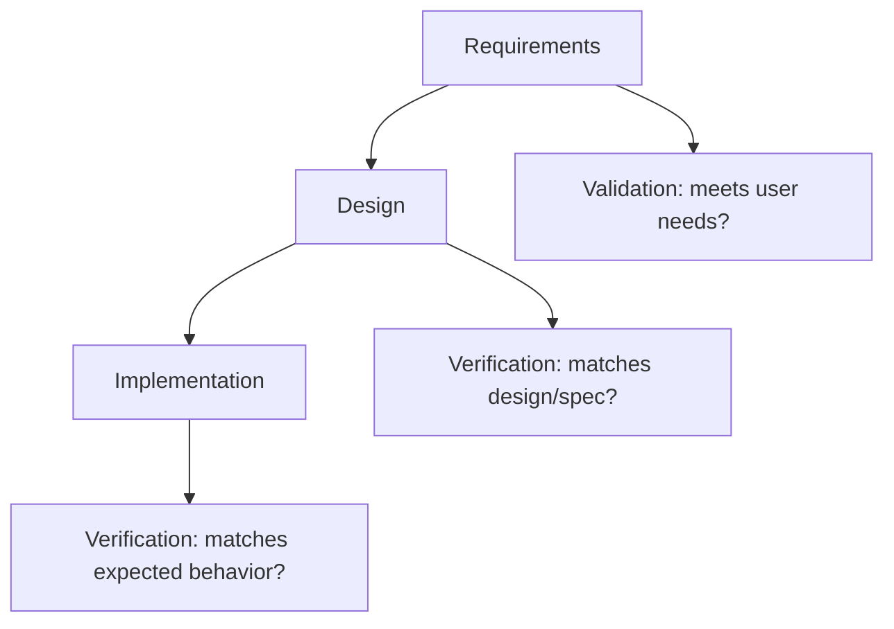

## The classic definition

- **Verification**: “Are we building the product right?”
  - checks work products against specs
  - reviews, inspections, static analysis

- **Validation**: “Are we building the right product?”
  - checks product meets user needs
  - product demos, UAT, real-world testing

## Examples

### Verification examples

- code review checks requirements are implemented
- linting checks coding standards
- unit test checks a function’s behavior

### Validation examples

- beta users confirm the feature solves their problem
- UAT sign-off in a business workflow

## Diagram


```mermaid
graph TD
A[Requirements] --> B[Design]
B --> C[Implementation]

A --> V1[Validation: meets user needs?]
B --> V2[Verification: matches design/spec?]
C --> V3[Verification: matches expected behavior?]
```

## The difference in one sentence

Verification checks that you built the thing according to the specification. Validation checks that the specification describes something people need. A product can pass verification completely and fail validation.

## A concrete case

A team is told to build a report export "as a CSV file". They deliver a correct CSV. Verification passes: the format is valid, tests pass and the review is clean. Then users say they wanted to open it in Excel with formatting. The requirement was met and the need was not. Only putting the product in front of users, which is validation, finds this.

Some checks can be run in code (verification):

```python title="test_export.py" showLineNumbers{1}
import csv
import io


def export_rows(rows):
    buf = io.StringIO()
    writer = csv.writer(buf)
    writer.writerow(["name", "total"])
    writer.writerows(rows)
    return buf.getvalue()


def test_export_has_header_and_rows():
    out = export_rows([("Ana", 10)])
    lines = out.strip().splitlines()
    assert lines[0] == "name,total"
    assert lines[1] == "Ana,10"
```

This test verifies the export matches the spec. It cannot tell you whether a CSV was the right thing to build.

## Static and dynamic

Verification includes **static** activities that do not run code: reviews, inspections, linting and type checking. It also includes dynamic ones such as unit and integration tests. Validation is nearly always dynamic and involves users or stakeholders: demos, betas, UAT and usability sessions.

## Common mistakes

- Believing green tests mean a good product.
- Doing validation only at the end, when a wrong assumption is costly to reverse. Show prototypes early.
- Treating reviews as optional. They are the cheapest form of verification.

## Connections

The SQA lesson calls this the "building it right" and "building the right thing" pair. UAT, later in Phase 2, is the main validation activity. The V-Model places verification on the left arm's reviews and on the lower test levels, and validation at the top.

## Check your understanding

<Quiz
  questions={[
    {
      q: "Which activity is verification?",
      options: [
        "Beta users trying a new feature",
        "UAT sign-off",
        "A code review checking requirements are implemented",
        "A usability session",
      ],
      answer: 2,
      explain: "Verification compares work products to specifications. The others check whether the product meets user needs.",
    },
    {
      q: "The feature matches the spec exactly but nobody uses it. What failed?",
      options: [
        "Verification",
        "Validation",
        "Static analysis",
        "Unit testing",
      ],
      answer: 1,
      explain: "The product was built right but was not the right product.",
    },
    {
      q: "Which of these is static verification?",
      options: [
        "Running the app in staging",
        "Running pylint",
        "A load test",
        "A beta release",
      ],
      answer: 1,
      explain: "Static verification examines code without running it. Linters do that.",
    },
  ]}
/>
