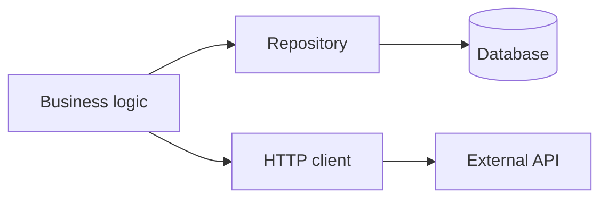

## What integration tests cover

Integration tests verify **interactions** between units.

Examples:

- repository ↔ database
- API client ↔ real HTTP server (or test server)
- service ↔ message queue

## When integration tests are valuable

- you want confidence in boundary behavior
- you’re worried about schema changes
- you use third-party APIs/libraries

## Diagram: integration boundary

## Tips

- Keep them fewer than unit tests
- Use test databases/containers where possible
- Make setup/teardown reliable

import DataCampExercise from "../../components/DataCampExercise.astro";

## 🧪 Try It Yourself

### Exercise 1 – Write a unittest TestCase

<DataCampExercise
  lang="python"
  hint={`Subclass `unittest.TestCase` and use `assertEqual` to assert values.`}
  code={`# Task: Exercise 1 – Write a unittest TestCase
import unittest

def add(a, b):
    return a + b

class TestAdd(unittest.___):    # replace ___ with TestCase
    def test_positive(self):
        self.___(add(2, 3), 5)  # replace ___ with assertEqual

# Run inline
suite = unittest.TestLoader().loadTestsFromTestCase(TestAdd)
runner = unittest.TextTestRunner(verbosity=0)
result = runner.run(suite)
print("Tests run:", result.testsRun)
print("Failures:", len(result.failures))

# ── Expected Output ───────────────────────────────────────────
# Tests run: 1
# Failures: 0
# ──────────────────────────────────────────────────────────────`}
  solution={`import unittest

def add(a, b):
    return a + b

class TestAdd(unittest.TestCase):
    def test_positive(self):
        self.assertEqual(add(2, 3), 5)

suite = unittest.TestLoader().loadTestsFromTestCase(TestAdd)
runner = unittest.TextTestRunner(verbosity=0)
result = runner.run(suite)
print("Tests run:", result.testsRun)
print("Failures:", len(result.failures))`}
  sct={`test_output_contains("Tests run: 1")
test_output_contains("Failures: 0")
success_msg("unittest TestCase working!")`}
  height={160}
/>

### Exercise 2 – assertRaises

<DataCampExercise
  lang="python"
  hint={`Use `self.assertRaises(ExceptionType)` as a context manager.`}
  code={`# Task: Exercise 2 – assertRaises
import unittest

def divide(a, b):
    if b == 0:
        raise ValueError("Cannot divide by zero")
    return a / b

class TestDivide(unittest.TestCase):
    def test_zero(self):
        # Hint: use assertRaises to expect a ValueError
        with self.___(___):          # replace blanks: assertRaises, ValueError
            divide(10, 0)

suite = unittest.TestLoader().loadTestsFromTestCase(TestDivide)
result = unittest.TextTestRunner(verbosity=0).run(suite)
print("Passed:", result.wasSuccessful())

# ── Expected Output ───────────────────────────────────────────
# Passed: True
# ──────────────────────────────────────────────────────────────`}
  solution={`import unittest

def divide(a, b):
    if b == 0:
        raise ValueError("Cannot divide by zero")
    return a / b

class TestDivide(unittest.TestCase):
    def test_zero(self):
        with self.assertRaises(ValueError):
            divide(10, 0)

suite = unittest.TestLoader().loadTestsFromTestCase(TestDivide)
result = unittest.TextTestRunner(verbosity=0).run(suite)
print("Passed:", result.wasSuccessful())`}
  sct={`test_output_contains("Passed: True")
success_msg("assertRaises verifies exceptions!")`}
  height={160}
/>

### Exercise 3 – setUp and tearDown

<DataCampExercise
  lang="python"
  hint={`Override `setUp` to run before each test and `tearDown` after.`}
  code={`# Task: Exercise 3 – setUp and tearDown
import unittest

class TestLifecycle(unittest.TestCase):
    def ___(self):              # replace ___ with setUp
        self.data = [1, 2, 3]
        print("setUp called")

    def test_length(self):
        self.assertEqual(len(self.data), 3)

    def ___(self):              # replace ___ with tearDown
        print("tearDown called")

suite = unittest.TestLoader().loadTestsFromTestCase(TestLifecycle)
unittest.TextTestRunner(verbosity=0).run(suite)

# ── Expected Output includes ──────────────────────────────────
# setUp called
# tearDown called
# ──────────────────────────────────────────────────────────────`}
  solution={`import unittest

class TestLifecycle(unittest.TestCase):
    def setUp(self):
        self.data = [1, 2, 3]
        print("setUp called")

    def test_length(self):
        self.assertEqual(len(self.data), 3)

    def tearDown(self):
        print("tearDown called")

suite = unittest.TestLoader().loadTestsFromTestCase(TestLifecycle)
unittest.TextTestRunner(verbosity=0).run(suite)`}
  sct={`test_output_contains("setUp called")
test_output_contains("tearDown called")
success_msg("setUp/tearDown lifecycle works!")`}
  height={162}
/>

