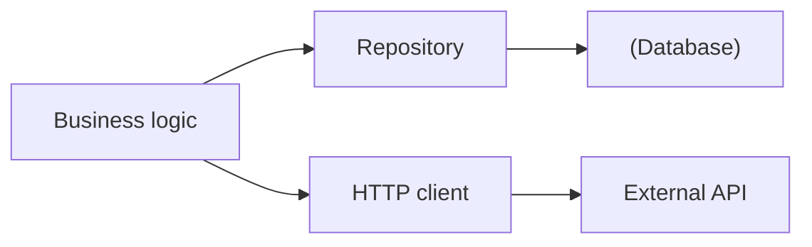

## What integration tests cover

Integration tests verify **interactions** between units.

Examples:

- repository ↔ database
- API client ↔ real HTTP server (or test server)
- service ↔ message queue

## When integration tests are valuable

- you want confidence in boundary behavior
- you’re worried about schema changes
- you use third-party APIs/libraries

## Diagram: integration boundary


```mermaid
graph LR
A[Business logic] --> B[Repository]
B --> C["(Database)"]

A --> D[HTTP client]
D --> E[External API]
```

## Tips

- Keep them fewer than unit tests
- Use test databases/containers where possible
- Make setup/teardown reliable

## Unit tests pass, the system still breaks

Each unit can be correct while the connection between them is wrong. A classic case is a service that stores dates as ISO strings while the reporting code expects timestamps. Both have green unit tests, and the integration fails. Integration tests exist to check these seams: the SQL really matches the schema, the JSON the client sends is what the server accepts, and the queue message has the fields the consumer reads.

## A worked example with a real database

SQLite is included with Python, so a repository can be tested against a real database without any setup.

```python title="repo.py" showLineNumbers{1}
import sqlite3


class UserRepo:
    def __init__(self, conn):
        self.conn = conn
        conn.execute("CREATE TABLE IF NOT EXISTS users (id INTEGER PRIMARY KEY, email TEXT UNIQUE)")

    def add(self, email):
        cur = self.conn.execute("INSERT INTO users (email) VALUES (?)", (email,))
        return cur.lastrowid

    def find_email(self, user_id):
        row = self.conn.execute("SELECT email FROM users WHERE id = ?", (user_id,)).fetchone()
        return row[0] if row else None
```

```python title="test_repo_integration.py" showLineNumbers{1}
import sqlite3
import pytest
from repo import UserRepo


@pytest.fixture
def repo():
    conn = sqlite3.connect(":memory:")
    yield UserRepo(conn)
    conn.close()


def test_round_trip(repo):
    uid = repo.add("ana@example.com")
    assert repo.find_email(uid) == "ana@example.com"


def test_duplicate_email_rejected(repo):
    repo.add("ana@example.com")
    with pytest.raises(sqlite3.IntegrityError):
        repo.add("ana@example.com")
```

A mocked database would let both tests pass even if the SQL were wrong. The real one checks the query and the `UNIQUE` constraint. Each test gets a fresh in-memory database through the fixture, so tests do not affect each other.

## How to keep them useful

- Use a disposable resource per test or per module: in-memory SQLite, a temporary directory, or a Docker container for Postgres.
- Test through the real boundary, and mock only what you cannot control, such as a paid third-party API. For HTTP you can run a local test server.
- Keep them few and targeted. One test per boundary behaviour is usually enough, because the logic is covered by unit tests.
- Mark them, for example `@pytest.mark.integration`, so developers can run only the fast tests during coding and CI runs everything.

## What goes wrong

Shared databases that keep state between runs make tests order-dependent. Tests that call a real external service fail when the network is down. Setup that takes minutes leads people to stop running the suite. The test pyramid lesson explains why you want fewer of these than unit tests, and system testing goes one level higher.

## 🧪 Try It Yourself

### Exercise 1 – Write a unittest TestCase

<DataCampExercise
  lang="python"
  hint={`Subclass \`unittest.TestCase\` and use \`assertEqual\` to assert values.`}
  code={`# Task: Exercise 1 – Write a unittest TestCase
import unittest

def add(a, b):
    return a + b

class TestAdd(unittest.___):    # replace ___ with TestCase
    def test_positive(self):
        self.___(add(2, 3), 5)  # replace ___ with assertEqual

# Run inline
suite = unittest.TestLoader().loadTestsFromTestCase(TestAdd)
runner = unittest.TextTestRunner(verbosity=0)
result = runner.run(suite)
print("Tests run:", result.testsRun)
print("Failures:", len(result.failures))

# ── Expected Output ───────────────────────────────────────────
# Tests run: 1
# Failures: 0
# ──────────────────────────────────────────────────────────────`}
  solution={`import unittest

def add(a, b):
    return a + b

class TestAdd(unittest.TestCase):
    def test_positive(self):
        self.assertEqual(add(2, 3), 5)

suite = unittest.TestLoader().loadTestsFromTestCase(TestAdd)
runner = unittest.TextTestRunner(verbosity=0)
result = runner.run(suite)
print("Tests run:", result.testsRun)
print("Failures:", len(result.failures))`}
  sct={`test_output_contains("Tests run: 1")
test_output_contains("Failures: 0")
success_msg("unittest TestCase working!")`}
  height={160}
/>

### Exercise 2 – assertRaises

<DataCampExercise
  lang="python"
  hint={`Use \`self.assertRaises(ExceptionType)\` as a context manager.`}
  code={`# Task: Exercise 2 – assertRaises
import unittest

def divide(a, b):
    if b == 0:
        raise ValueError("Cannot divide by zero")
    return a / b

class TestDivide(unittest.TestCase):
    def test_zero(self):
        # Hint: use assertRaises to expect a ValueError
        with self.___(___):          # replace blanks: assertRaises, ValueError
            divide(10, 0)

suite = unittest.TestLoader().loadTestsFromTestCase(TestDivide)
result = unittest.TextTestRunner(verbosity=0).run(suite)
print("Passed:", result.wasSuccessful())

# ── Expected Output ───────────────────────────────────────────
# Passed: True
# ──────────────────────────────────────────────────────────────`}
  solution={`import unittest

def divide(a, b):
    if b == 0:
        raise ValueError("Cannot divide by zero")
    return a / b

class TestDivide(unittest.TestCase):
    def test_zero(self):
        with self.assertRaises(ValueError):
            divide(10, 0)

suite = unittest.TestLoader().loadTestsFromTestCase(TestDivide)
result = unittest.TextTestRunner(verbosity=0).run(suite)
print("Passed:", result.wasSuccessful())`}
  sct={`test_output_contains("Passed: True")
success_msg("assertRaises verifies exceptions!")`}
  height={160}
/>

### Exercise 3 – setUp and tearDown

<DataCampExercise
  lang="python"
  hint={`Override \`setUp\` to run before each test and \`tearDown\` after.`}
  code={`# Task: Exercise 3 – setUp and tearDown
import unittest

class TestLifecycle(unittest.TestCase):
    def ___(self):              # replace ___ with setUp
        self.data = [1, 2, 3]
        print("setUp called")

    def test_length(self):
        self.assertEqual(len(self.data), 3)

    def ___(self):              # replace ___ with tearDown
        print("tearDown called")

suite = unittest.TestLoader().loadTestsFromTestCase(TestLifecycle)
unittest.TextTestRunner(verbosity=0).run(suite)

# ── Expected Output includes ──────────────────────────────────
# setUp called
# tearDown called
# ──────────────────────────────────────────────────────────────`}
  solution={`import unittest

class TestLifecycle(unittest.TestCase):
    def setUp(self):
        self.data = [1, 2, 3]
        print("setUp called")

    def test_length(self):
        self.assertEqual(len(self.data), 3)

    def tearDown(self):
        print("tearDown called")

suite = unittest.TestLoader().loadTestsFromTestCase(TestLifecycle)
unittest.TextTestRunner(verbosity=0).run(suite)`}
  sct={`test_output_contains("setUp called")
test_output_contains("tearDown called")
success_msg("setUp/tearDown lifecycle works!")`}
  height={162}
/>

