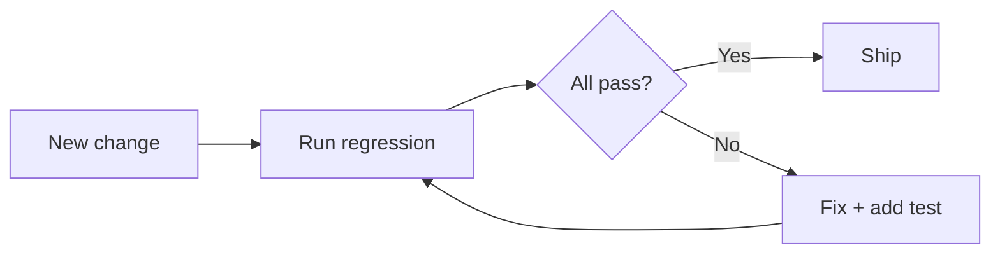

## What regression testing is

Regression testing ensures:

- new changes don’t break existing features

It’s triggered by:

- bug fixes
- refactors
- new features
- dependency upgrades

## Manual vs automated regression

- manual regression: slow but useful sometimes
- automated regression: fast and repeatable

## Build a regression suite

Start with:

- critical user flows
- high-risk modules
- recently buggy areas

## Diagram: change → regression safety

