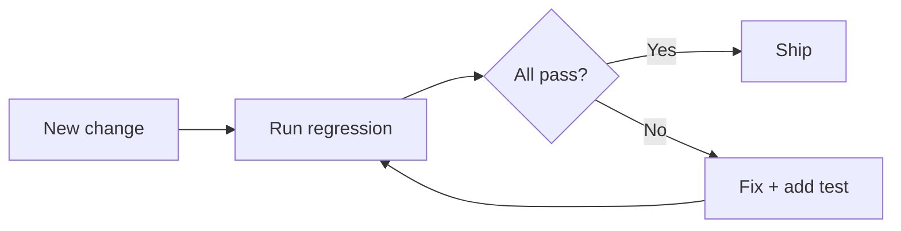

## What regression testing is

Regression testing ensures:

- new changes don’t break existing features

It’s triggered by:

- bug fixes
- refactors
- new features
- dependency upgrades

## Manual vs automated regression

- manual regression: slow but useful sometimes
- automated regression: fast and repeatable

## Build a regression suite

Start with:

- critical user flows
- high-risk modules
- recently buggy areas

## Diagram: change → regression safety


```mermaid
graph LR
A[New change] --> B[Run regression]
B --> C{All pass?}
C -- Yes --> D[Ship]
C -- No --> E[Fix + add test]
E --> B
```

## The idea

A regression is something that used to work and no longer does. Regression testing is re-running checks after a change to confirm nothing else moved. The changes that cause regressions look harmless: a refactor, a dependency upgrade, a one-line fix.

## The best regression test is a bug you already had

When you fix a bug, first write a test that fails because of it. Then fix the bug and watch the test pass. That test stays in the suite permanently.

```python title="test_regression_coupon.py" showLineNumbers{1}
def normalize_coupon(code: str) -> str:
    return "".join(code.split()).upper()


def test_coupon_with_spaces_regression():
    # Bug #412: "SAVE 10" caused a 500 at checkout
    assert normalize_coupon("SAVE 10") == "SAVE10"


def test_coupon_lowercase():
    assert normalize_coupon("save10") == "SAVE10"
```

Naming the bug in a comment tells the next person why the test exists and stops someone deleting it during cleanup. This links to the bug report lesson, where the same coupon case is used.

## Choosing what to run

Running everything is ideal and often possible for a fast suite. When the suite grows slow, choose by risk:

- **Full regression** before a release, usually in CI overnight.
- **Selective regression** on a pull request: tests covering the changed area plus critical flows.
- **Smoke tests** on every deployment, described in the next lesson.

pytest markers help here, for example `pytest -m "not slow"` on each commit and the full run nightly.

## What goes wrong

- **Suites nobody trusts.** Flaky tests make people rerun until green, and real regressions slip through.
- **Suites that only grow.** Duplicate and obsolete tests slow feedback. Review and delete tests that check removed behaviour.
- **Only automated.** New features need exploratory testing too, because regression tests only check what you already knew to check.
- **Fixing the test to make it pass.** If an old test fails, first decide whether the behaviour change was intended.

## Connections

Regression suites are the main reason to automate, as the manual versus automated lesson argues. CI runs them on every change. Coverage reports show which parts of the code no regression test protects.

## Check your understanding

<Quiz
  questions={[
    {
      q: "You fix a production bug. What should you add to the suite?",
      options: [
        "Nothing, the bug is fixed",
        "A test that reproduces the bug and now passes, so it cannot silently return",
        "A manual checklist item",
        "A larger E2E test",
      ],
      answer: 1,
      explain: "A regression test that failed before the fix and passes after it prevents the same bug coming back.",
    },
    {
      q: "A pull request changes only the invoice module. The full suite takes two hours. What is a sensible plan?",
      options: [
        "Skip tests",
        "Run invoice-related tests and critical flows on the PR, the full suite nightly",
        "Run only unit tests forever",
        "Run the suite once a year",
      ],
      answer: 1,
      explain: "Selective regression on PRs keeps feedback fast, and the full run catches anything the selection missed.",
    },
    {
      q: "An old test fails after your refactor. What do you do first?",
      options: [
        "Delete the test",
        "Change the assertion to match the new output",
        "Decide whether the behaviour change was intended, then fix the code or update the test",
        "Mark it flaky",
      ],
      answer: 2,
      explain: "The failing test is information. Editing it blindly hides a real regression.",
    },
  ]}
/>
