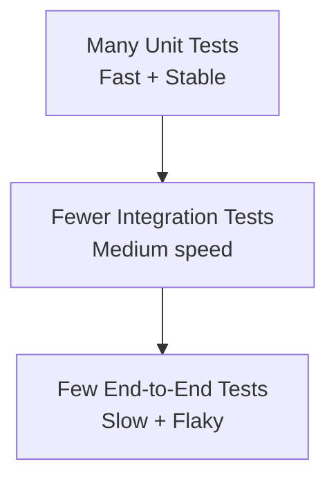

## What is the test pyramid?

The **test pyramid** is a strategy to keep your test suite:

- fast
- reliable
- easy to maintain

The idea: write **many small unit tests**, fewer integration tests, and the fewest end-to-end (E2E/UI) tests.

## Diagram: Test pyramid

## Why this works

- Unit tests run in milliseconds → fast feedback
- Integration tests validate boundaries (DB/API/files)
- E2E tests validate realistic user workflows

## Common anti-pattern

An **inverted pyramid** (too many UI tests):

- slow pipelines
- flaky failures
- hard debugging

## Practical guidance

- Put most logic behind unit-tested functions/classes
- Use integration tests for real dependencies (DB, HTTP)
- Use a small number of E2E tests for critical paths (login, checkout)
