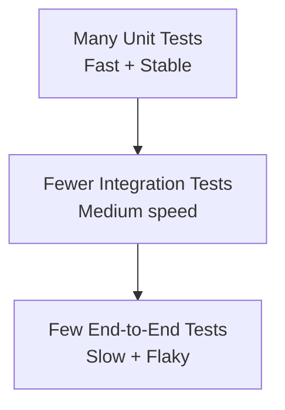

## What is the test pyramid?

The **test pyramid** is a strategy to keep your test suite:

- fast
- reliable
- easy to maintain

The idea: write **many small unit tests**, fewer integration tests, and the fewest end-to-end (E2E/UI) tests.

## Diagram: Test pyramid


```mermaid
graph TD
U[Many Unit Tests\nFast + Stable] --> I[Fewer Integration Tests\nMedium speed]
I --> E[Few End-to-End Tests\nSlow + Flaky]
```

## Why this works

- Unit tests run in milliseconds → fast feedback
- Integration tests validate boundaries (DB/API/files)
- E2E tests validate realistic user workflows

## Common anti-pattern

An **inverted pyramid** (too many UI tests):

- slow pipelines
- flaky failures
- hard debugging

## Practical guidance

- Put most logic behind unit-tested functions/classes
- Use integration tests for real dependencies (DB, HTTP)
- Use a small number of E2E tests for critical paths (login, checkout)

## Visualize it

The pyramid shape reflects how many tests you should have at each level - lots at the base, fewer as you go up.

```mermaid title="The Test Pyramid" desc="Many fast unit tests form the base, with fewer integration tests and the fewest slow E2E tests at the top."
flowchart TB
U["Unit tests (many, fast)"] --> I["Integration tests (some)"]
I --> E["E2E / UI tests (few, slow)"]
```

## Where the shape comes from

The pyramid is about cost and feedback speed. A unit test takes milliseconds and its failure points at one function. An end-to-end test takes seconds, involves a browser, a network and several services, and its failure says "something is wrong". If you have a thousand of each, the difference is between a suite that runs in a few seconds and one that runs for an hour.

| Level | Typical speed | What a failure tells you | Rough share |
| --- | --- | --- | --- |
| Unit | milliseconds | which function | most |
| Integration | tens to hundreds of ms | which boundary | some |
| End-to-end | seconds | something, somewhere | few |

## Making code pyramid-friendly

The pyramid only works if logic can be tested without the slow layers. That means keeping business rules out of route handlers and UI code.

```python title="checkout.py" showLineNumbers{1}
def order_total(items, coupon_percent=0):
    subtotal = sum(price * qty for price, qty in items)
    return round(subtotal * (1 - coupon_percent / 100), 2)
```

```python title="test_checkout.py" showLineNumbers{1}
from checkout import order_total


def test_total_with_coupon():
    assert order_total([(10.0, 2), (5.0, 1)], coupon_percent=20) == 20.0
```

The rule is tested in one line with no browser. A single E2E test then checks that the button, the form and the total on screen are connected, and there is no need to repeat every discount case through the UI.

## The inverted pyramid, and the ice-cream cone

Teams that start with UI tests only, because they mirror what a tester does by hand, get an inverted pyramid. Builds take an hour, tests fail at random because of timing, and debugging means watching videos. The variant with many manual tests on top is called the ice-cream cone. Both grow from the same cause: logic is only reachable through the UI.

## How to use it

- When a bug is found by an E2E test, write a unit test that reproduces it at the lowest level, then keep the E2E test only if the flow itself is critical.
- Count your tests by level now and then. If the E2E share is growing, ask why.
- Treat the shape as a guide. A data pipeline may need more integration tests than unit tests, and that is fine if they stay fast.

## Connections

The unit, integration and system lessons in this phase describe each layer. Flaky UI tests are the reason for the Page Object Model and explicit waits in Phase 5.

## Check your understanding

<Quiz
  questions={[
    {
      q: "A pipeline takes 90 minutes and most tests drive a browser. What is this shape called, and what is the usual fix?",
      options: [
        "A pyramid; add more browser tests",
        "An inverted pyramid; move logic checks down into unit and integration tests",
        "A diamond; delete unit tests",
        "A circle; buy faster servers",
      ],
      answer: 1,
      explain: "Testing business rules through the UI is slow and flaky. Lower-level tests give the same coverage cheaply.",
    },
    {
      q: "An E2E test finds a rounding bug in a discount. What is the best follow-up?",
      options: [
        "Add ten more E2E tests",
        "Add a unit test that reproduces the rounding bug, then fix it",
        "Ignore it",
        "Mark the E2E test flaky",
      ],
      answer: 1,
      explain: "Reproduce bugs at the lowest level that can show them, for fast and precise feedback.",
    },
    {
      q: "Why is business logic inside a route handler a problem for the pyramid?",
      options: [
        "Handlers are slow to write",
        "The logic can only be tested through slower integration or E2E tests",
        "It cannot be tested at all",
        "It breaks linting",
      ],
      answer: 1,
      explain: "Separating logic into plain functions lets you unit test it directly.",
    },
  ]}
/>
