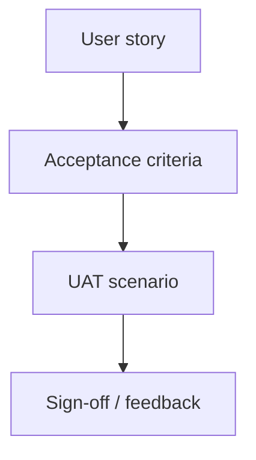

## What UAT is

UAT is where real users or business stakeholders confirm:

- the product meets their needs
- workflows match business rules

## Who performs UAT

- product owners
- business analysts
- customer representatives

QA can facilitate, but UAT is about **business acceptance**.

## Acceptance criteria

Strong criteria are:

- observable
- testable
- unambiguous

Example:

- “When an order is paid, an invoice PDF is available within 30 seconds.”

## Diagram: from requirement to acceptance

