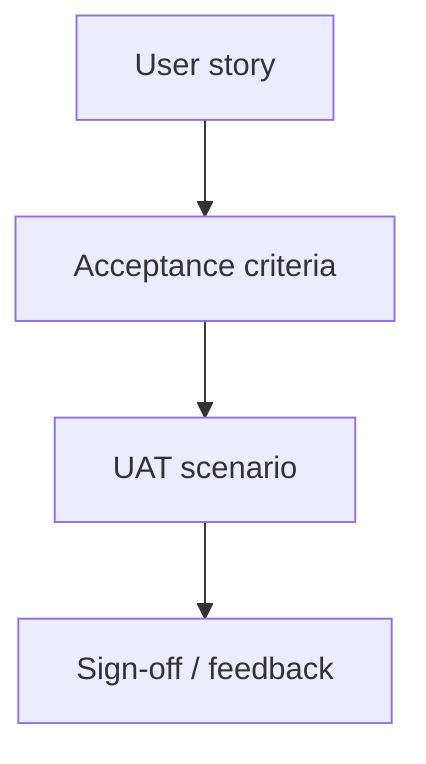

## What UAT is

UAT is where real users or business stakeholders confirm:

- the product meets their needs
- workflows match business rules

## Who performs UAT

- product owners
- business analysts
- customer representatives

QA can facilitate, but UAT is about **business acceptance**.

## Acceptance criteria

Strong criteria are:

- observable
- testable
- unambiguous

Example:

- “When an order is paid, an invoice PDF is available within 30 seconds.”

## Diagram: from requirement to acceptance


```mermaid
graph TD
A[User story] --> B[Acceptance criteria]
B --> C[UAT scenario]
C --> D[Sign-off / feedback]
```

## What makes UAT different

Every earlier level is run by the team that built the product and checks it against a specification. UAT is run by the people the software is for, or their representatives, and answers one question: can we use this to do our work? It is validation, not verification. A payroll system can meet every technical requirement and still be rejected because the approval step does not match how the finance team really works.

## Writing acceptance criteria that can be checked

Criteria written as vague wishes ("invoices should be quick") cannot be signed off. Use concrete, observable statements, and the Given-When-Then form from Phase 5 works well:

- Given an order has been paid, when the customer opens the order page, then a PDF invoice is available within 30 seconds.
- Given a refund above 500, when the clerk submits it, then a manager must approve it before money moves.

These can be turned into a UAT script, where each row has steps, expected result, actual result and pass or fail. Some can also be automated:

```python title="test_acceptance_invoice.py" showLineNumbers{1}
import time


def invoice_ready_within(seconds, poll, timeout_s=30):
    deadline = time.monotonic() + timeout_s
    while time.monotonic() < deadline:
        if poll():
            return True
        time.sleep(1)
    return False
```

The automated version covers the timing rule. The business user still judges whether the invoice layout is acceptable.

## Running UAT well

- **Prepare the environment and data first.** Users should not spend their session fixing test accounts.
- **Use real scenarios**, not the developer's demo path, and include the awkward cases users meet weekly.
- **Set entry and exit conditions.** UAT starts when system testing is done, and ends with a written decision: accept, accept with known issues, or reject.
- **Triage findings.** Not every comment is a defect. Some are change requests, and the team must separate them.

## What goes wrong

UAT scheduled in the last week has no time for real changes. Users are asked to test without training, so they report confusion, not defects. Acceptance criteria are written after the build and match the code, not the need. Involve users earlier through demos so UAT holds no big surprises.

## Connections

UAT sits at the top of the V-Model, paired with business requirements. It is the main validation step from the verification versus validation lesson.

## Check your understanding

<Quiz
  questions={[
    {
      q: "Who should decide whether a feature passes UAT?",
      options: [
        "The developer who built it",
        "The business users or product owner who will rely on it",
        "The CI server",
        "The QA lead alone",
      ],
      answer: 1,
      explain: "UAT is business acceptance, so the people who need the software make the call.",
    },
    {
      q: "Which acceptance criterion is testable?",
      options: [
        "The invoice page should be fast",
        "The invoice PDF is available within 30 seconds of payment",
        "The design should feel modern",
        "The system should be robust",
      ],
      answer: 1,
      explain: "It is observable, measurable and unambiguous.",
    },
    {
      q: "Users in UAT report that a button label is confusing but the feature works to spec. How should the team treat this?",
      options: [
        "Reject the comment",
        "Triage it: it is likely a usability or change request rather than a spec defect",
        "Fail all UAT",
        "Ignore until next year",
      ],
      answer: 1,
      explain: "Validation finds needs the spec missed. Triage decides whether it is a defect or a new requirement.",
    },
  ]}
/>
