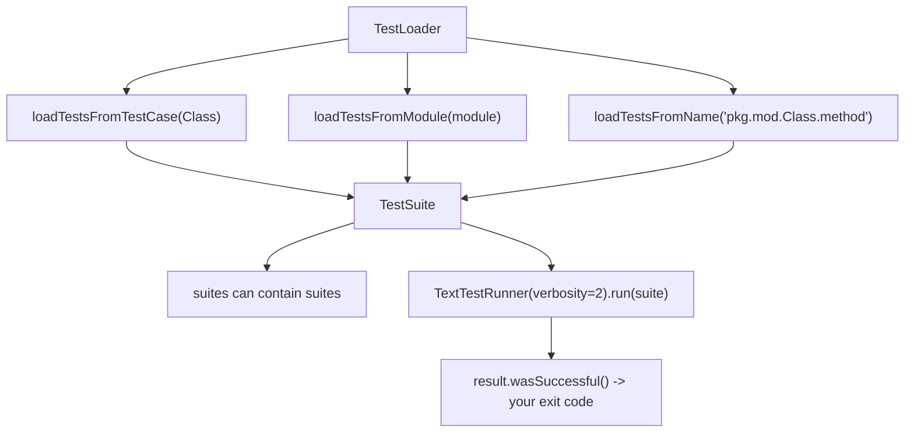

## Why test suites?

Suites let you:

- group tests by feature
- run a subset for smoke/regression
- create custom runners

## Example suite

```python title="suite_example.py" showLineNumbers{1}
import unittest


class TestA(unittest.TestCase):
    def test_one(self):
        self.assertTrue(True)


class TestB(unittest.TestCase):
    def test_two(self):
        self.assertEqual(1 + 1, 2)


def load_suite():
    suite = unittest.TestSuite()
    suite.addTest(unittest.defaultTestLoader.loadTestsFromTestCase(TestA))
    suite.addTest(unittest.defaultTestLoader.loadTestsFromTestCase(TestB))
    return suite


if __name__ == "__main__":
    runner = unittest.TextTestRunner(verbosity=2)
    runner.run(load_suite())
```

## Tip

In most modern codebases, you’ll rely on discovery.

Suites are most useful for curated runs.

## A TestSuite is a container you build yourself

Discovery is the usual entry point. A `TestSuite` is what you reach for when you need to
choose and order the tests explicitly:

```python title="suite.py" showLineNumbers{1}
import unittest
from tests.test_calc import TestAdd
from tests.test_msgs import TestMessages

def build_suite():
    suite = unittest.TestSuite()
    loader = unittest.TestLoader()

    suite.addTest(loader.loadTestsFromTestCase(TestAdd))
    suite.addTest(TestMessages("test_in"))        # one specific method
    return suite

if __name__ == "__main__":
    runner = unittest.TextTestRunner(verbosity=2)
    result = runner.run(build_suite())
    raise SystemExit(0 if result.wasSuccessful() else 1)
```



`raise SystemExit(...)` on the last line is the part people leave out. Without it, a custom
runner script exits 0 whatever happened, and CI reports success on a failing suite.

## Grouping by speed rather than by module

The useful grouping is usually not "all the model tests" but "the tests I can afford to run
on every save":

```python title="grouped.py" showLineNumbers{1}
def fast_suite():
    loader = unittest.TestLoader()
    suite = unittest.TestSuite()
    for cls in (TestAdd, TestMessages):
        for name in loader.getTestCaseNames(cls):
            if not name.endswith("_slow"):
                suite.addTest(cls(name))
    return suite
```

This is exactly what pytest markers do declaratively, which is one of the reasons the next
phase exists.

## Sharing expensive setup across a whole suite

```python title="shared.py" showLineNumbers{1}
def setUpModule():
    global _server
    _server = start_test_server()      # once for the entire module

def tearDownModule():
    _server.stop()
```

| hook | runs |
|:--|:--|
| `setUpModule` | once per module |
| `setUpClass` | once per class |
| `setUp` | before every test method |

Push shared setup as far up as it will go **only when it is genuinely read-only**. A
database connection shared across a class is fine; a mutable object shared across tests
reintroduces exactly the coupling `setUp` exists to prevent.

:::caution[Shared state is how order-dependence gets in]
Since tests run alphabetically, a suite that passes today can fail after a rename if one
test mutates something another expects. If you suspect it, run a single test on its own —
if it fails alone and passes in the suite, the state is shared.
:::

## See it move

```p5 title="Building a suite from parts" desc="A loader turns classes and names into tests, a suite holds them in the order you add them, and the runner's result decides your exit code." height="330"
let picked = [true, true, false];
const PARTS = [
  { n: 'loadTestsFromTestCase(TestAdd)', c: 3 },
  { n: "TestMessages('test_in')", c: 1 },
  { n: 'loadTestsFromModule(test_slow)', c: 4 },
];

function setup() {
  createCanvas(600, 330);
  textFont('monospace');
}

function draw() {
  background(13, 17, 23);
  let total = 0;
  for (let i = 0; i < 3; i++) if (picked[i]) total += PARTS[i].c;

  noStroke();
  fill(230);
  textSize(13);
  textAlign(LEFT, TOP);
  text('suite = unittest.TestSuite()', 24, 16);

  for (let i = 0; i < 3; i++) {
    const y = 46 + i * 46;
    const on = picked[i];
    stroke(on ? color(120, 190, 130) : color(48, 56, 68));
    strokeWeight(1);
    fill(on ? color(18, 30, 22) : color(17, 22, 29));
    rect(24, y, 400, 38, 4);
    noStroke();
    fill(on ? color(120, 190, 130) : 80);
    textSize(10);
    textAlign(LEFT, CENTER);
    text((on ? 'suite.addTest(' : '// ') + PARTS[i].n + (on ? ')' : ''), 38, y + 19);
    fill(on ? 150 : 60);
    textAlign(RIGHT, CENTER);
    textSize(10);
    text('+' + PARTS[i].c, 412, y + 19);
  }

  stroke(48, 56, 68);
  strokeWeight(1);
  fill(18, 23, 30);
  rect(24, 194, 552, 62, 5);
  noStroke();
  fill(110);
  textSize(10);
  textAlign(LEFT, TOP);
  text('runner.run(suite)', 38, 204);
  fill(total > 0 ? color(120, 190, 130) : color(232, 110, 110));
  textSize(16);
  text('Ran ' + total + ' test' + (total === 1 ? '' : 's'), 38, 224);
  if (total === 0) {
    fill(232, 110, 110);
    textSize(10);
    text('an empty suite still reports success', 200, 230);
  }

  fill(90);
  textSize(10);
  textAlign(LEFT, TOP);
  text('raise SystemExit(0 if result.wasSuccessful() else 1)', 24, 272);
  text('without that line the script exits 0 even when tests failed', 24, 290);
}

function mousePressed() {
  for (let i = 0; i < 3; i++) {
    const y = 46 + i * 46;
    if (mouseX > 24 && mouseX < 424 && mouseY > y && mouseY < y + 38) picked[i] = !picked[i];
  }
}
```

## Check yourself

<Quiz
  questions={[
    {
      q: "You write a script that builds a TestSuite and runs it with TextTestRunner. What must the script do that discovery does for you?",
      options: [
        "import unittest",
        "set the exit code from result.wasSuccessful(), or CI reports success on a failing suite",
        "call setUp manually",
        "sort the tests",
      ],
      answer: 1,
      explain:
        "A custom runner script exits 0 by default whatever the result. raise SystemExit(0 if result.wasSuccessful() else 1) is the missing line.",
    },
    {
      q: "Which hook runs once per module?",
      options: [
        "setUp",
        "setUpClass",
        "setUpModule",
        "tearDown",
      ],
      answer: 2,
      explain:
        "setUpModule runs once per module, setUpClass once per class, and setUp before every test method. Push shared setup upward only when it is read-only.",
    },
    {
      q: "A test passes in the suite but fails when run alone. What does that indicate?",
      options: [
        "a bug in unittest",
        "the test depends on state left behind by another test",
        "the test is too slow",
        "discovery is misconfigured",
      ],
      answer: 1,
      explain:
        "Since tests run alphabetically, shared mutable state creates order-dependence that survives until someone renames a method.",
    },
  ]}
/>
