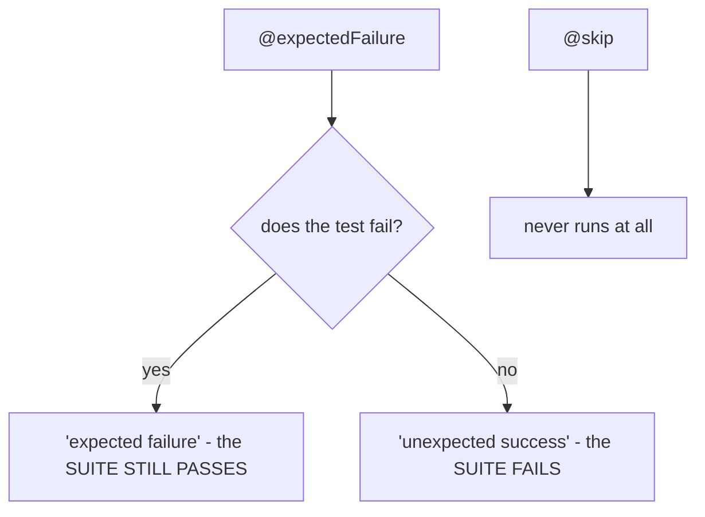

import Quiz from "../../../../components/Quiz.astro";

## Skipping tests

Skip a test when:

- a dependency isn’t available
- a feature is not supported on the OS

```python title="skip_examples.py" showLineNumbers{1}
import sys
import unittest


class TestPlatform(unittest.TestCase):
    @unittest.skipIf(sys.platform.startswith("win"), "Not supported on Windows")
    def test_linux_only_behavior(self):
        self.assertTrue(True)

    @unittest.skip("Temporarily disabled")
    def test_disabled(self):
        self.assertTrue(False)
```

## Expected failures

Use when:

- you want to keep a failing test visible
- you’re tracking known issues

```python title="expected_failure.py" showLineNumbers{1}
import unittest


class TestKnownBug(unittest.TestCase):
    @unittest.expectedFailure
    def test_buggy_behavior(self):
        self.assertEqual(1, 2)
```

## Tip

Don’t overuse skips—treat them as temporary.

import DataCampExercise from "../../../../components/DataCampExercise.astro";

## 🧪 Try It Yourself

### Exercise 1 – Write a unittest TestCase

<DataCampExercise
  lang="python"
  hint={`Subclass \`unittest.TestCase\` and use \`assertEqual\` to assert values.`}
  code={`# Task: Exercise 1 – Write a unittest TestCase
import unittest

def add(a, b):
    return a + b

class TestAdd(unittest.___):    # replace ___ with TestCase
    def test_positive(self):
        self.___(add(2, 3), 5)  # replace ___ with assertEqual

# Run inline
suite = unittest.TestLoader().loadTestsFromTestCase(TestAdd)
runner = unittest.TextTestRunner(verbosity=0)
result = runner.run(suite)
print("Tests run:", result.testsRun)
print("Failures:", len(result.failures))

# ── Expected Output ───────────────────────────────────────────
# Tests run: 1
# Failures: 0
# ──────────────────────────────────────────────────────────────`}
  solution={`import unittest

def add(a, b):
    return a + b

class TestAdd(unittest.TestCase):
    def test_positive(self):
        self.assertEqual(add(2, 3), 5)

suite = unittest.TestLoader().loadTestsFromTestCase(TestAdd)
runner = unittest.TextTestRunner(verbosity=0)
result = runner.run(suite)
print("Tests run:", result.testsRun)
print("Failures:", len(result.failures))`}
  sct={`test_output_contains("Tests run: 1")
test_output_contains("Failures: 0")
success_msg("unittest TestCase working!")`}
  height={160}
/>

### Exercise 2 – assertRaises

<DataCampExercise
  lang="python"
  hint={`Use \`self.assertRaises(ExceptionType)\` as a context manager.`}
  code={`# Task: Exercise 2 – assertRaises
import unittest

def divide(a, b):
    if b == 0:
        raise ValueError("Cannot divide by zero")
    return a / b

class TestDivide(unittest.TestCase):
    def test_zero(self):
        # Hint: use assertRaises to expect a ValueError
        with self.___(___):          # replace blanks: assertRaises, ValueError
            divide(10, 0)

suite = unittest.TestLoader().loadTestsFromTestCase(TestDivide)
result = unittest.TextTestRunner(verbosity=0).run(suite)
print("Passed:", result.wasSuccessful())

# ── Expected Output ───────────────────────────────────────────
# Passed: True
# ──────────────────────────────────────────────────────────────`}
  solution={`import unittest

def divide(a, b):
    if b == 0:
        raise ValueError("Cannot divide by zero")
    return a / b

class TestDivide(unittest.TestCase):
    def test_zero(self):
        with self.assertRaises(ValueError):
            divide(10, 0)

suite = unittest.TestLoader().loadTestsFromTestCase(TestDivide)
result = unittest.TextTestRunner(verbosity=0).run(suite)
print("Passed:", result.wasSuccessful())`}
  sct={`test_output_contains("Passed: True")
success_msg("assertRaises verifies exceptions!")`}
  height={160}
/>

### Exercise 3 – setUp and tearDown

<DataCampExercise
  lang="python"
  hint={`Override \`setUp\` to run before each test and \`tearDown\` after.`}
  code={`# Task: Exercise 3 – setUp and tearDown
import unittest

class TestLifecycle(unittest.TestCase):
    def ___(self):              # replace ___ with setUp
        self.data = [1, 2, 3]
        print("setUp called")

    def test_length(self):
        self.assertEqual(len(self.data), 3)

    def ___(self):              # replace ___ with tearDown
        print("tearDown called")

suite = unittest.TestLoader().loadTestsFromTestCase(TestLifecycle)
unittest.TextTestRunner(verbosity=0).run(suite)

# ── Expected Output includes ──────────────────────────────────
# setUp called
# tearDown called
# ──────────────────────────────────────────────────────────────`}
  solution={`import unittest

class TestLifecycle(unittest.TestCase):
    def setUp(self):
        self.data = [1, 2, 3]
        print("setUp called")

    def test_length(self):
        self.assertEqual(len(self.data), 3)

    def tearDown(self):
        print("tearDown called")

suite = unittest.TestLoader().loadTestsFromTestCase(TestLifecycle)
unittest.TextTestRunner(verbosity=0).run(suite)`}
  sct={`test_output_contains("setUp called")
test_output_contains("tearDown called")
success_msg("setUp/tearDown lifecycle works!")`}
  height={162}
/>

## Skips are recorded, not hidden

```python title="skips.py" showLineNumbers{1}
@unittest.skip("demonstrating skip")
def test_skipped(self):
    self.fail("never runs")

@unittest.skipIf(sys.platform == "win32", "POSIX only")
def test_skipif(self):
    ...

@unittest.skipUnless(HAS_DB, "needs a database")
def test_needs_db(self):
    ...
```

Measured output:

```text title="unittest discover -v"
test_skipif  ... skipped 'conditionally skipped'
test_skipped ... skipped 'demonstrating skip'
```

The reason string is printed, which is the whole point — a skip with a good reason is
documentation; a commented-out test is a mystery.

:::caution[Skipping on a condition can silently disable a test forever]
`@skipUnless(HAS_DB, ...)` looks responsible and quietly stops running the moment CI loses
its database. The count is in the summary, so **watch the skip count** — a suite that
reports `skipped=40` is not the suite you think you have.
:::

## Expected failures are a different thing

```python title="expected.py" showLineNumbers{1}
@unittest.expectedFailure
def test_known_bug(self):
    self.assertEqual(add(1, 1), 3)      # known wrong, tracked in issue #123
```



The second branch is the interesting one. Measured on a suite of eight tests where one
`@expectedFailure` test actually passed:

```text title="result"
Ran 8 tests in 0.004s

FAILED (skipped=2, expected failures=1, unexpected successes=1)
```

**The run failed** — with no ordinary failure anywhere in it. An unexpected success means
the bug was fixed and the marker is now lying, so the framework makes you go and remove it.
That is the mechanism that stops `@expectedFailure` becoming permanent.

## Choosing between them

| situation | use |
|:--|:--|
| the feature is not available on this platform | `@skipIf` / `@skipUnless` |
| a dependency is missing in this environment | `@skipUnless` |
| a known bug, with an issue open | `@expectedFailure` |
| the test is flaky and nobody has looked at it | **neither** — fix or delete it |

The last row matters. A skip added to make CI green is a test that no longer exists, and
it will be quietly carried for years.

## Skipping mid-test

```python title="runtime_skip.py" showLineNumbers{1}
def test_optional_feature(self):
    if not shutil.which("ffmpeg"):
        self.skipTest("ffmpeg not installed")
    ...
```

`self.skipTest()` works after the test has started, which is what you need when the
condition can only be determined at runtime.

## See it move

```p5 title="skip, expected failure, and unexpected success" desc="A skip never runs. An expected failure passes the suite when it fails, and FAILS the suite when it unexpectedly passes." height="340"
let mode = 0;
const CASES = [
  { n: '@skip', runs: false, outcome: 'skipped', suite: 'passes', c: [255, 211, 67] },
  { n: '@expectedFailure, test fails', runs: true, outcome: 'expected failure', suite: 'passes', c: [120, 190, 130] },
  { n: '@expectedFailure, test PASSES', runs: true, outcome: 'unexpected success', suite: 'FAILS', c: [232, 110, 110] },
  { n: 'plain test that fails', runs: true, outcome: 'failure', suite: 'FAILS', c: [232, 110, 110] },
];

function setup() {
  createCanvas(600, 340);
  textFont('monospace');
}

function draw() {
  background(13, 17, 23);
  const cse = CASES[mode];
  const c = color(cse.c[0], cse.c[1], cse.c[2]);

  noStroke();
  fill(230);
  textSize(13);
  textAlign(LEFT, TOP);
  text(cse.n, 24, 16);

  const steps = [
    { l: 'the test body runs', v: cse.runs ? 'yes' : 'no' },
    { l: 'reported as', v: cse.outcome },
    { l: 'the suite', v: cse.suite },
  ];
  for (let i = 0; i < 3; i++) {
    const y = 52 + i * 54;
    stroke(48, 56, 68);
    strokeWeight(1);
    fill(17, 22, 29);
    rect(24, y, 552, 44, 4);
    noStroke();
    fill(150);
    textSize(11);
    textAlign(LEFT, CENTER);
    text(steps[i].l, 38, y + 22);
    fill(i === 2 ? (cse.suite === 'passes' ? color(120, 190, 130) : color(232, 110, 110)) : c);
    textSize(14);
    text(steps[i].v, 250, y + 22);
  }

  if (mode === 2) {
    stroke(232, 110, 110);
    strokeWeight(1);
    fill(32, 18, 20);
    rect(24, 224, 552, 56, 5);
    noStroke();
    fill(232, 110, 110);
    textSize(11);
    textAlign(LEFT, TOP);
    text('the bug was fixed, so the marker is now lying', 38, 236);
    fill(150);
    textSize(10);
    text('measured: FAILED (skipped=2, expected failures=1, unexpected successes=1)', 38, 256);
  }

  drawBtn(24, 296, 220, 'next case');
  fill(90);
  textSize(10);
  textAlign(LEFT, TOP);
  text(mode + 1 + ' of 4', 260, 302);
}

function drawBtn(x, y, w, label) {
  const hot = mouseX > x && mouseX < x + w && mouseY > y && mouseY < y + 24;
  stroke(hot ? color(255, 211, 67) : color(60, 70, 84));
  strokeWeight(1);
  fill(hot ? color(34, 40, 50) : color(22, 28, 36));
  rect(x, y, w, 24, 4);
  noStroke();
  fill(hot ? color(255, 211, 67) : 200);
  textSize(11);
  textAlign(CENTER, CENTER);
  text(label, x + w / 2, y + 12);
}

function mousePressed() {
  if (mouseY > 296 && mouseY < 320 && mouseX > 24 && mouseX < 244) mode = (mode + 1) % 4;
}
```

## Check yourself

<Quiz
  questions={[
    {
      q: "A test decorated @expectedFailure unexpectedly passes. What happens to the suite?",
      options: [
        "nothing, it counts as a pass",
        "the suite FAILS, reported as an unexpected success",
        "the test is skipped",
        "the decorator is ignored",
      ],
      answer: 1,
      explain:
        "Measured: FAILED (skipped=2, expected failures=1, unexpected successes=1) with no ordinary failure present. It means the bug was fixed and the marker now lies.",
    },
    {
      q: "What is the practical risk of @skipUnless(HAS_DB, 'needs a database')?",
      options: [
        "it slows the suite down",
        "it stops running silently the moment the environment loses its database, so watch the skip count",
        "it cannot be used with setUp",
        "it fails on Windows",
      ],
      answer: 1,
      explain:
        "A suite reporting skipped=40 is not the suite you think you have. The reason string is printed, which is why a skip beats commenting a test out.",
    },
    {
      q: "When should you use @skip rather than @expectedFailure?",
      options: [
        "for a known bug with an open issue",
        "when the test cannot run in this environment at all, such as a platform-specific feature",
        "when the test is slow",
        "they are interchangeable",
      ],
      answer: 1,
      explain:
        "expectedFailure runs the test and requires it to fail, which is how it notices the bug being fixed. skip never runs it, which is right when running is impossible.",
    },
  ]}
/>
