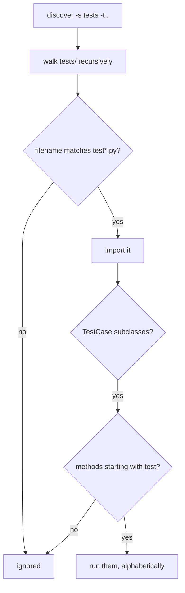

## Test discovery rules (common pattern)

Unittest can discover tests when:

- files match `test*.py`
- tests are under a folder like `tests/`
- test methods start with `test_`

## Typical project layout

```text
project/
  src/
    app.py
  tests/
    test_app.py
```

## Running discovery

From the project root:

```bash
python -m unittest discover
```

To specify a tests folder:

```bash
python -m unittest discover -s tests
```

## Run a specific test module

```bash
python -m unittest tests.test_app
```

## Tip

If discovery finds 0 tests, check:

- filenames
- class inherits from `unittest.TestCase`
- methods start with `test_`


## 🧪 Try It Yourself

### Exercise 1 – Write a unittest TestCase

<DataCampExercise
  lang="python"
  hint={`Subclass \`unittest.TestCase\` and use \`assertEqual\` to assert values.`}
  code={`# Task: Exercise 1 – Write a unittest TestCase
import unittest

def add(a, b):
    return a + b

class TestAdd(unittest.___):    # replace ___ with TestCase
    def test_positive(self):
        self.___(add(2, 3), 5)  # replace ___ with assertEqual

# Run inline
suite = unittest.TestLoader().loadTestsFromTestCase(TestAdd)
runner = unittest.TextTestRunner(verbosity=0)
result = runner.run(suite)
print("Tests run:", result.testsRun)
print("Failures:", len(result.failures))

# ── Expected Output ───────────────────────────────────────────
# Tests run: 1
# Failures: 0
# ──────────────────────────────────────────────────────────────`}
  solution={`import unittest

def add(a, b):
    return a + b

class TestAdd(unittest.TestCase):
    def test_positive(self):
        self.assertEqual(add(2, 3), 5)

suite = unittest.TestLoader().loadTestsFromTestCase(TestAdd)
runner = unittest.TextTestRunner(verbosity=0)
result = runner.run(suite)
print("Tests run:", result.testsRun)
print("Failures:", len(result.failures))`}
  sct={`test_output_contains("Tests run: 1")
test_output_contains("Failures: 0")
success_msg("unittest TestCase working!")`}
  height={160}
/>

### Exercise 2 – assertRaises

<DataCampExercise
  lang="python"
  hint={`Use \`self.assertRaises(ExceptionType)\` as a context manager.`}
  code={`# Task: Exercise 2 – assertRaises
import unittest

def divide(a, b):
    if b == 0:
        raise ValueError("Cannot divide by zero")
    return a / b

class TestDivide(unittest.TestCase):
    def test_zero(self):
        # Hint: use assertRaises to expect a ValueError
        with self.___(___):          # replace blanks: assertRaises, ValueError
            divide(10, 0)

suite = unittest.TestLoader().loadTestsFromTestCase(TestDivide)
result = unittest.TextTestRunner(verbosity=0).run(suite)
print("Passed:", result.wasSuccessful())

# ── Expected Output ───────────────────────────────────────────
# Passed: True
# ──────────────────────────────────────────────────────────────`}
  solution={`import unittest

def divide(a, b):
    if b == 0:
        raise ValueError("Cannot divide by zero")
    return a / b

class TestDivide(unittest.TestCase):
    def test_zero(self):
        with self.assertRaises(ValueError):
            divide(10, 0)

suite = unittest.TestLoader().loadTestsFromTestCase(TestDivide)
result = unittest.TextTestRunner(verbosity=0).run(suite)
print("Passed:", result.wasSuccessful())`}
  sct={`test_output_contains("Passed: True")
success_msg("assertRaises verifies exceptions!")`}
  height={160}
/>

### Exercise 3 – setUp and tearDown

<DataCampExercise
  lang="python"
  hint={`Override \`setUp\` to run before each test and \`tearDown\` after.`}
  code={`# Task: Exercise 3 – setUp and tearDown
import unittest

class TestLifecycle(unittest.TestCase):
    def ___(self):              # replace ___ with setUp
        self.data = [1, 2, 3]
        print("setUp called")

    def test_length(self):
        self.assertEqual(len(self.data), 3)

    def ___(self):              # replace ___ with tearDown
        print("tearDown called")

suite = unittest.TestLoader().loadTestsFromTestCase(TestLifecycle)
unittest.TextTestRunner(verbosity=0).run(suite)

# ── Expected Output includes ──────────────────────────────────
# setUp called
# tearDown called
# ──────────────────────────────────────────────────────────────`}
  solution={`import unittest

class TestLifecycle(unittest.TestCase):
    def setUp(self):
        self.data = [1, 2, 3]
        print("setUp called")

    def test_length(self):
        self.assertEqual(len(self.data), 3)

    def tearDown(self):
        print("tearDown called")

suite = unittest.TestLoader().loadTestsFromTestCase(TestLifecycle)
unittest.TextTestRunner(verbosity=0).run(suite)`}
  sct={`test_output_contains("setUp called")
test_output_contains("tearDown called")
success_msg("setUp/tearDown lifecycle works!")`}
  height={162}
/>

## What discovery looks for

```bash title="commands"
python -m unittest discover                 # from the current directory
python -m unittest discover -s tests -t .   # start in tests/, resolve imports from .
python -m unittest discover -p "check_*.py" # a different file pattern
python -m unittest discover -v              # name each test as it runs
```



Four things must all be true for a test to run, and each is a silent failure on its own:

1. the **file** matches `test*.py`
2. the **class** subclasses `unittest.TestCase`
3. the **method** name starts with `test`
4. the package is **importable** from the top-level directory

## `-s` and `-t` are different, and that is the usual problem

- `-s` is where to **start looking** for test files.
- `-t` is the **top-level directory**, which is what gets put on `sys.path`.

Running `discover -s tests` alone makes `tests/` the top level, so `from calc import add`
fails — `calc.py` lives one level up. Measured working invocation:

```bash title="what actually works"
python -m unittest discover -s tests -t .
```

with an `__init__.py` inside `tests/` so it is a package.

:::caution[A suite that finds nothing exits successfully]
`Ran 0 tests` is not an error. A green CI run can mean every test passed, or that
discovery matched nothing at all. Assert the count if that distinction matters:

```bash title="guard"
python -m unittest discover -v 2>&1 | tee out.txt
grep -q "Ran 0 tests" out.txt && exit 1
```
:::

## Reading the result line

Measured on a suite with eight tests:

```text title="output"
Ran 8 tests in 0.004s

FAILED (skipped=2, expected failures=1, unexpected successes=1)
```

Every counter there matters, and the run **failed** without a single ordinary failure —
because of the unexpected success, which the next page covers.

## See it move

```p5 title="Why a test did not run" desc="Four conditions must all hold before unittest runs a method. Any one of them failing is silent." height="340"
let cond = [true, true, true, true];
const LABEL = [
  'file matches test*.py',
  'class subclasses TestCase',
  'method name starts with test',
  'package importable from -t',
];
const FAILMSG = [
  'the file is never imported',
  'the class is not collected',
  'the method is skipped silently',
  'ImportError during collection',
];

function setup() {
  createCanvas(600, 340);
  textFont('monospace');
}

function draw() {
  background(13, 17, 23);
  let firstBad = -1;
  for (let i = 0; i < 4; i++) if (!cond[i] && firstBad < 0) firstBad = i;

  noStroke();
  fill(230);
  textSize(13);
  textAlign(LEFT, TOP);
  text('will this test run?', 24, 16);
  fill(120);
  textSize(11);
  text('click a condition to break it', 24, 36);

  for (let i = 0; i < 4; i++) {
    const y = 64 + i * 46;
    const ok = cond[i];
    stroke(ok ? color(120, 190, 130) : color(232, 110, 110));
    strokeWeight(1);
    fill(ok ? color(18, 30, 22) : color(32, 18, 20));
    rect(24, y, 400, 38, 4);
    noStroke();
    fill(ok ? color(120, 190, 130) : color(232, 110, 110));
    textSize(11);
    textAlign(LEFT, CENTER);
    text(LABEL[i], 38, y + 19);
    textAlign(RIGHT, CENTER);
    textSize(10);
    text(ok ? 'ok' : 'broken', 412, y + 19);
    if (!ok) {
      noStroke();
      fill(232, 110, 110);
      textAlign(LEFT, CENTER);
      textSize(10);
      text(FAILMSG[i], 436, y + 19);
    }
  }

  const runs = firstBad < 0;
  stroke(runs ? color(120, 190, 130) : color(255, 211, 67));
  strokeWeight(1);
  fill(18, 23, 30);
  rect(24, 256, 552, 54, 5);
  noStroke();
  fill(runs ? color(120, 190, 130) : color(255, 211, 67));
  textSize(14);
  textAlign(LEFT, TOP);
  text(runs ? 'Ran 1 test - OK' : 'Ran 0 tests - OK', 38, 268);
  fill(150);
  textSize(10);
  text(runs ? 'the test was collected and executed'
            : 'the suite reports success having executed nothing', 38, 290);

  fill(90);
  textSize(10);
  textAlign(LEFT, TOP);
  text('Ran 0 tests exits 0 - green CI does not prove tests ran', 24, 320);
}

function mousePressed() {
  for (let i = 0; i < 4; i++) {
    const y = 64 + i * 46;
    if (mouseX > 24 && mouseX < 424 && mouseY > y && mouseY < y + 38) cond[i] = !cond[i];
  }
}
```

## Check yourself

<Quiz
  questions={[
    {
      q: "What is the difference between -s and -t in unittest discover?",
      options: [
        "-s is silent mode and -t is timing",
        "-s is where to start looking for test files; -t is the top-level directory placed on sys.path",
        "they are aliases",
        "-t selects a single test",
      ],
      answer: 1,
      explain:
        "Running discover -s tests alone makes tests/ the top level, so importing a module one directory up fails. The working form measured here was -s tests -t .",
    },
    {
      q: "Discovery matches no files and the suite prints Ran 0 tests. What is the exit status?",
      options: [
        "non-zero, because nothing ran",
        "zero — success, indistinguishable from all tests passing",
        "it raises a collection error",
        "it depends on the -v flag",
      ],
      answer: 1,
      explain:
        "A green CI run can mean every test passed or that discovery matched nothing. Assert the count if the distinction matters.",
    },
    {
      q: "A test method is defined but never runs. Which of these would cause that silently?",
      options: [
        "the method name does not start with test",
        "the class does not subclass TestCase",
        "the file does not match test*.py",
        "any of the above",
      ],
      answer: 3,
      explain:
        "All four discovery conditions fail silently. That is why a suite can grow while its effective coverage quietly shrinks.",
    },
  ]}
/>
