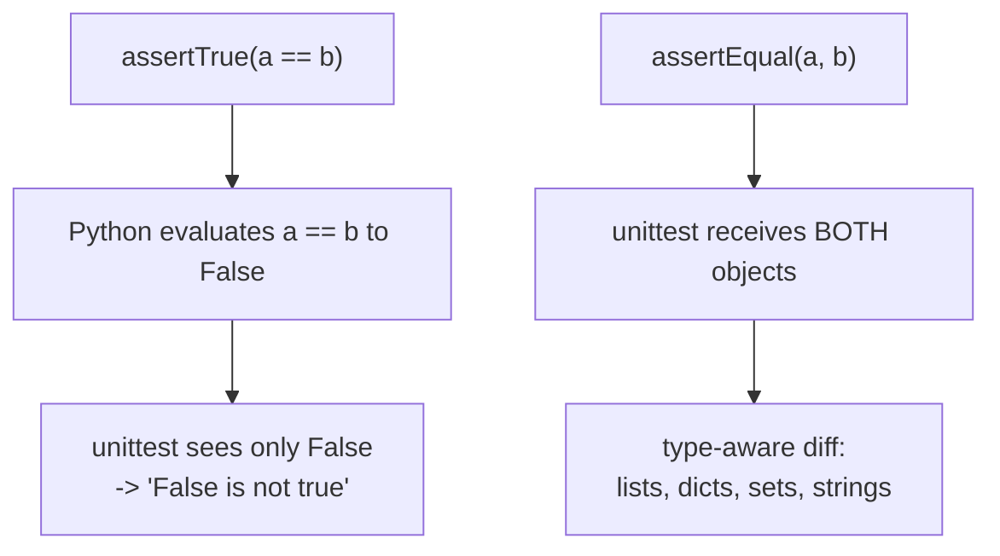

## Common assertions

### Equality

```python title="assert_equal.py" showLineNumbers{1}
self.assertEqual(actual, expected)
self.assertNotEqual(actual, expected)
```

### Truthiness

```python title="assert_truthy.py" showLineNumbers{1}
self.assertTrue(condition)
self.assertFalse(condition)
```

### None checks

```python title="assert_none.py" showLineNumbers{1}
self.assertIsNone(value)
self.assertIsNotNone(value)
```

### Identity / type

```python title="assert_type.py" showLineNumbers{1}
self.assertIs(a, b)
self.assertIsInstance(obj, dict)
```

## Testing exceptions

Use `assertRaises` for exception behavior.

```python title="assert_raises.py" showLineNumbers{1}
import unittest


def parse_age(s: str) -> int:
    age = int(s)
    if age < 0:
        raise ValueError("age must be >= 0")
    return age


class TestParseAge(unittest.TestCase):
    def test_negative_age_raises(self):
        with self.assertRaises(ValueError):
            parse_age("-1")
```

## Tip

Prefer specific assertions (e.g., `assertIsNone`) instead of `assertTrue(x is None)`.


## 🧪 Try It Yourself

### Exercise 1 – Write a unittest TestCase

<DataCampExercise
  lang="python"
  hint={`Subclass \`unittest.TestCase\` and use \`assertEqual\` to assert values.`}
  code={`# Task: Exercise 1 – Write a unittest TestCase
import unittest

def add(a, b):
    return a + b

class TestAdd(unittest.___):    # replace ___ with TestCase
    def test_positive(self):
        self.___(add(2, 3), 5)  # replace ___ with assertEqual

# Run inline
suite = unittest.TestLoader().loadTestsFromTestCase(TestAdd)
runner = unittest.TextTestRunner(verbosity=0)
result = runner.run(suite)
print("Tests run:", result.testsRun)
print("Failures:", len(result.failures))

# ── Expected Output ───────────────────────────────────────────
# Tests run: 1
# Failures: 0
# ──────────────────────────────────────────────────────────────`}
  solution={`import unittest

def add(a, b):
    return a + b

class TestAdd(unittest.TestCase):
    def test_positive(self):
        self.assertEqual(add(2, 3), 5)

suite = unittest.TestLoader().loadTestsFromTestCase(TestAdd)
runner = unittest.TextTestRunner(verbosity=0)
result = runner.run(suite)
print("Tests run:", result.testsRun)
print("Failures:", len(result.failures))`}
  sct={`test_output_contains("Tests run: 1")
test_output_contains("Failures: 0")
success_msg("unittest TestCase working!")`}
  height={160}
/>

### Exercise 2 – assertRaises

<DataCampExercise
  lang="python"
  hint={`Use \`self.assertRaises(ExceptionType)\` as a context manager.`}
  code={`# Task: Exercise 2 – assertRaises
import unittest

def divide(a, b):
    if b == 0:
        raise ValueError("Cannot divide by zero")
    return a / b

class TestDivide(unittest.TestCase):
    def test_zero(self):
        # Hint: use assertRaises to expect a ValueError
        with self.___(___):          # replace blanks: assertRaises, ValueError
            divide(10, 0)

suite = unittest.TestLoader().loadTestsFromTestCase(TestDivide)
result = unittest.TextTestRunner(verbosity=0).run(suite)
print("Passed:", result.wasSuccessful())

# ── Expected Output ───────────────────────────────────────────
# Passed: True
# ──────────────────────────────────────────────────────────────`}
  solution={`import unittest

def divide(a, b):
    if b == 0:
        raise ValueError("Cannot divide by zero")
    return a / b

class TestDivide(unittest.TestCase):
    def test_zero(self):
        with self.assertRaises(ValueError):
            divide(10, 0)

suite = unittest.TestLoader().loadTestsFromTestCase(TestDivide)
result = unittest.TextTestRunner(verbosity=0).run(suite)
print("Passed:", result.wasSuccessful())`}
  sct={`test_output_contains("Passed: True")
success_msg("assertRaises verifies exceptions!")`}
  height={160}
/>

### Exercise 3 – setUp and tearDown

<DataCampExercise
  lang="python"
  hint={`Override \`setUp\` to run before each test and \`tearDown\` after.`}
  code={`# Task: Exercise 3 – setUp and tearDown
import unittest

class TestLifecycle(unittest.TestCase):
    def ___(self):              # replace ___ with setUp
        self.data = [1, 2, 3]
        print("setUp called")

    def test_length(self):
        self.assertEqual(len(self.data), 3)

    def ___(self):              # replace ___ with tearDown
        print("tearDown called")

suite = unittest.TestLoader().loadTestsFromTestCase(TestLifecycle)
unittest.TextTestRunner(verbosity=0).run(suite)

# ── Expected Output includes ──────────────────────────────────
# setUp called
# tearDown called
# ──────────────────────────────────────────────────────────────`}
  solution={`import unittest

class TestLifecycle(unittest.TestCase):
    def setUp(self):
        self.data = [1, 2, 3]
        print("setUp called")

    def test_length(self):
        self.assertEqual(len(self.data), 3)

    def tearDown(self):
        print("tearDown called")

suite = unittest.TestLoader().loadTestsFromTestCase(TestLifecycle)
unittest.TextTestRunner(verbosity=0).run(suite)`}
  sct={`test_output_contains("setUp called")
test_output_contains("tearDown called")
success_msg("setUp/tearDown lifecycle works!")`}
  height={162}
/>

## The assertion you choose decides what a failure tells you

Both of these test the same thing. Only one is useful when it breaks:

```python title="tests/test_msgs.py" showLineNumbers{1}
def test_assertTrue_says_nothing(self):
    self.assertTrue([1, 2, 3] == [1, 2, 4])

def test_assertEqual_shows_a_diff(self):
    self.assertEqual([1, 2, 3], [1, 2, 4])
```

Measured output:

```text title="assertTrue"
AssertionError: False is not true
```

```text title="assertEqual"
AssertionError: Lists differ: [1, 2, 3] != [1, 2, 4]

First differing element 2:
3
4

- [1, 2, 3]
?        ^
+ [1, 2, 4]
?        ^
```

`assertTrue` reduced the comparison to a boolean **before** the framework saw it, so all it
could report was `False`. `assertEqual` received both objects and produced a diff naming
the differing element.



:::caution[Never wrap a comparison in assertTrue]
`assertTrue(x == y)`, `assertTrue(x in y)`, `assertTrue(len(x) == 3)` all throw away the
information you need. Use the assertion that matches the relationship.
:::

## The ones worth knowing

| assertion | use for |
|:--|:--|
| `assertEqual(a, b)` | any equality — gives type-aware diffs |
| `assertAlmostEqual(a, b)` | floats |
| `assertIn(a, b)` | membership, with both operands reported |
| `assertIs(a, b)` | identity — `None`, `True`, `False` |
| `assertIsNone(x)` | clearer than `assertEqual(x, None)` |
| `assertRaises(Err)` | as a context manager |
| `assertRaisesRegex(Err, "text")` | the exception **and** its message |
| `assertCountEqual(a, b)` | same items, order irrelevant |

## Floats need `assertAlmostEqual`

```python title="floats.py" showLineNumbers{1}
self.assertEqual(0.1 + 0.2, 0.3)         # AssertionError: 0.30000000000000004 != 0.3
self.assertAlmostEqual(0.1 + 0.2, 0.3)   # passes
```

Measured both. Binary floating point cannot represent `0.3` exactly, so exact equality is
the wrong question for any computed float.

## Testing that something raises

```python title="raises.py" showLineNumbers{1}
with self.assertRaises(ZeroDivisionError):
    div(1, 0)

with self.assertRaisesRegex(ZeroDivisionError, "cannot divide"):
    div(1, 0)
```

The context-manager form is important: `assertRaises(Err, div, 1, 0)` also works but reads
badly and cannot wrap several statements. Prefer `assertRaisesRegex` when the message
matters — a test that accepts *any* `ValueError` will keep passing when the code starts
failing for an entirely different reason.

## See it move

```p5 title="Same bug, different assertion" desc="assertTrue collapses the comparison to a boolean before the framework sees it. assertEqual receives both values and can diff them." height="330"
let which = 0;
const A = [
  { call: 'assertTrue([1,2,3] == [1,2,4])', out: ['AssertionError: False is not true'], good: false },
  { call: 'assertEqual([1,2,3], [1,2,4])', out: ['AssertionError: Lists differ:', '[1, 2, 3] != [1, 2, 4]', 'First differing element 2:', '3', '4'], good: true },
  { call: 'assertEqual(0.1 + 0.2, 0.3)', out: ['AssertionError:', '0.30000000000000004 != 0.3'], good: false },
  { call: 'assertAlmostEqual(0.1 + 0.2, 0.3)', out: ['passes'], good: true },
];

function setup() {
  createCanvas(600, 330);
  textFont('monospace');
}

function draw() {
  background(13, 17, 23);
  const a = A[which];

  noStroke();
  fill(230);
  textSize(12);
  textAlign(LEFT, TOP);
  text('the assertion you wrote', 24, 16);

  for (let i = 0; i < A.length; i++) {
    const y = 40 + i * 28;
    const on = i === which;
    stroke(on ? color(255, 211, 67) : color(40, 48, 58));
    strokeWeight(1);
    fill(on ? color(28, 34, 44) : color(17, 22, 29));
    rect(24, y, 350, 24, 3);
    noStroke();
    fill(on ? color(255, 211, 67) : 120);
    textSize(10);
    textAlign(LEFT, CENTER);
    text(A[i].call, 34, y + 12);
  }

  const c = a.good ? color(120, 190, 130) : color(232, 110, 110);
  stroke(c);
  strokeWeight(1);
  fill(18, 23, 30);
  rect(24, 168, 552, 108, 5);
  noStroke();
  fill(110);
  textSize(10);
  textAlign(LEFT, TOP);
  text('what the failure tells you', 38, 178);
  for (let i = 0; i < a.out.length; i++) {
    fill(c);
    textSize(12);
    text(a.out[i], 38, 200 + i * 17);
  }

  fill(a.good ? color(120, 190, 130) : color(232, 110, 110));
  textSize(11);
  textAlign(LEFT, TOP);
  text(a.good ? 'you can fix the bug from this message alone'
              : 'you now have to go and reproduce it by hand', 24, 292);
}

function mousePressed() {
  for (let i = 0; i < A.length; i++) {
    const y = 40 + i * 28;
    if (mouseX > 24 && mouseX < 374 && mouseY > y && mouseY < y + 24) which = i;
  }
}
```

## Check yourself

<Quiz
  questions={[
    {
      q: "assertTrue([1,2,3] == [1,2,4]) fails. What does it print?",
      options: [
        "a diff naming the differing element",
        "AssertionError: False is not true",
        "the two lists side by side",
        "nothing, it passes",
      ],
      answer: 1,
      explain:
        "Python evaluated the comparison to False before unittest saw it, so False is all it could report. assertEqual receives both objects and produces a diff.",
    },
    {
      q: "Why does assertEqual(0.1 + 0.2, 0.3) fail?",
      options: [
        "the arguments are in the wrong order",
        "binary floating point cannot represent 0.3 exactly, so the sum is 0.30000000000000004",
        "assertEqual does not support floats",
        "0.1 + 0.2 raises",
      ],
      answer: 1,
      explain:
        "Measured exactly that value. Use assertAlmostEqual for any computed float, which measured as passing.",
    },
    {
      q: "Why prefer assertRaisesRegex over assertRaises?",
      options: [
        "it is faster",
        "it checks the message too, so the test does not keep passing when the code starts failing for a different reason",
        "assertRaises is deprecated",
        "it can catch several exception types",
      ],
      answer: 1,
      explain:
        "A test that accepts any ValueError will happily pass on an unrelated ValueError introduced later.",
    },
  ]}
/>
