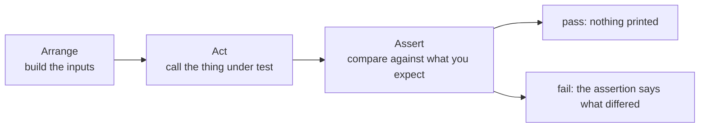

import Quiz from "../../../../components/Quiz.astro";

## The AAA pattern

A clean test follows **Arrange → Act → Assert**:

1. Arrange: set up inputs
2. Act: call the code under test
3. Assert: verify output/side effects

## Example: function + test

```python title="calculator.py" showLineNumbers{1}
def divide(a: float, b: float) -> float:
    return a / b
```

```python title="test_calculator.py" showLineNumbers{1}
import unittest
from calculator import divide


class TestCalculator(unittest.TestCase):
    def test_divide_returns_quotient(self):
        # Arrange
        a, b = 10, 2

        # Act
        result = divide(a, b)

        # Assert
        self.assertEqual(result, 5)


if __name__ == "__main__":
    unittest.main()
```

## Test naming tips

Good test names describe behavior:

- `test_divide_by_two_returns_half`
- `test_divide_by_zero_raises`

Avoid vague names like `test1`.

import DataCampExercise from "../../../../components/DataCampExercise.astro";

## 🧪 Try It Yourself

### Exercise 1 – Write a unittest TestCase

<DataCampExercise
  lang="python"
  hint={`Subclass \`unittest.TestCase\` and use \`assertEqual\` to assert values.`}
  code={`# Task: Exercise 1 – Write a unittest TestCase
import unittest

def add(a, b):
    return a + b

class TestAdd(unittest.___):    # replace ___ with TestCase
    def test_positive(self):
        self.___(add(2, 3), 5)  # replace ___ with assertEqual

# Run inline
suite = unittest.TestLoader().loadTestsFromTestCase(TestAdd)
runner = unittest.TextTestRunner(verbosity=0)
result = runner.run(suite)
print("Tests run:", result.testsRun)
print("Failures:", len(result.failures))

# ── Expected Output ───────────────────────────────────────────
# Tests run: 1
# Failures: 0
# ──────────────────────────────────────────────────────────────`}
  solution={`import unittest

def add(a, b):
    return a + b

class TestAdd(unittest.TestCase):
    def test_positive(self):
        self.assertEqual(add(2, 3), 5)

suite = unittest.TestLoader().loadTestsFromTestCase(TestAdd)
runner = unittest.TextTestRunner(verbosity=0)
result = runner.run(suite)
print("Tests run:", result.testsRun)
print("Failures:", len(result.failures))`}
  sct={`test_output_contains("Tests run: 1")
test_output_contains("Failures: 0")
success_msg("unittest TestCase working!")`}
  height={160}
/>

### Exercise 2 – assertRaises

<DataCampExercise
  lang="python"
  hint={`Use \`self.assertRaises(ExceptionType)\` as a context manager.`}
  code={`# Task: Exercise 2 – assertRaises
import unittest

def divide(a, b):
    if b == 0:
        raise ValueError("Cannot divide by zero")
    return a / b

class TestDivide(unittest.TestCase):
    def test_zero(self):
        # Hint: use assertRaises to expect a ValueError
        with self.___(___):          # replace blanks: assertRaises, ValueError
            divide(10, 0)

suite = unittest.TestLoader().loadTestsFromTestCase(TestDivide)
result = unittest.TextTestRunner(verbosity=0).run(suite)
print("Passed:", result.wasSuccessful())

# ── Expected Output ───────────────────────────────────────────
# Passed: True
# ──────────────────────────────────────────────────────────────`}
  solution={`import unittest

def divide(a, b):
    if b == 0:
        raise ValueError("Cannot divide by zero")
    return a / b

class TestDivide(unittest.TestCase):
    def test_zero(self):
        with self.assertRaises(ValueError):
            divide(10, 0)

suite = unittest.TestLoader().loadTestsFromTestCase(TestDivide)
result = unittest.TextTestRunner(verbosity=0).run(suite)
print("Passed:", result.wasSuccessful())`}
  sct={`test_output_contains("Passed: True")
success_msg("assertRaises verifies exceptions!")`}
  height={160}
/>

### Exercise 3 – setUp and tearDown

<DataCampExercise
  lang="python"
  hint={`Override \`setUp\` to run before each test and \`tearDown\` after.`}
  code={`# Task: Exercise 3 – setUp and tearDown
import unittest

class TestLifecycle(unittest.TestCase):
    def ___(self):              # replace ___ with setUp
        self.data = [1, 2, 3]
        print("setUp called")

    def test_length(self):
        self.assertEqual(len(self.data), 3)

    def ___(self):              # replace ___ with tearDown
        print("tearDown called")

suite = unittest.TestLoader().loadTestsFromTestCase(TestLifecycle)
unittest.TextTestRunner(verbosity=0).run(suite)

# ── Expected Output includes ──────────────────────────────────
# setUp called
# tearDown called
# ──────────────────────────────────────────────────────────────`}
  solution={`import unittest

class TestLifecycle(unittest.TestCase):
    def setUp(self):
        self.data = [1, 2, 3]
        print("setUp called")

    def test_length(self):
        self.assertEqual(len(self.data), 3)

    def tearDown(self):
        print("tearDown called")

suite = unittest.TestLoader().loadTestsFromTestCase(TestLifecycle)
unittest.TextTestRunner(verbosity=0).run(suite)`}
  sct={`test_output_contains("setUp called")
test_output_contains("tearDown called")
success_msg("setUp/tearDown lifecycle works!")`}
  height={162}
/>

## Arrange, Act, Assert

Every test has the same three parts, and naming them keeps a test readable when it fails
six months later:



```python title="tests/test_calc.py" showLineNumbers{1}
import unittest
from calc import add

class TestAdd(unittest.TestCase):
    def test_add(self):
        result = add(2, 3)          # Arrange and Act
        self.assertEqual(result, 5)  # Assert
```

Three rules the framework enforces, and one convention:

- The class must subclass **`unittest.TestCase`**.
- Test methods must start with **`test`** — a method named `check_add` is never run, and
  nothing warns you.
- Assertions come from `self`, not the `assert` statement (the next page shows why).
- The file is conventionally named `test_*.py` so discovery finds it.

## setUp, tearDown, and how often they run

```python title="fixtures.py" showLineNumbers{1}
class TestAdd(unittest.TestCase):
    @classmethod
    def setUpClass(cls):
        print("runs ONCE for the whole class")

    def setUp(self):
        self.log = ["setUp"]        # runs before EVERY test method

    def tearDown(self):
        pass                        # runs after every test method, even if it failed
```

Measured: `setUpClass` printed once across eight tests. `setUp` runs per test, which is
what gives each test a clean object to work with — and why one test cannot corrupt
another's state.

:::caution[Each test must not depend on another]
Tests run in **alphabetical order by method name**, not the order you wrote them. Measured
discovery order on a class defining `test_add` first and `test_unexpected_pass` last:

```text title="actual run order"
test_add, test_assertion_messages, test_known_bug, test_raises,
test_raises_message, test_skipif, test_skipped, test_unexpected_pass
```

A test that only passes after another has run will break the moment someone renames
either one.
:::

## Running it

```bash title="commands"
python -m unittest tests.test_calc          # one module
python -m unittest discover -s tests -t .   # find everything
python -m unittest discover -v              # name each test as it runs
```

## See it move

```p5 title="The order things actually run in" desc="setUpClass runs once, setUp runs before every test, and the tests themselves run in alphabetical order rather than the order written." height="340"
let t = 0;
let playing = true;
const SEQ = [
  { n: 'setUpClass', kind: 'class' },
  { n: 'setUp', kind: 'each' },
  { n: 'test_add', kind: 'test' },
  { n: 'tearDown', kind: 'each' },
  { n: 'setUp', kind: 'each' },
  { n: 'test_raises', kind: 'test' },
  { n: 'tearDown', kind: 'each' },
  { n: 'setUp', kind: 'each' },
  { n: 'test_skipped', kind: 'skip' },
  { n: 'tearDown', kind: 'each' },
  { n: 'tearDownClass', kind: 'class' },
];

function setup() {
  createCanvas(600, 340);
  textFont('monospace');
}

function colOf(k) {
  if (k === 'class') return color(200, 140, 220);
  if (k === 'each') return color(75, 139, 190);
  if (k === 'skip') return color(255, 211, 67);
  return color(120, 190, 130);
}

function draw() {
  background(13, 17, 23);
  if (playing) { t += 0.035; if (t > SEQ.length + 2) t = 0; }
  const at = floor(t);

  noStroke();
  fill(230);
  textSize(13);
  textAlign(LEFT, TOP);
  text('one TestCase class, three test methods', 24, 16);
  fill(120);
  textSize(11);
  text('purple = per class    blue = per test    green = a test', 24, 36);

  for (let i = 0; i < SEQ.length; i++) {
    const col = i % 2;
    const row = floor(i / 2);
    const x = 24 + col * 286;
    const y = 62 + row * 38;
    const done = i < at;
    const on = i === at;
    const c = colOf(SEQ[i].kind);
    stroke(on ? c : (done ? color(48, 56, 68) : color(32, 38, 46)));
    strokeWeight(on ? 2 : 1);
    fill(on ? color(red(c) * 0.2, green(c) * 0.2, blue(c) * 0.2) : color(17, 22, 29));
    rect(x, y, 270, 30, 4);
    noStroke();
    fill(on ? c : (done ? 120 : 60));
    textSize(11);
    textAlign(LEFT, CENTER);
    text((i + 1) + '. ' + SEQ[i].n, x + 12, y + 15);
    if (SEQ[i].kind === 'skip' && (on || done)) {
      fill(255, 211, 67);
      textAlign(RIGHT, CENTER);
      textSize(9);
      text('skipped', x + 258, y + 15);
    }
  }

  noStroke();
  fill(150);
  textSize(11);
  textAlign(LEFT, TOP);
  text('setUp and tearDown run around EVERY test, so no test inherits', 24, 282);
  text('another test\u0027s state', 24, 298);

  drawBtn(430, 292, 146, playing ? 'pause' : 'play');
}

function drawBtn(x, y, w, label) {
  const hot = mouseX > x && mouseX < x + w && mouseY > y && mouseY < y + 24;
  stroke(hot ? color(255, 211, 67) : color(60, 70, 84));
  strokeWeight(1);
  fill(hot ? color(34, 40, 50) : color(22, 28, 36));
  rect(x, y, w, 24, 4);
  noStroke();
  fill(hot ? color(255, 211, 67) : 200);
  textSize(11);
  textAlign(CENTER, CENTER);
  text(label, x + w / 2, y + 12);
}

function mousePressed() {
  if (mouseY > 292 && mouseY < 316 && mouseX > 430 && mouseX < 576) playing = !playing;
}
```

## Check yourself

<Quiz
  questions={[
    {
      q: "You write a method named check_addition inside a TestCase. What happens when you run the suite?",
      options: [
        "it runs like any other test",
        "it is never run, and nothing warns you",
        "it raises a collection error",
        "it runs only with -v",
      ],
      answer: 1,
      explain:
        "unittest collects methods whose names start with test. A misnamed method is silently ignored, which is why a suite can report all-passing while covering nothing.",
    },
    {
      q: "In what order do test methods within a TestCase run?",
      options: [
        "the order they are defined",
        "alphabetically by method name",
        "randomly on each run",
        "by how long they took last time",
      ],
      answer: 1,
      explain:
        "Measured: a class defining test_add first and test_unexpected_pass last ran them alphabetically. A test that depends on another running first will break on a rename.",
    },
    {
      q: "How often does setUpClass run compared with setUp?",
      options: [
        "both run before every test",
        "setUpClass runs once per class; setUp runs before every test method",
        "setUpClass runs before every test and setUp once",
        "both run once",
      ],
      answer: 1,
      explain:
        "Measured setUpClass printing once across eight tests. Per-test setUp is what gives each test a clean starting state.",
    },
  ]}
/>
