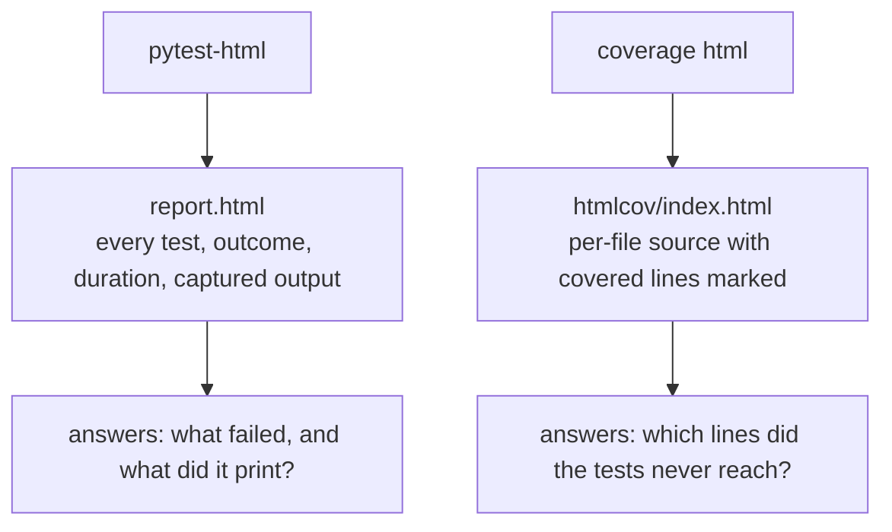

import Quiz from "../../../../components/Quiz.astro";

## Why HTML reports

Useful for:

- sharing results with teams
- CI artifacts
- historical tracking

## Common plugin

- `pytest-html`

## Example usage

```bash
pytest --html=report.html --self-contained-html
```

## Tips

- store reports as CI artifacts
- include environment info and versions

## Two different reports, often confused

```bash title="commands"
pytest --html=report.html --self-contained-html       # which TESTS ran
pytest --cov=shop --cov-report=html                    # which CODE ran
```



Measured artefacts from one run:

| file | size | contents |
|:--|--:|:--|
| `report.html` | **37,274 bytes** | the test run, self-contained |
| `htmlcov/index.html` | **4,686 bytes** | per-file coverage, plus assets |
| `coverage.xml` | **1,279 bytes** | `line-rate="0.8333"` for CI tools |
| `.coverage` | **53,248 bytes** | the raw SQLite data file |

`--self-contained-html` inlines the CSS and JavaScript so the file survives being emailed
or stored as a CI artefact. Without it the report needs its `assets/` directory alongside,
and it arrives unstyled.

## Machine-readable output matters more than the HTML

```bash title="for CI"
pytest --junitxml=results.xml        # test results, understood by most CI systems
pytest --cov --cov-report=xml        # coverage.xml for Codecov, SonarQube and friends
```

Measured `coverage.xml` carried `line-rate="0.8333"`, matching the 83% in the terminal.
CI systems parse these to annotate a pull request with which tests failed and which lines
a change left uncovered — which is where the information is actually useful, rather than
in a file someone has to open.

## Publishing them

```yaml title=".github/workflows/tests.yml" showLineNumbers{1}
- name: Run tests
  run: pytest --cov=myapp --cov-report=xml --junitxml=results.xml --html=report.html --self-contained-html

- name: Upload reports
  if: always()          # otherwise a failing test suite uploads nothing
  uses: actions/upload-artifact@v4
  with:
    name: test-reports
    path: |
      report.html
      results.xml
      coverage.xml
```

`if: always()` is the line worth copying. Without it the upload step is skipped when tests
fail — which is precisely the run whose report you wanted.

## Keep them out of version control

```text title=".gitignore"
report.html
htmlcov/
coverage.xml
.coverage
.pytest_cache/
```

These are build outputs. Committing them produces enormous diffs on every run and they are
stale the moment anything changes.

:::caution[A report is a record, not a signal]
Nobody opens an HTML report on a green build. The number that changes behaviour is the exit
code and the pull request annotation; the report is for the run where you already know
something is wrong and need the detail.
:::

## See it move

```p5 title="Which report answers which question" desc="pytest-html records the test run. coverage html records which lines the run reached. They are complementary, not alternatives." height="330"
let sel = 0;
const R = [
  { n: 'report.html', size: '37,274 bytes', q: 'which tests ran, what failed, what did they print?',
    has: ['every test with pass or fail', 'duration per test', 'captured stdout and logs'], c: [75, 139, 190] },
  { n: 'htmlcov/index.html', size: '4,686 bytes', q: 'which lines did the tests never reach?',
    has: ['per-file percentages', 'source with uncovered lines marked', 'missing branches'], c: [120, 190, 130] },
  { n: 'coverage.xml', size: '1,279 bytes', q: 'what should CI annotate the pull request with?',
    has: ['line-rate="0.8333"', 'machine readable', 'consumed by Codecov and SonarQube'], c: [255, 211, 67] },
];

function setup() {
  createCanvas(600, 330);
  textFont('monospace');
}

function draw() {
  background(13, 17, 23);
  const r = R[sel];

  noStroke();
  fill(230);
  textSize(13);
  textAlign(LEFT, TOP);
  text('artefacts from one pytest run', 24, 16);

  for (let i = 0; i < R.length; i++) {
    const x = 24 + i * 186;
    const on = i === sel;
    const c = R[i].c;
    stroke(on ? color(c[0], c[1], c[2]) : color(48, 56, 68));
    strokeWeight(on ? 2 : 1);
    fill(on ? color(c[0] * 0.18, c[1] * 0.18, c[2] * 0.18) : color(17, 22, 29));
    rect(x, 44, 174, 44, 4);
    noStroke();
    fill(on ? color(c[0], c[1], c[2]) : 110);
    textSize(10);
    textAlign(CENTER, TOP);
    text(R[i].n, x + 87, 54);
    fill(on ? 150 : 70);
    textSize(9);
    text(R[i].size, x + 87, 72);
  }

  stroke(r.c[0], r.c[1], r.c[2]);
  strokeWeight(1);
  fill(18, 23, 30);
  rect(24, 106, 552, 130, 5);
  noStroke();
  fill(110);
  textSize(10);
  textAlign(LEFT, TOP);
  text('the question it answers', 38, 116);
  fill(r.c[0], r.c[1], r.c[2]);
  textSize(12);
  text(r.q, 38, 136);
  fill(110);
  textSize(10);
  text('what is in it', 38, 166);
  for (let i = 0; i < r.has.length; i++) {
    fill(200);
    textSize(10);
    text('- ' + r.has[i], 38, 186 + i * 16);
  }

  fill(90);
  textSize(10);
  textAlign(LEFT, TOP);
  text('all three are build outputs - keep them out of version control', 24, 252);
  text('and upload them with if: always(), or a failing run uploads nothing', 24, 270);
}

function mousePressed() {
  for (let i = 0; i < R.length; i++) {
    const x = 24 + i * 186;
    if (mouseX > x && mouseX < x + 174 && mouseY > 44 && mouseY < 88) sel = i;
  }
}
```

## Check yourself

<Quiz
  questions={[
    {
      q: "What is the difference between report.html from pytest-html and htmlcov/index.html from coverage?",
      options: [
        "they are the same report in different formats",
        "one records which tests ran and what they printed; the other records which lines of source the run reached",
        "htmlcov is a summary of report.html",
        "report.html only appears when tests fail",
      ],
      answer: 1,
      explain:
        "They answer different questions and are complementary. Measured 37,274 bytes for the test report and 4,686 for the coverage index.",
    },
    {
      q: "Why pass --self-contained-html?",
      options: [
        "it makes the report smaller",
        "it inlines the CSS and JavaScript so the single file survives being emailed or stored as a CI artefact",
        "it is required for coverage",
        "it removes captured output",
      ],
      answer: 1,
      explain:
        "Without it the report needs its assets directory alongside and arrives unstyled.",
    },
    {
      q: "Why does the artifact-upload step in CI need if: always()?",
      options: [
        "to upload faster",
        "without it the step is skipped when tests fail — exactly the run whose report you wanted",
        "it is required by the action",
        "to overwrite the previous artifact",
      ],
      answer: 1,
      explain:
        "Steps are skipped by default once a previous step fails, so the report from the interesting run is the one you would lose.",
    },
  ]}
/>
