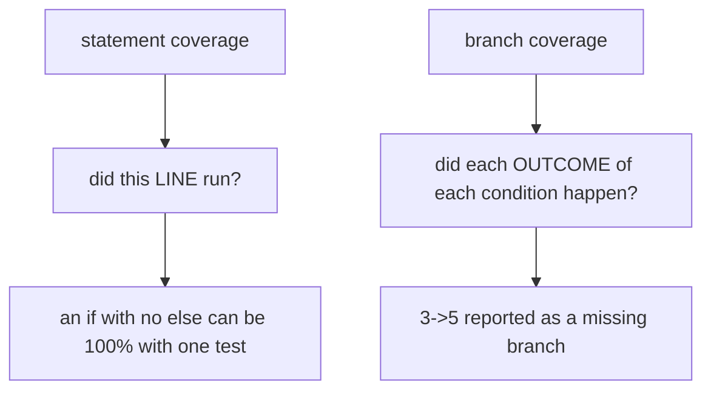

## What coverage tells you

Coverage measures which lines/branches ran during tests.

Coverage helps you find:

- untested code paths
- dead code

Coverage does **not** guarantee correctness.

## Using pytest-cov

Common setup:

- `pytest-cov` uses `coverage.py`

Run:

```bash
pytest --cov=src --cov-report=term-missing
```

HTML report:

```bash
pytest --cov=src --cov-report=html
```

## Good practice

- aim for meaningful coverage
- focus on risk areas
- don’t chase 100% blindly

## Running it

```bash title="commands"
pytest --cov=shop --cov-report=term-missing
pytest --cov=shop --cov-report=html         # browsable, htmlcov/index.html
pytest --cov=shop --cov-report=xml          # for CI tools
pytest --cov=shop --cov-fail-under=80       # exit 1 below the threshold
```

Measured on a small module:

```text title="term-missing"
Name      Stmts   Miss  Cover   Missing
---------------------------------------
shop.py      12      2    83%   11, 14
```

`Missing` is the column that matters. `83%` tells you how much; **lines 11 and 14** tell
you what to do next.

## The measurement that should change how you read a coverage number

A module with one `if`, and a single test that only exercises the true branch:

```python title="branchy.py" showLineNumbers{1}
def classify(n):
    label = "small"
    if n > 10:
        label = "big"
    return label
```

```python title="test_branchy.py" showLineNumbers{1}
def test_big():
    assert classify(50) == "big"
```

```text title="statement coverage"
branchy.py   5   0   100%
```

```text title="with --cov-branch"
branchy.py   5   0   2   1   86%   3->5
```

**100% against 86%.** Nothing ever passed a small number, so the `if` was never false, and
the `3->5` branch — falling straight from the condition to the return — was never taken.
Statement coverage cannot see it, because every *line* did execute.



Turn it on. It is one flag:

```ini title="pyproject.toml" showLineNumbers{1}
[tool.coverage.run]
branch = true
source = ["myapp"]
omit = ["*/migrations/*", "*/tests/*"]

[tool.coverage.report]
show_missing = true
skip_covered = true
exclude_lines = [
  "pragma: no cover",
  "if TYPE_CHECKING:",
  "raise NotImplementedError",
]
```

## Threshold behaviour

```bash title="measured exit codes"
pytest --cov=shop --cov-fail-under=90     # actual 83%  ->  exit 1
pytest --cov=shop                          #             ->  exit 0
```

A threshold is a ratchet, not a target. Setting it slightly below the current number stops
coverage falling; setting it at 100 encourages tests written to touch lines rather than to
check behaviour.

:::danger[Coverage measures execution, not verification]
A test that calls a function and asserts nothing gives full coverage of it. This passes,
and covers every line:

```python title="worthless.py" showLineNumbers{1}
def test_it_runs():
    price_with_tax(100)        # no assert
```

Coverage tells you what your tests **touched**. It cannot tell you what they **checked**.
:::

## What to do with the report

The useful reading is not the percentage but the `Missing` column and the HTML report's
red lines. Uncovered error handling and uncovered branches are where bugs live, because
they are exactly the paths nobody exercised by hand either.

## See it move

```p5 title="100% statement coverage, 86% branch coverage" desc="One test through the true side of a condition executes every line while never taking the false branch." height="340"
let tests = 1;   // 1 = only the big case, 2 = both

function setup() {
  createCanvas(600, 340);
  textFont('monospace');
}

function draw() {
  background(13, 17, 23);
  const both = tests === 2;
  const stmt = 100;
  const branch = both ? 100 : 86;

  noStroke();
  fill(230);
  textSize(12);
  textAlign(LEFT, TOP);
  text(both ? 'tests: classify(50) and classify(1)' : 'tests: classify(50) only', 24, 16);

  const LINES = ['def classify(n):', '    label = \u0022small\u0022', '    if n > 10:', '        label = \u0022big\u0022', '    return label'];
  for (let i = 0; i < LINES.length; i++) {
    const y = 46 + i * 28;
    stroke(120, 190, 130);
    strokeWeight(1);
    fill(18, 30, 22);
    rect(24, y, 400, 24, 3);
    noStroke();
    fill(120, 190, 130);
    textSize(11);
    textAlign(LEFT, CENTER);
    text(LINES[i], 34, y + 12);
    fill(90);
    textSize(9);
    textAlign(LEFT, CENTER);
    text('ran', 432, y + 12);
  }

  stroke(both ? color(120, 190, 130) : color(232, 110, 110));
  strokeWeight(2);
  const bx = 470;
  line(bx, 102, bx, 158);
  noStroke();
  fill(both ? color(120, 190, 130) : color(232, 110, 110));
  textSize(9);
  textAlign(LEFT, CENTER);
  text(both ? 'branch 3->5 taken' : 'branch 3->5 NEVER taken', bx + 6, 130);

  const bars = [
    { l: 'statement coverage', v: stmt, c: [120, 190, 130] },
    { l: 'branch coverage', v: branch, c: branch === 100 ? [120, 190, 130] : [232, 110, 110] },
  ];
  for (let i = 0; i < 2; i++) {
    const y = 202 + i * 46;
    noStroke();
    fill(150);
    textSize(10);
    textAlign(LEFT, TOP);
    text(bars[i].l, 24, y);
    stroke(48, 56, 68);
    strokeWeight(1);
    fill(17, 22, 29);
    rect(24, y + 16, 400, 20, 3);
    noStroke();
    fill(bars[i].c[0], bars[i].c[1], bars[i].c[2]);
    rect(25, y + 17, (bars[i].v / 100) * 398, 18, 2);
    fill(bars[i].c[0], bars[i].c[1], bars[i].c[2]);
    textSize(13);
    textAlign(LEFT, CENTER);
    text(bars[i].v + '%', 436, y + 26);
  }

  fill(both ? color(120, 190, 130) : color(232, 110, 110));
  textSize(11);
  textAlign(LEFT, TOP);
  text(both ? 'both outcomes exercised' : 'every line ran, and one outcome never happened', 24, 296);

  drawBtn(400, 292, 176, both ? 'tests: 2' : 'tests: 1');
}

function drawBtn(x, y, w, label) {
  const hot = mouseX > x && mouseX < x + w && mouseY > y && mouseY < y + 24;
  stroke(hot ? color(255, 211, 67) : color(60, 70, 84));
  strokeWeight(1);
  fill(hot ? color(34, 40, 50) : color(22, 28, 36));
  rect(x, y, w, 24, 4);
  noStroke();
  fill(hot ? color(255, 211, 67) : 200);
  textSize(11);
  textAlign(CENTER, CENTER);
  text(label, x + w / 2, y + 12);
}

function mousePressed() {
  if (mouseY > 292 && mouseY < 316 && mouseX > 400 && mouseX < 576) tests = tests === 1 ? 2 : 1;
}
```

## Check yourself

<Quiz
  questions={[
    {
      q: "A module scored 100% statement coverage and 86% branch coverage from the same single test. How?",
      options: [
        "the branch measurement is unreliable",
        "every line executed, but one outcome of an if never happened — the false branch was never taken",
        "branch coverage counts differently by design and is always lower",
        "the test failed",
      ],
      answer: 1,
      explain:
        "Measured the missing branch reported as 3->5. An if with no else can reach 100% statement coverage from a single test that only takes the true side.",
    },
    {
      q: "What does this test contribute to coverage: def test_it_runs(): price_with_tax(100)?",
      options: [
        "nothing, because it has no assert",
        "full coverage of every line it executes, while verifying nothing at all",
        "coverage only counts if an assertion passes",
        "it fails the run",
      ],
      answer: 1,
      explain:
        "Coverage measures execution, not verification. It tells you what your tests touched, never what they checked.",
    },
    {
      q: "pytest --cov=shop --cov-fail-under=90 on a module at 83% exits with what code?",
      options: [
        "0",
        "1",
        "5",
        "83",
      ],
      answer: 1,
      explain:
        "Measured exit 1. A threshold works best as a ratchet just below the current number, to stop coverage falling rather than to chase a target.",
    },
  ]}
/>
