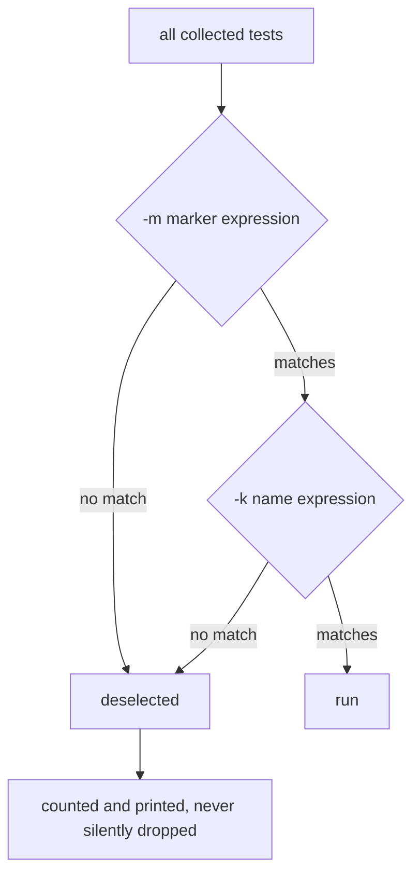

## Why markers

Markers let you categorize tests:

- `unit`
- `integration`
- `slow`

## Example

```python title="test_markers.py" showLineNumbers{1}
import pytest


@pytest.mark.unit
def test_fast():
    assert 1 + 1 == 2


@pytest.mark.slow
def test_slow():
    assert "a" * 1000
```

## Filtering by marker

Run only slow tests:

```bash
pytest -m slow
```

Exclude slow tests:

```bash
pytest -m "not slow"
```

## Register custom markers

In a real project, register markers in `pytest.ini` to avoid warnings.

## A marker is a label you can filter on

```python title="test_shop.py" showLineNumbers{1}
import pytest

@pytest.mark.slow
def test_marked_slow():
    assert discount(100, "HALF") == 50
```

```ini title="pytest.ini" showLineNumbers{1}
[pytest]
markers =
    slow: takes a long time
    integration: needs external services
```

Measured selection on a suite of 8 tests:

| command | result |
|:--|:--|
| `pytest` | `8 passed` |
| `pytest -m slow` | `1 passed, 7 deselected` |
| `pytest -m "not slow"` | `7 passed, 1 deselected` |
| `pytest -k discount` | `1 passed, 7 deselected` |

`-m` filters on **markers**; `-k` matches **test names** as a Python-ish expression
(`-k "discount and not slow"` works). Both report what they deselected, so you can always
see how much of the suite you just skipped.



## Register your markers

An unregistered marker still works, with a warning:

```text title="measured"
PytestUnknownMarkWarning: Unknown pytest.mark.typoed - is this a typo?
1 passed, 1 warning
```

That warning is the only thing standing between you and a silent typo. Registering markers
in `pytest.ini` and running with `--strict-markers` turns an unknown marker into a
collection **error** instead, which is what you want in CI.

:::caution[A typo in -m selects nothing, and exits 5]
```text title="measured"
pytest -m nosuchmark   ->  8 deselected, exit code 5
```
Exit code **5** means "no tests collected", which is distinct from 0. A CI step that only
checks for non-zero will catch it — but one that runs `pytest -m smoke || true`, or that
treats any completed run as success, will report green having run **nothing**.
:::

## The markers pytest gives you

| marker | effect |
|:--|:--|
| `@pytest.mark.skip(reason=...)` | never runs |
| `@pytest.mark.skipif(cond, reason=...)` | runs only when the condition is false |
| `@pytest.mark.xfail(reason=...)` | expected to fail; an unexpected pass is reported as `XPASS` |
| `@pytest.mark.parametrize(...)` | one test per case |

`xfail` is pytest's `expectedFailure`, with one useful addition: `strict=True` makes an
unexpected pass **fail** the run, which is the behaviour unittest gives you by default.

## A workflow markers make possible

```bash title="fast loop, full check"
pytest -m "not slow and not integration"     # on every save
pytest                                        # before pushing
pytest -m integration                         # nightly
```

Splitting a suite by cost is the difference between a test run people wait for and one
they skip.

## See it move

```p5 title="Selecting a subset" desc="Markers and name expressions both narrow the run, and both report how many tests they deselected." height="340"
let sel = 0;
const SEL = [
  { cmd: 'pytest', run: 8, desel: 0, note: 'everything' },
  { cmd: 'pytest -m slow', run: 1, desel: 7, note: 'only tests marked slow' },
  { cmd: 'pytest -m "not slow"', run: 7, desel: 1, note: 'everything except slow' },
  { cmd: 'pytest -k discount', run: 1, desel: 7, note: 'name contains discount' },
  { cmd: 'pytest -m nosuchmark', run: 0, desel: 8, note: 'typo - exit code 5, nothing ran' },
];

function setup() {
  createCanvas(600, 340);
  textFont('monospace');
}

function draw() {
  background(13, 17, 23);
  const s = SEL[sel];

  noStroke();
  fill(230);
  textSize(13);
  textAlign(LEFT, TOP);
  text(s.cmd, 24, 16);

  for (let i = 0; i < 8; i++) {
    const col = i % 4;
    const row = floor(i / 4);
    const x = 24 + col * 140;
    const y = 50 + row * 56;
    const ran = i < s.run;
    stroke(ran ? color(120, 190, 130) : color(48, 56, 68));
    strokeWeight(1);
    fill(ran ? color(18, 30, 22) : color(16, 20, 26));
    rect(x, y, 128, 44, 4);
    noStroke();
    fill(ran ? color(120, 190, 130) : 60);
    textSize(10);
    textAlign(CENTER, CENTER);
    text(ran ? 'ran' : 'deselected', x + 64, y + 22);
  }

  stroke(s.run === 0 ? color(232, 110, 110) : color(48, 56, 68));
  strokeWeight(1);
  fill(18, 23, 30);
  rect(24, 176, 552, 62, 5);
  noStroke();
  fill(s.run === 0 ? color(232, 110, 110) : color(120, 190, 130));
  textSize(16);
  textAlign(LEFT, TOP);
  text(s.run + ' passed, ' + s.desel + ' deselected', 38, 190);
  fill(150);
  textSize(10);
  text(s.note, 38, 214);

  if (s.run === 0) {
    fill(232, 110, 110);
    textSize(11);
    textAlign(LEFT, TOP);
    text('exit code 5 - no tests collected. a CI step that ignores it reports green', 24, 250);
  } else {
    fill(90);
    textSize(10);
    textAlign(LEFT, TOP);
    text('the deselected count is always printed, so nothing is silently dropped', 24, 250);
  }

  drawBtn(24, 288, 200, 'next selection');
}

function drawBtn(x, y, w, label) {
  const hot = mouseX > x && mouseX < x + w && mouseY > y && mouseY < y + 24;
  stroke(hot ? color(255, 211, 67) : color(60, 70, 84));
  strokeWeight(1);
  fill(hot ? color(34, 40, 50) : color(22, 28, 36));
  rect(x, y, w, 24, 4);
  noStroke();
  fill(hot ? color(255, 211, 67) : 200);
  textSize(11);
  textAlign(CENTER, CENTER);
  text(label, x + w / 2, y + 12);
}

function mousePressed() {
  if (mouseY > 288 && mouseY < 312 && mouseX > 24 && mouseX < 224) sel = (sel + 1) % SEL.length;
}
```

## Check yourself

<Quiz
  questions={[
    {
      q: "What is the difference between -m and -k?",
      options: [
        "-m matches names and -k matches markers",
        "-m filters on markers; -k matches test names as an expression",
        "they are aliases",
        "-k only accepts a single word",
      ],
      answer: 1,
      explain:
        "Measured: -m slow gave 1 passed 7 deselected, and -k discount also gave 1 passed 7 deselected but by matching the name.",
    },
    {
      q: "You run pytest -m smoke but mistype the marker. What happens?",
      options: [
        "pytest errors out immediately",
        "every test is deselected and the run exits with code 5, which a CI step that ignores exit codes will report as green",
        "all tests run instead",
        "the marker is created automatically",
      ],
      answer: 1,
      explain:
        "Measured 8 deselected and exit code 5. Registering markers and running with --strict-markers turns an unknown marker into a collection error.",
    },
    {
      q: "What does an unregistered marker produce by default?",
      options: [
        "a collection error",
        "a PytestUnknownMarkWarning, while the test still runs",
        "nothing at all",
        "the test is skipped",
      ],
      answer: 1,
      explain:
        "Measured 1 passed, 1 warning. The warning is the only signal that you mistyped a marker name, which is why --strict-markers is worth enabling.",
    },
  ]}
/>
