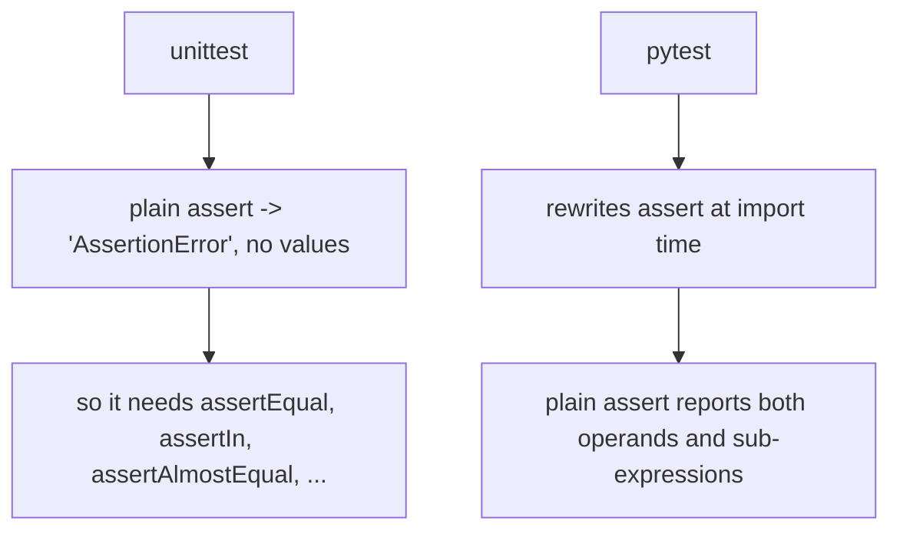

import Quiz from "../../../../components/Quiz.astro";

## Key differences

### unittest

- class-based (`unittest.TestCase`)
- assertion methods (`self.assertEqual`)
- more boilerplate

### pytest

- simple functions
- plain `assert`
- powerful fixtures
- rich plugin ecosystem

## Example comparison

### unittest

```python title="test_add_unittest.py" showLineNumbers{1}
import unittest


def add(a, b):
    return a + b


class TestAdd(unittest.TestCase):
    def test_add(self):
        self.assertEqual(add(2, 3), 5)
```

### pytest

```python title="test_add_pytest.py" showLineNumbers{1}

def add(a, b):
    return a + b


def test_add():
    assert add(2, 3) == 5
```

## Why teams like pytest

- less ceremony
- clearer failures
- fixtures scale better than setUp/tearDown
- easy parameterization

import DataCampExercise from "../../../../components/DataCampExercise.astro";

## 🧪 Try It Yourself

### Exercise 1 – Write a unittest TestCase

<DataCampExercise
  lang="python"
  hint={`Subclass \`unittest.TestCase\` and use \`assertEqual\` to assert values.`}
  code={`# Task: Exercise 1 – Write a unittest TestCase
import unittest

def add(a, b):
    return a + b

class TestAdd(unittest.___):    # replace ___ with TestCase
    def test_positive(self):
        self.___(add(2, 3), 5)  # replace ___ with assertEqual

# Run inline
suite = unittest.TestLoader().loadTestsFromTestCase(TestAdd)
runner = unittest.TextTestRunner(verbosity=0)
result = runner.run(suite)
print("Tests run:", result.testsRun)
print("Failures:", len(result.failures))

# ── Expected Output ───────────────────────────────────────────
# Tests run: 1
# Failures: 0
# ──────────────────────────────────────────────────────────────`}
  solution={`import unittest

def add(a, b):
    return a + b

class TestAdd(unittest.TestCase):
    def test_positive(self):
        self.assertEqual(add(2, 3), 5)

suite = unittest.TestLoader().loadTestsFromTestCase(TestAdd)
runner = unittest.TextTestRunner(verbosity=0)
result = runner.run(suite)
print("Tests run:", result.testsRun)
print("Failures:", len(result.failures))`}
  sct={`test_output_contains("Tests run: 1")
test_output_contains("Failures: 0")
success_msg("unittest TestCase working!")`}
  height={160}
/>

### Exercise 2 – assertRaises

<DataCampExercise
  lang="python"
  hint={`Use \`self.assertRaises(ExceptionType)\` as a context manager.`}
  code={`# Task: Exercise 2 – assertRaises
import unittest

def divide(a, b):
    if b == 0:
        raise ValueError("Cannot divide by zero")
    return a / b

class TestDivide(unittest.TestCase):
    def test_zero(self):
        # Hint: use assertRaises to expect a ValueError
        with self.___(___):          # replace blanks: assertRaises, ValueError
            divide(10, 0)

suite = unittest.TestLoader().loadTestsFromTestCase(TestDivide)
result = unittest.TextTestRunner(verbosity=0).run(suite)
print("Passed:", result.wasSuccessful())

# ── Expected Output ───────────────────────────────────────────
# Passed: True
# ──────────────────────────────────────────────────────────────`}
  solution={`import unittest

def divide(a, b):
    if b == 0:
        raise ValueError("Cannot divide by zero")
    return a / b

class TestDivide(unittest.TestCase):
    def test_zero(self):
        with self.assertRaises(ValueError):
            divide(10, 0)

suite = unittest.TestLoader().loadTestsFromTestCase(TestDivide)
result = unittest.TextTestRunner(verbosity=0).run(suite)
print("Passed:", result.wasSuccessful())`}
  sct={`test_output_contains("Passed: True")
success_msg("assertRaises verifies exceptions!")`}
  height={160}
/>

### Exercise 3 – setUp and tearDown

<DataCampExercise
  lang="python"
  hint={`Override \`setUp\` to run before each test and \`tearDown\` after.`}
  code={`# Task: Exercise 3 – setUp and tearDown
import unittest

class TestLifecycle(unittest.TestCase):
    def ___(self):              # replace ___ with setUp
        self.data = [1, 2, 3]
        print("setUp called")

    def test_length(self):
        self.assertEqual(len(self.data), 3)

    def ___(self):              # replace ___ with tearDown
        print("tearDown called")

suite = unittest.TestLoader().loadTestsFromTestCase(TestLifecycle)
unittest.TextTestRunner(verbosity=0).run(suite)

# ── Expected Output includes ──────────────────────────────────
# setUp called
# tearDown called
# ──────────────────────────────────────────────────────────────`}
  solution={`import unittest

class TestLifecycle(unittest.TestCase):
    def setUp(self):
        self.data = [1, 2, 3]
        print("setUp called")

    def test_length(self):
        self.assertEqual(len(self.data), 3)

    def tearDown(self):
        print("tearDown called")

suite = unittest.TestLoader().loadTestsFromTestCase(TestLifecycle)
unittest.TextTestRunner(verbosity=0).run(suite)`}
  sct={`test_output_contains("setUp called")
test_output_contains("tearDown called")
success_msg("setUp/tearDown lifecycle works!")`}
  height={162}
/>

## The same test, both frameworks

```python title="unittest" showLineNumbers{1}
import unittest
from shop import price_with_tax

class TestPricing(unittest.TestCase):
    def test_tax(self):
        self.assertEqual(price_with_tax(100), 120.0)
```

```python title="pytest" showLineNumbers{1}
from shop import price_with_tax

def test_tax():
    assert price_with_tax(100) == 120.0
```

No class, no `self`, no assertion vocabulary. What makes that possible is **assertion
rewriting** — pytest rewrites the bytecode of `assert` statements at import time so it can
report the operands:

```text title="measured pytest failure"
>       assert price_with_tax(100) == 121.0
E       assert 120.0 == 121.0
E        +  where 120.0 = price_with_tax(100)
```

It reported the comparison **and** the sub-expression that produced the left-hand side.
The same plain `assert` under unittest measured only `AssertionError`, with no values at
all.



## Running the same test suite

pytest **runs `unittest.TestCase` classes unchanged**. Adopting it does not mean rewriting
anything — you install it, run `pytest`, and your existing suite executes with better
failure output. New tests can then be written as plain functions.

## What you actually gain

| | unittest | pytest |
|:--|:--|:--|
| in the standard library | yes | no, `pip install pytest` |
| plain `assert` reports values | no | **yes** |
| many inputs | `subTest` | `@parametrize`, each case its own test |
| shared setup | `setUp` per class | fixtures, requested by name and scoped |
| selecting tests | by name | `-k` expressions and `-m` markers |
| plugins | few | a large ecosystem: coverage, HTML reports, xdist |
| runs the other's tests | no | **yes** |

Measured on a small suite: five test functions became **8 tests**, because one was
parametrized with four cases and each case is reported separately.

## When to stay with unittest

- A third-party dependency is genuinely unacceptable — pytest is not in the standard
  library.
- The codebase is large, stable, and nobody is complaining about the tests.

Otherwise the cost is one install and the benefit starts with the first failure you have to
diagnose.

## See it move

```p5 title="What the failure tells you" desc="pytest rewrites assert statements so a plain assert reports both operands. unittest needs a specific assertion method to say anything useful." height="330"
let which = 0;
const C = [
  { n: 'pytest, plain assert', out: ['assert 120.0 == 121.0', 'where 120.0 = price_with_tax(100)'], good: true },
  { n: 'unittest, plain assert', out: ['AssertionError'], good: false },
  { n: 'unittest, assertEqual', out: ['AssertionError: 120.0 != 121.0'], good: true },
];

function setup() {
  createCanvas(600, 330);
  textFont('monospace');
}

function draw() {
  background(13, 17, 23);
  const c = C[which];

  noStroke();
  fill(230);
  textSize(12);
  textAlign(LEFT, TOP);
  text('price_with_tax(100) returns 120.0; the test expects 121.0', 24, 16);

  for (let i = 0; i < C.length; i++) {
    const y = 46 + i * 30;
    const on = i === which;
    stroke(on ? color(255, 211, 67) : color(40, 48, 58));
    strokeWeight(1);
    fill(on ? color(28, 34, 44) : color(17, 22, 29));
    rect(24, y, 300, 26, 3);
    noStroke();
    fill(on ? color(255, 211, 67) : 120);
    textSize(11);
    textAlign(LEFT, CENTER);
    text(C[i].n, 34, y + 13);
  }

  const col = c.good ? color(120, 190, 130) : color(232, 110, 110);
  stroke(col);
  strokeWeight(1);
  fill(18, 23, 30);
  rect(24, 150, 552, 96, 5);
  noStroke();
  fill(110);
  textSize(10);
  textAlign(LEFT, TOP);
  text('what you see when it fails', 38, 160);
  for (let i = 0; i < c.out.length; i++) {
    fill(col);
    textSize(13);
    text(c.out[i], 38, 184 + i * 24);
  }

  fill(col);
  textSize(11);
  textAlign(LEFT, TOP);
  text(c.good ? 'enough to fix it without opening the file'
              : 'you know it failed, and nothing else', 24, 262);
  fill(90);
  textSize(10);
  text('pytest also runs unittest.TestCase classes unchanged', 24, 292);
}

function mousePressed() {
  for (let i = 0; i < C.length; i++) {
    const y = 46 + i * 30;
    if (mouseX > 24 && mouseX < 324 && mouseY > y && mouseY < y + 26) which = i;
  }
}
```

## Check yourself

<Quiz
  questions={[
    {
      q: "How can pytest report operand values from a plain assert when unittest cannot?",
      options: [
        "it inspects the stack after the exception",
        "it rewrites the bytecode of assert statements when it imports your test module",
        "plain assert always reports values in Python",
        "it runs the test twice",
      ],
      answer: 1,
      explain:
        "Measured pytest printing assert 120.0 == 121.0 plus where 120.0 = price_with_tax(100). The same plain assert under unittest printed only AssertionError.",
    },
    {
      q: "What does adopting pytest require you to do with an existing unittest suite?",
      options: [
        "rewrite every TestCase as functions",
        "nothing; pytest runs unittest.TestCase classes unchanged",
        "convert assertions first",
        "run the two suites separately",
      ],
      answer: 1,
      explain:
        "Install it, run pytest, and the existing suite executes with better failure output. New tests can be plain functions from then on.",
    },
    {
      q: "Five test functions produced 8 tests in the measured run. Why?",
      options: [
        "three tests ran twice",
        "one function was parametrized with four cases, and each case is a separate test",
        "fixtures added tests",
        "pytest retries failures",
      ],
      answer: 1,
      explain:
        "parametrize expands one function into independently named and reported tests, which is what makes a failing case identifiable.",
    },
  ]}
/>
