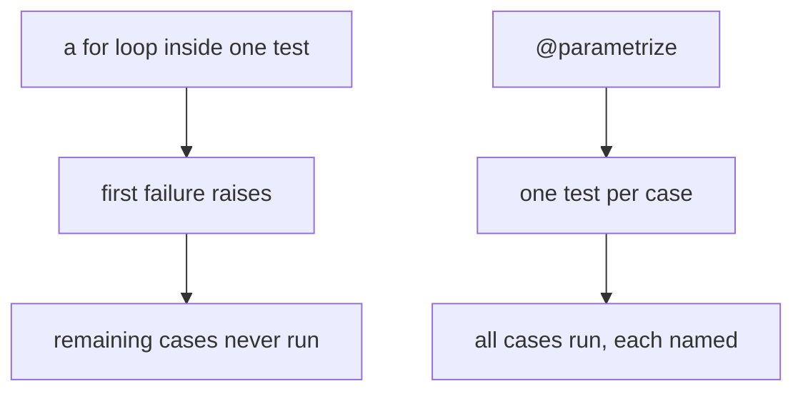

:::note[What plain `assert` prints when it fails]
pytest rewrites assert statements so the failure shows the actual values, which is why it needs
no `assertEqual` family. Comparing `[1, 2, 3]` with `[1, 2, 4]`:

```text
>       assert a == b
E       assert [1, 2, 3] == [1, 2, 4]
E
E         At index 2 diff: 3 != 4
```

It reported both sides *and* located the first difference. With `unittest` the same information
requires choosing the right assertion method; here one keyword covers every comparison.

The rewriting only happens in files pytest collects as tests. An `assert` inside your
application code is a plain assert with no introspection — and is stripped entirely when Python
runs with `-O`, which is why application logic should raise real exceptions rather than assert.
:::

## Assertion introspection

pytest rewrites asserts to show helpful diffs.

```python title="test_strings.py" showLineNumbers{1}

def test_username_format():
    username = "alice_01"
    assert username.startswith("alice")
    assert " " not in username
```

If a check fails, pytest shows:

- the values involved
- a readable explanation

## Testing exceptions

```python title="test_exceptions.py" showLineNumbers{1}
import pytest


def parse_age(s: str) -> int:
    age = int(s)
    if age < 0:
        raise ValueError("age must be >= 0")
    return age


def test_parse_age_negative():
    with pytest.raises(ValueError):
        parse_age("-1")
```

## Tip

Prefer many small asserts over one huge assert.


## 🧪 Try It Yourself

### Exercise 1 – Write a unittest TestCase

<DataCampExercise
  lang="python"
  hint={`Subclass \`unittest.TestCase\` and use \`assertEqual\` to assert values.`}
  code={`# Task: Exercise 1 – Write a unittest TestCase
import unittest

def add(a, b):
    return a + b

class TestAdd(unittest.___):    # replace ___ with TestCase
    def test_positive(self):
        self.___(add(2, 3), 5)  # replace ___ with assertEqual

# Run inline
suite = unittest.TestLoader().loadTestsFromTestCase(TestAdd)
runner = unittest.TextTestRunner(verbosity=0)
result = runner.run(suite)
print("Tests run:", result.testsRun)
print("Failures:", len(result.failures))

# ── Expected Output ───────────────────────────────────────────
# Tests run: 1
# Failures: 0
# ──────────────────────────────────────────────────────────────`}
  solution={`import unittest

def add(a, b):
    return a + b

class TestAdd(unittest.TestCase):
    def test_positive(self):
        self.assertEqual(add(2, 3), 5)

suite = unittest.TestLoader().loadTestsFromTestCase(TestAdd)
runner = unittest.TextTestRunner(verbosity=0)
result = runner.run(suite)
print("Tests run:", result.testsRun)
print("Failures:", len(result.failures))`}
  sct={`test_output_contains("Tests run: 1")
test_output_contains("Failures: 0")
success_msg("unittest TestCase working!")`}
  height={160}
/>

### Exercise 2 – assertRaises

<DataCampExercise
  lang="python"
  hint={`Use \`self.assertRaises(ExceptionType)\` as a context manager.`}
  code={`# Task: Exercise 2 – assertRaises
import unittest

def divide(a, b):
    if b == 0:
        raise ValueError("Cannot divide by zero")
    return a / b

class TestDivide(unittest.TestCase):
    def test_zero(self):
        # Hint: use assertRaises to expect a ValueError
        with self.___(___):          # replace blanks: assertRaises, ValueError
            divide(10, 0)

suite = unittest.TestLoader().loadTestsFromTestCase(TestDivide)
result = unittest.TextTestRunner(verbosity=0).run(suite)
print("Passed:", result.wasSuccessful())

# ── Expected Output ───────────────────────────────────────────
# Passed: True
# ──────────────────────────────────────────────────────────────`}
  solution={`import unittest

def divide(a, b):
    if b == 0:
        raise ValueError("Cannot divide by zero")
    return a / b

class TestDivide(unittest.TestCase):
    def test_zero(self):
        with self.assertRaises(ValueError):
            divide(10, 0)

suite = unittest.TestLoader().loadTestsFromTestCase(TestDivide)
result = unittest.TextTestRunner(verbosity=0).run(suite)
print("Passed:", result.wasSuccessful())`}
  sct={`test_output_contains("Passed: True")
success_msg("assertRaises verifies exceptions!")`}
  height={160}
/>

### Exercise 3 – setUp and tearDown

<DataCampExercise
  lang="python"
  hint={`Override \`setUp\` to run before each test and \`tearDown\` after.`}
  code={`# Task: Exercise 3 – setUp and tearDown
import unittest

class TestLifecycle(unittest.TestCase):
    def ___(self):              # replace ___ with setUp
        self.data = [1, 2, 3]
        print("setUp called")

    def test_length(self):
        self.assertEqual(len(self.data), 3)

    def ___(self):              # replace ___ with tearDown
        print("tearDown called")

suite = unittest.TestLoader().loadTestsFromTestCase(TestLifecycle)
unittest.TextTestRunner(verbosity=0).run(suite)

# ── Expected Output includes ──────────────────────────────────
# setUp called
# tearDown called
# ──────────────────────────────────────────────────────────────`}
  solution={`import unittest

class TestLifecycle(unittest.TestCase):
    def setUp(self):
        self.data = [1, 2, 3]
        print("setUp called")

    def test_length(self):
        self.assertEqual(len(self.data), 3)

    def tearDown(self):
        print("tearDown called")

suite = unittest.TestLoader().loadTestsFromTestCase(TestLifecycle)
unittest.TextTestRunner(verbosity=0).run(suite)`}
  sct={`test_output_contains("setUp called")
test_output_contains("tearDown called")
success_msg("setUp/tearDown lifecycle works!")`}
  height={162}
/>

## One statement, no vocabulary to learn

```python title="test_shop.py" showLineNumbers{1}
def test_tax():
    assert price_with_tax(100) == 120.0

def test_in():
    assert "cat" in "concatenate"

def test_almost():
    assert price_with_tax(19.99) == 23.99
```

Measured failure output:

```text title="pytest -q"
>       assert price_with_tax(100) == 121.0
E       assert 120.0 == 121.0
E        +  where 120.0 = price_with_tax(100)
```

The `+ where` line is the part worth noticing: pytest reports not only the comparison but
**the sub-expressions that produced it**, so you often do not need to open the file.

## Testing exceptions

```python title="raises.py" showLineNumbers{1}
import pytest

def test_negative_raises():
    with pytest.raises(ValueError, match="must not be negative"):
        price_with_tax(-1)
```

`match=` takes a regular expression and is searched against the message. Without it, the
test passes for **any** `ValueError` — including one raised for a completely different
reason later.

```python title="capture.py" showLineNumbers{1}
def test_message_details():
    with pytest.raises(ValueError) as exc:
        price_with_tax(-1)
    assert "negative" in str(exc.value)
```

## Parametrize instead of looping

```python title="parametrize.py" showLineNumbers{1}
@pytest.mark.parametrize("price,rate,want", [
    (100, 0.2, 120.0),
    (50, 0.1, 55.0),
    (0, 0.2, 0.0),
    (19.99, 0.2, 23.99),
])
def test_tax(price, rate, want):
    assert price_with_tax(price, rate) == want
```

Four independent tests, each named and reported separately. A loop inside one test stops at
the first failure and hides the rest; parametrize runs them all and tells you exactly which
inputs broke.



## Floats

```python title="approx.py" showLineNumbers{1}
assert 0.1 + 0.2 == pytest.approx(0.3)
assert result == pytest.approx(expected, rel=1e-3)
```

`pytest.approx` is the equivalent of `assertAlmostEqual`, and it works inside lists and
dicts too — `assert [0.1 + 0.2] == pytest.approx([0.3])`.

:::caution[Do not put several unrelated assertions in one test]
The first failure ends the test, so later assertions never run and you fix the failures one
re-run at a time. Several assertions describing **one** outcome are fine; several
describing different outcomes should be different tests.
:::

## See it move

```p5 title="A loop against parametrize" desc="A loop inside one test stops at the first failing case. parametrize makes each case its own test, so every failure is reported in one run." height="340"
let mode = 0;
const CASES = [
  { i: '(100, 0.2)', ok: true },
  { i: '(50, 0.1)', ok: false },
  { i: '(0, 0.2)', ok: true },
  { i: '(19.99, 0.2)', ok: false },
];

function setup() {
  createCanvas(600, 340);
  textFont('monospace');
}

function draw() {
  background(13, 17, 23);
  const param = mode === 1;

  noStroke();
  fill(230);
  textSize(13);
  textAlign(LEFT, TOP);
  text(param ? '@pytest.mark.parametrize - one test per case'
             : 'for case in cases:  assert ... - one test, a loop inside', 24, 16);

  let stopped = false;
  let reported = 0;
  for (let i = 0; i < CASES.length; i++) {
    const y = 52 + i * 44;
    const c = CASES[i];
    let state;
    if (param) state = c.ok ? 'passed' : 'FAILED';
    else if (stopped) state = 'never ran';
    else state = c.ok ? 'passed' : 'FAILED';
    if (!param && !c.ok) stopped = true;
    if (state === 'FAILED') reported++;

    const col = state === 'passed' ? color(120, 190, 130)
      : (state === 'FAILED' ? color(232, 110, 110) : color(70, 78, 88));
    stroke(col);
    strokeWeight(1);
    fill(state === 'never ran' ? color(16, 20, 26) : color(18, 23, 30));
    rect(24, y, 400, 36, 4);
    noStroke();
    fill(col);
    textSize(11);
    textAlign(LEFT, CENTER);
    text(c.i, 38, y + 18);
    textAlign(RIGHT, CENTER);
    text(state, 412, y + 18);
  }

  stroke(48, 56, 68);
  strokeWeight(1);
  fill(18, 23, 30);
  rect(24, 236, 552, 54, 5);
  noStroke();
  fill(110);
  textSize(10);
  textAlign(LEFT, TOP);
  text('failures you learn about in this run', 38, 246);
  fill(reported === 2 ? color(120, 190, 130) : color(232, 110, 110));
  textSize(18);
  text(reported + ' of 2', 38, 264);
  fill(150);
  textSize(10);
  text(param ? 'both bad inputs identified at once'
             : 'the second failure is hidden until you fix the first', 130, 270);

  drawBtn(24, 302, 250, param ? 'style: parametrize' : 'style: loop');
}

function drawBtn(x, y, w, label) {
  const hot = mouseX > x && mouseX < x + w && mouseY > y && mouseY < y + 24;
  stroke(hot ? color(255, 211, 67) : color(60, 70, 84));
  strokeWeight(1);
  fill(hot ? color(34, 40, 50) : color(22, 28, 36));
  rect(x, y, w, 24, 4);
  noStroke();
  fill(hot ? color(255, 211, 67) : 200);
  textSize(11);
  textAlign(CENTER, CENTER);
  text(label, x + w / 2, y + 12);
}

function mousePressed() {
  if (mouseY > 302 && mouseY < 326 && mouseX > 24 && mouseX < 274) mode = 1 - mode;
}
```

## Check yourself

<Quiz
  questions={[
    {
      q: "What does the line starting with + where add to a pytest failure?",
      options: [
        "the file and line number",
        "the value of a sub-expression, such as where 120.0 = price_with_tax(100)",
        "a suggested fix",
        "the test's duration",
      ],
      answer: 1,
      explain:
        "Reporting the intermediate value is often enough to diagnose the failure without opening the file.",
    },
    {
      q: "Why prefer @parametrize over a for loop inside one test?",
      options: [
        "loops are slower",
        "the loop stops at the first failing case, while parametrize runs every case as its own test and reports all failures in one run",
        "loops cannot use assert",
        "parametrize retries failures",
      ],
      answer: 1,
      explain:
        "Each parametrized case is named independently, so a failure identifies exactly which inputs broke.",
    },
    {
      q: "What is wrong with pytest.raises(ValueError) without match=?",
      options: [
        "it does not catch subclasses",
        "it passes for any ValueError, including one raised later for an entirely different reason",
        "it requires a context manager",
        "it swallows the exception",
      ],
      answer: 1,
      explain:
        "match= takes a regular expression searched against the message, which keeps the test tied to the failure it was written for.",
    },
  ]}
/>
