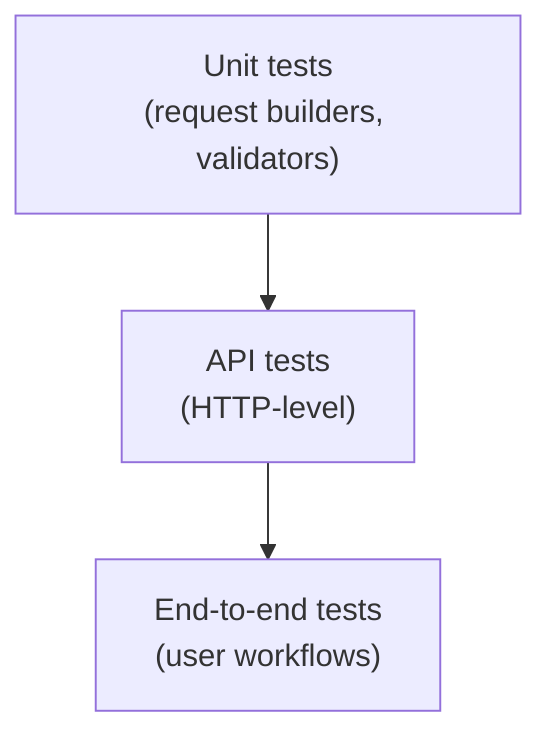

## What you'll learn

- What API testing is and how it differs from UI and unit testing
- The HTTP basics every API tester needs: methods, status codes, headers and bodies
- What to check in a response: status, schema, values, errors and auth
- How to write deterministic API tests in Python
- Why idempotency and error paths deserve their own tests

## What is API testing?

API testing validates a service at the HTTP interface level:

- requests and responses
- status codes and headers
- payload correctness (JSON shape)
- authentication/authorization
- error handling and rate limits

## What to test (checklist)

- **Status codes**: 200/201/204, 400/401/403/404, 429, 5xx
- **Response body**: required keys, value types, constraints
- **Contracts**: backwards compatibility
- **Auth**: missing token, invalid token, role permissions
- **Idempotency**: repeated requests behave correctly
- **Performance**: basic response time budgets

## Why test at the API level?

A UI test clicks through a browser. It is slow and breaks when a button moves. An API test talks straight to the service, so it is fast, stable and pinpoints failures. It also sits in the middle of the test pyramid: broader than a unit test, much cheaper than an end-to-end test.

## HTTP in five minutes

| Method | Typical use | Safe | Idempotent |
| --- | --- | --- | --- |
| GET | Read a resource | Yes | Yes |
| POST | Create a resource | No | No |
| PUT | Replace a resource | No | Yes |
| PATCH | Partially update | No | Usually not guaranteed |
| DELETE | Remove a resource | No | Yes |

| Status family | Meaning | Examples |
| --- | --- | --- |
| 2xx | Success | 200 OK, 201 Created, 204 No Content |
| 3xx | Redirect | 301, 304 |
| 4xx | Client error | 400 Bad Request, 401 Unauthorized, 403 Forbidden, 404 Not Found, 429 Too Many Requests |
| 5xx | Server error | 500, 502, 503 |

A request has a method, a URL, headers (such as Authorization and Content-Type) and sometimes a body. A response has a status code, headers and usually a JSON body.

## Your first API test

The example below tests a tiny function that plays the role of a service, so it runs anywhere with no network. The same assertions work against a real HTTP response.

```python title="test_user_api.py" showLineNumbers{1}
import unittest

USERS = {1: {"id": 1, "name": "Ada", "email": "ada@example.com"}}

def get_user(user_id):
    """Pretend endpoint: GET /users/<id>. Returns (status, body)."""
    if not isinstance(user_id, int):
        return 400, {"error": "id must be an integer"}
    user = USERS.get(user_id)
    if user is None:
        return 404, {"error": "user not found"}
    return 200, user

class TestGetUser(unittest.TestCase):
    def test_found(self):
        status, body = get_user(1)
        self.assertEqual(status, 200)
        self.assertEqual(body["name"], "Ada")

    def test_schema(self):
        _, body = get_user(1)
        self.assertEqual(set(body), {"id", "name", "email"})
        self.assertIsInstance(body["id"], int)

    def test_not_found(self):
        status, body = get_user(99)
        self.assertEqual(status, 404)
        self.assertIn("error", body)

    def test_bad_input(self):
        status, _ = get_user("abc")
        self.assertEqual(status, 400)

if __name__ == "__main__":
    unittest.main()
```

Notice that the error paths (404, 400) get as much attention as the happy path. Most real bugs live there.

## Testing a real HTTP API

With the `requests` library the shape is the same. Check the status first, then the body.

```python title="test_http_api.py" showLineNumbers{1}
import requests

BASE = "https://api.example.com"

def test_list_users():
    resp = requests.get(f"{BASE}/users", timeout=5)
    assert resp.status_code == 200
    assert resp.headers["Content-Type"].startswith("application/json")
    data = resp.json()
    assert isinstance(data, list)

def test_missing_token_is_rejected():
    resp = requests.get(f"{BASE}/private", timeout=5)
    assert resp.status_code == 401
```

Always pass a `timeout`. Without one, a hung server hangs your test run.

## Checking the response body

- **Required keys**: every field the contract promises is present.
- **Types**: ids are integers, names are strings, dates match a format.
- **Constraints**: a price is not negative, a list is not longer than the page size.
- **No leaks**: passwords or internal fields never appear.

## Idempotency

An operation is idempotent when repeating it gives the same final state. Repeating `DELETE /users/1` should leave the user deleted both times (the second call may return 404 or 204, but never break anything). Repeating a `POST` that creates an order, however, makes two orders unless the API uses an idempotency key. Test both behaviours.

## Keeping tests deterministic

- Create the data your test needs, and clean it up afterwards.
- Do not depend on the order tests run in.
- Replace third-party services with fakes or mocks so CI does not flake.
- Do not assert on values that change, such as timestamps or random ids. Assert on their type or format.

## Diagram: test levels around an API



## Tip

- Write API tests as deterministic as possible.
- Avoid relying on external services in CI.

## Visualize it

An API test builds a request, sends it to the endpoint, and checks the response before reporting pass or fail.

```mermaid title="API Test Flow" desc="An API test builds a request, sends it, checks the response, and reports pass or fail."
flowchart LR
A["Build request"] --> B["Send to endpoint"]
B --> C["Receive response"]
C --> D["Assert status code + body"]
D --> E["Pass"]
D --> F["Fail"]
```

## Check what you learned

<Quiz
  questions={[
    {
      q: "A request arrives with no authentication token. Which status code should a protected endpoint return?",
      options: [
        "200 OK",
        "201 Created",
        "401 Unauthorized",
        "500 Internal Server Error",
      ],
      answer: 2,
      explain: "401 means the caller is not authenticated. 403 means authenticated but not allowed. Both should have tests.",
    },
    {
      q: "Why should API tests cover error responses such as 400 and 404?",
      options: [
        "Because they are easier to write",
        "Because error handling is a promised part of the contract and a common source of bugs",
        "Because happy paths never fail",
        "Because status codes do not matter",
      ],
      answer: 1,
      explain: "Clients depend on predictable errors. A missing or wrong error path breaks them just as much as a broken success path.",
    },
    {
      q: "Which HTTP method is naturally idempotent?",
      options: [
        "POST that creates a new order each time",
        "PUT that replaces a resource with the same body",
        "A POST without any idempotency key",
        "None of them",
      ],
      answer: 1,
      explain: "Sending the same PUT again leaves the resource in the same state. A plain POST that creates records is not idempotent.",
    },
  ]}
/>


## 🧪 Try It Yourself

### Exercise 1 – Write a unittest TestCase

<DataCampExercise
  lang="python"
  hint={`Subclass \`unittest.TestCase\` and use \`assertEqual\` to assert values.`}
  code={`# Task: Exercise 1 – Write a unittest TestCase
import unittest

def add(a, b):
    return a + b

class TestAdd(unittest.___):    # replace ___ with TestCase
    def test_positive(self):
        self.___(add(2, 3), 5)  # replace ___ with assertEqual

# Run inline
suite = unittest.TestLoader().loadTestsFromTestCase(TestAdd)
runner = unittest.TextTestRunner(verbosity=0)
result = runner.run(suite)
print("Tests run:", result.testsRun)
print("Failures:", len(result.failures))

# ── Expected Output ───────────────────────────────────────────
# Tests run: 1
# Failures: 0
# ──────────────────────────────────────────────────────────────`}
  solution={`import unittest

def add(a, b):
    return a + b

class TestAdd(unittest.TestCase):
    def test_positive(self):
        self.assertEqual(add(2, 3), 5)

suite = unittest.TestLoader().loadTestsFromTestCase(TestAdd)
runner = unittest.TextTestRunner(verbosity=0)
result = runner.run(suite)
print("Tests run:", result.testsRun)
print("Failures:", len(result.failures))`}
  sct={`test_output_contains("Tests run: 1")
test_output_contains("Failures: 0")
success_msg("unittest TestCase working!")`}
  height={160}
/>

### Exercise 2 – assertRaises

<DataCampExercise
  lang="python"
  hint={`Use \`self.assertRaises(ExceptionType)\` as a context manager.`}
  code={`# Task: Exercise 2 – assertRaises
import unittest

def divide(a, b):
    if b == 0:
        raise ValueError("Cannot divide by zero")
    return a / b

class TestDivide(unittest.TestCase):
    def test_zero(self):
        # Hint: use assertRaises to expect a ValueError
        with self.___(___):          # replace blanks: assertRaises, ValueError
            divide(10, 0)

suite = unittest.TestLoader().loadTestsFromTestCase(TestDivide)
result = unittest.TextTestRunner(verbosity=0).run(suite)
print("Passed:", result.wasSuccessful())

# ── Expected Output ───────────────────────────────────────────
# Passed: True
# ──────────────────────────────────────────────────────────────`}
  solution={`import unittest

def divide(a, b):
    if b == 0:
        raise ValueError("Cannot divide by zero")
    return a / b

class TestDivide(unittest.TestCase):
    def test_zero(self):
        with self.assertRaises(ValueError):
            divide(10, 0)

suite = unittest.TestLoader().loadTestsFromTestCase(TestDivide)
result = unittest.TextTestRunner(verbosity=0).run(suite)
print("Passed:", result.wasSuccessful())`}
  sct={`test_output_contains("Passed: True")
success_msg("assertRaises verifies exceptions!")`}
  height={160}
/>

### Exercise 3 – setUp and tearDown

<DataCampExercise
  lang="python"
  hint={`Override \`setUp\` to run before each test and \`tearDown\` after.`}
  code={`# Task: Exercise 3 – setUp and tearDown
import unittest

class TestLifecycle(unittest.TestCase):
    def ___(self):              # replace ___ with setUp
        self.data = [1, 2, 3]
        print("setUp called")

    def test_length(self):
        self.assertEqual(len(self.data), 3)

    def ___(self):              # replace ___ with tearDown
        print("tearDown called")

suite = unittest.TestLoader().loadTestsFromTestCase(TestLifecycle)
unittest.TextTestRunner(verbosity=0).run(suite)

# ── Expected Output includes ──────────────────────────────────
# setUp called
# tearDown called
# ──────────────────────────────────────────────────────────────`}
  solution={`import unittest

class TestLifecycle(unittest.TestCase):
    def setUp(self):
        self.data = [1, 2, 3]
        print("setUp called")

    def test_length(self):
        self.assertEqual(len(self.data), 3)

    def tearDown(self):
        print("tearDown called")

suite = unittest.TestLoader().loadTestsFromTestCase(TestLifecycle)
unittest.TextTestRunner(verbosity=0).run(suite)`}
  sct={`test_output_contains("setUp called")
test_output_contains("tearDown called")
success_msg("setUp/tearDown lifecycle works!")`}
  height={162}
/>

