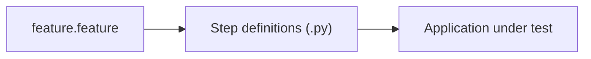

## What is BDD?

BDD (Behavior-Driven Development) focuses on:

- shared understanding between dev/QA/product
- writing behavior examples first

BDD uses:

- **Gherkin** feature files (Given/When/Then)
- step definitions in code

## When BDD is useful

- multiple stakeholders collaborate
- requirements are unclear or change often
- acceptance criteria must be traceable

## How behave fits

`behave` runs feature scenarios and maps steps to Python.



## The problem BDD tries to solve

Many defects come from misunderstanding, not from bad code. A product owner says "customers get free shipping on big orders" and each person imagines a different threshold. BDD tackles this by having product, developers and testers write concrete examples together before coding. The examples are written in plain language, and because they are executable they become the tests too.

## The three parts

1. **A feature file** written in Gherkin. It describes behaviour in Given-When-Then form, and business people can read it.
2. **Step definitions** in Python that connect each sentence to code.
3. **The application** that the steps drive, through the UI, an API or the domain code directly.

The next lesson goes deeper into the syntax. Here is a complete tiny example that runs with `behave`:

```gherkin title="features/shipping.feature"
Feature: Free shipping
  Scenario: Large order ships free
    Given a cart with a total of 120
    When I check the shipping cost
    Then the shipping cost is 0

  Scenario: Small order pays for shipping
    Given a cart with a total of 30
    When I check the shipping cost
    Then the shipping cost is 5
```

```python title="features/steps/shipping_steps.py" showLineNumbers{1}
from behave import given, when, then


def shipping_cost(total):
    return 0 if total >= 100 else 5


@given("a cart with a total of {total:d}")
def step_cart(context, total):
    context.total = total


@when("I check the shipping cost")
def step_check(context):
    context.cost = shipping_cost(context.total)


@then("the shipping cost is {expected:d}")
def step_expect(context, expected):
    assert context.cost == expected
```

Running `behave` reads the feature, matches each line to a step and reports results per scenario. In a real project `shipping_cost` would be imported from your application, not defined in the steps file.

## When it pays off, and when not

BDD helps when the rules are business-heavy and several roles must agree on them: pricing, eligibility, approvals. It adds little to purely technical code such as a parser or a sorting routine, where a plain unit test is shorter.

## What goes wrong

- **The conversation is skipped.** Developers write the feature files alone, so you have pytest with extra typing and no shared understanding.
- **Scenarios describe clicks.** "When I click the blue button" ties the tests to the UI. Describe intent instead, such as "When I check out".
- **Too many scenarios.** Feature files should hold a few key examples per rule, and edge cases stay in unit tests.
- **Steps become a second programming language** with hundreds of near-duplicate sentences.

## Connections

BDD scenarios are written the same way as acceptance criteria in the UAT lesson. The Gherkin lesson covers the syntax and good style.

## Check your understanding

<Quiz
  questions={[
    {
      q: "What is the main benefit of BDD?",
      options: [
        "Faster execution than unit tests",
        "A shared, executable understanding of behaviour between business, developers and testers",
        "Removing the need for tests",
        "Automatic UI generation",
      ],
      answer: 1,
      explain: "BDD works through the collaboration, and the executable examples keep it honest.",
    },
    {
      q: "A team uses behave but only developers write the feature files. What has probably been lost?",
      options: [
        "Test speed",
        "The shared understanding that justified the extra layer",
        "Python support",
        "Assertions",
      ],
      answer: 1,
      explain: "Without the conversation, BDD is just a more verbose way to write tests.",
    },
    {
      q: "Which code is a poor candidate for BDD?",
      options: [
        "Loan eligibility rules agreed with the business",
        "A low-level string parsing function",
        "Discount rules for a store",
        "Approval workflow",
      ],
      answer: 1,
      explain: "Technical utilities have no business language to share, so a unit test is simpler.",
    },
  ]}
/>
