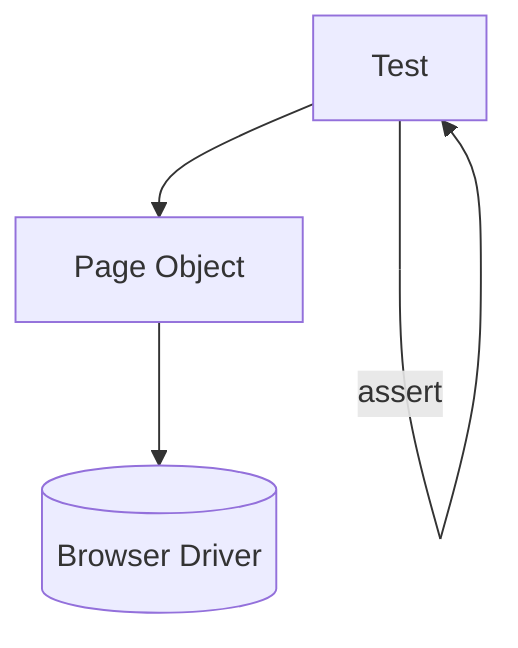

## The problem POM solves

UI tests often repeat:

- locators
- click/type logic
- wait logic

When the UI changes, many tests break.

## POM idea

Create a class per page:

- locators live in one place
- actions are methods

## Diagram



## Example structure

```python title="login_page.py" showLineNumbers{1}
from selenium.webdriver.common.by import By


class LoginPage:
    USERNAME = (By.ID, "username")
    PASSWORD = (By.ID, "password")
    SUBMIT = (By.CSS_SELECTOR, "button[type='submit']")

    def __init__(self, driver):
        self.driver = driver

    def open(self, url: str):
        self.driver.get(url)

    def login(self, username: str, password: str):
        self.driver.find_element(*self.USERNAME).send_keys(username)
        self.driver.find_element(*self.PASSWORD).send_keys(password)
        self.driver.find_element(*self.SUBMIT).click()
```

## Tip

Also consider the “Screenplay pattern” for larger suites.
