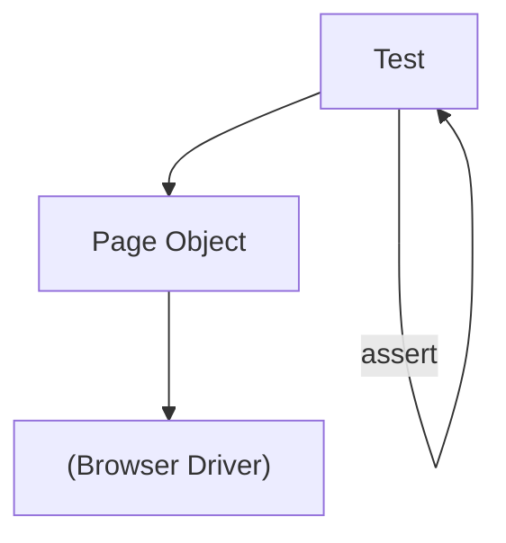

## The problem POM solves

UI tests often repeat:

- locators
- click/type logic
- wait logic

When the UI changes, many tests break.

## POM idea

Create a class per page:

- locators live in one place
- actions are methods

## Diagram


```mermaid
graph TD
T[Test] --> P[Page Object]
P --> B["(Browser Driver)"]
T -->|assert| T
```

## Example structure

```python title="login_page.py" showLineNumbers{1}
from selenium.webdriver.common.by import By


class LoginPage:
    USERNAME = (By.ID, "username")
    PASSWORD = (By.ID, "password")
    SUBMIT = (By.CSS_SELECTOR, "button[type='submit']")

    def __init__(self, driver):
        self.driver = driver

    def open(self, url: str):
        self.driver.get(url)

    def login(self, username: str, password: str):
        self.driver.find_element(*self.USERNAME).send_keys(username)
        self.driver.find_element(*self.PASSWORD).send_keys(password)
        self.driver.find_element(*self.SUBMIT).click()
```

## Tip

Also consider the “Screenplay pattern” for larger suites.

## What the pattern is really about

Without it, a login flow is copied into thirty tests. When the login button gets a new `data-testid`, thirty tests fail and you edit thirty places. A page object puts the knowledge of how to operate a page in one class. Tests then describe what the user does, and the class knows how the page does it.

## Before and after

```python title="test_login_no_pom.py" showLineNumbers{1}
def test_login_shows_dashboard(driver):
    driver.get("https://staging.example.com/login")
    driver.find_element("id", "username").send_keys("alice")
    driver.find_element("id", "password").send_keys("secret")
    driver.find_element("css selector", "button[type='submit']").click()
    assert "Dashboard" in driver.find_element("tag name", "h1").text
```

With the `LoginPage` class above, and a second class for the next page, the same test reads as intent:

```python title="test_login_pom.py" showLineNumbers{1}
from login_page import LoginPage
from dashboard_page import DashboardPage


def test_login_shows_dashboard(driver):
    LoginPage(driver).open("https://staging.example.com/login")
    LoginPage(driver).login("alice", "secret")
    assert DashboardPage(driver).heading_text() == "Dashboard"
```

```python title="dashboard_page.py" showLineNumbers{1}
from selenium.webdriver.common.by import By
from selenium.webdriver.support.ui import WebDriverWait
from selenium.webdriver.support import expected_conditions as EC


class DashboardPage:
    HEADING = (By.TAG_NAME, "h1")

    def __init__(self, driver):
        self.driver = driver

    def heading_text(self) -> str:
        el = WebDriverWait(self.driver, 10).until(
            EC.visibility_of_element_located(self.HEADING)
        )
        return el.text
```

The page object also owns the waiting, so tests never contain sleeps.

## Design rules

- **Methods describe user actions**, such as `login` or `add_to_cart`, not clicks. Return values or other page objects so tests can chain steps.
- **Keep assertions in tests.** The page object exposes state such as `heading_text()`, and the test decides what is correct. Mixing them makes page objects hard to reuse for negative cases.
- **One class per page or significant component**, such as a header or a modal.
- **Locators are constants** at the top of the class, so a change is one edit.

## What goes wrong

- **God page objects** with hundreds of methods. Split by component.
- **Logic in page objects.** They should not decide business rules.
- **Wrapping every locator in a method** with no benefit. Start simple and extract when duplication appears.
- **Ignoring the pyramid.** A perfect page object does not make a thousand UI tests a good idea.

## Connections

The Selenium and Playwright lessons show the tools this pattern wraps. It works the same way with either. The checkout project asks you to build page objects for a full purchase flow.

## Check your understanding

<Quiz
  questions={[
    {
      q: "The login button's locator changes. In a suite using page objects, how many places need editing?",
      options: [
        "Every test",
        "The one page object that defines the locator",
        "Every fixture",
        "The CI config",
      ],
      answer: 1,
      explain: "Centralising locators is the main benefit of the pattern.",
    },
    {
      q: "Where should the assertion that the heading equals Dashboard live?",
      options: [
        "Inside the page object's login method",
        "In the test, using a value exposed by the page object",
        "In conftest.py",
        "In the browser driver",
      ],
      answer: 1,
      explain: "Page objects expose state, and tests decide what is correct, which keeps the objects reusable.",
    },
    {
      q: "A page object has 200 methods covering the whole app. What is the fix?",
      options: [
        "Keep it",
        "Split it into page and component objects",
        "Delete the pattern",
        "Add more waits",
      ],
      answer: 1,
      explain: "One class per page or component keeps each object small and understandable.",
    },
  ]}
/>
