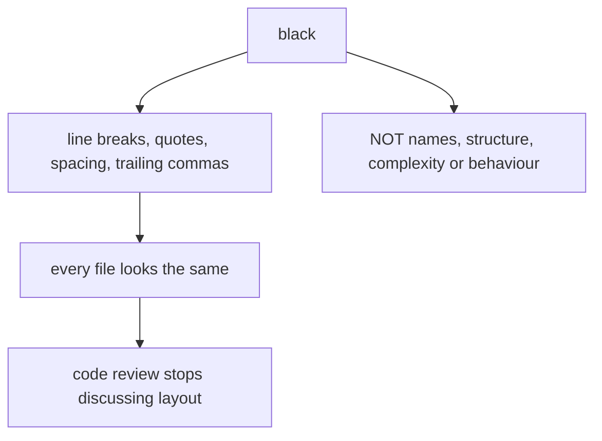

## What Black does

Black is an opinionated formatter that:

- rewrites code formatting automatically
- enforces consistent style

## Run

```bash
black .
```

Check only (CI mode):

```bash
black --check .
```

## Configure line length

In `pyproject.toml`:

```toml
[tool.black]
line-length = 88
```

## Tip

Run Black before linting so style issues disappear.

## One file, six tools

Every measurement on this page — and on the other five tools in this phase — comes from
running the tool against this deliberately flawed file:

```python title="sample.py" showLineNumbers{1}
import os
import subprocess
import hashlib


def process(items, user_input, flag = False):
    unused_var = 42
    result=[]
    for i in items:
        if i > 0:
            if flag:
                if i % 2 == 0:
                    result.append(i*2)
                else:
                    result.append(i)
            else:
                result.append(i)
    password = "hunter2"
    h = hashlib.md5(password.encode()).hexdigest()
    os.system("echo " + user_input)
    subprocess.call("ls " + user_input, shell=True)
    return result


def add(a: int, b: int) -> int:
    return a + b


x = add("1", 2)
```

| tool | what it reported on `sample.py` |
|:--|:--|
| **flake8** | 5 style and dead-code issues. **No security findings.** |
| **pylint** | 4 issues, score **8.10/10** |
| **mypy** | 1 type error, which neither linter saw |
| **bandit** | 5 security issues, **3 of them HIGH** |
| **radon** | complexity **A (5)**, maintainability **A (56.30)** |

The headline is that **no tool subsumes another**. flake8 read the whole file and reported
nothing about the shell injection on line 20. bandit read the same file and said nothing
about the type error on line 29. Running one and concluding the code is clean is the
mistake this phase exists to prevent.

```p5 title="Six tools, one file, almost no overlap" desc="Each tool was run against the same 29-line file. Click a tool to see what it found and, more importantly, what it did not." height="340"
let sel = 0;
const T = [
  { n: 'flake8', found: ['E251 spaces around keyword equals x2', 'F841 unused variable x2', 'E225 missing whitespace'],
    missed: 'every security issue, and the type error', c: [75, 139, 190] },
  { n: 'pylint', found: ['C0114 missing module docstring', 'C0116 missing docstrings x2', 'W0612 unused variable h'],
    missed: "unused_var - its name matches the dummy-variable regex", c: [120, 190, 130] },
  { n: 'mypy', found: ['arg-type: str passed where int expected'],
    missed: 'style, dead code, and security', c: [255, 211, 67] },
  { n: 'bandit', found: ['B324 HIGH weak MD5 hash', 'B605 HIGH shell injection via os.system', 'B602 HIGH subprocess shell=True', 'B105 LOW hardcoded password'],
    missed: 'style, typing, complexity', c: [232, 110, 110] },
  { n: 'black', found: ['reformats spacing and commas', 'exit 1 before, exit 0 after'],
    missed: 'everything semantic - complexity stayed C(15)', c: [200, 140, 220] },
  { n: 'radon', found: ['cyclomatic complexity A (5)', 'maintainability A (56.30)'],
    missed: 'correctness, style and security entirely', c: [140, 190, 200] },
];

function setup() {
  createCanvas(600, 340);
  textFont('monospace');
}

function draw() {
  background(13, 17, 23);
  const t = T[sel];

  noStroke();
  fill(230);
  textSize(13);
  textAlign(LEFT, TOP);
  text('one 29-line file, six tools', 24, 16);

  for (let i = 0; i < T.length; i++) {
    const col = i % 3;
    const row = floor(i / 3);
    const x = 24 + col * 186;
    const y = 42 + row * 40;
    const on = i === sel;
    const c = T[i].c;
    stroke(on ? color(c[0], c[1], c[2]) : color(48, 56, 68));
    strokeWeight(on ? 2 : 1);
    fill(on ? color(c[0] * 0.18, c[1] * 0.18, c[2] * 0.18) : color(17, 22, 29));
    rect(x, y, 174, 32, 4);
    noStroke();
    fill(on ? color(c[0], c[1], c[2]) : 110);
    textSize(12);
    textAlign(CENTER, CENTER);
    text(T[i].n, x + 87, y + 16);
  }

  stroke(t.c[0], t.c[1], t.c[2]);
  strokeWeight(1);
  fill(18, 23, 30);
  rect(24, 132, 552, 118, 5);
  noStroke();
  fill(110);
  textSize(10);
  textAlign(LEFT, TOP);
  text('what it found', 38, 142);
  for (let i = 0; i < t.found.length; i++) {
    fill(t.c[0], t.c[1], t.c[2]);
    textSize(11);
    text('- ' + t.found[i], 38, 162 + i * 20);
  }

  stroke(60, 70, 84);
  strokeWeight(1);
  fill(24, 20, 20);
  rect(24, 260, 552, 46, 5);
  noStroke();
  fill(110);
  textSize(10);
  textAlign(LEFT, TOP);
  text('what it did NOT look for', 38, 268);
  fill(232, 110, 110);
  textSize(11);
  text(t.missed, 38, 286);

  fill(90);
  textSize(10);
  textAlign(LEFT, TOP);
  text('no tool subsumes another - they answer different questions', 24, 316);
}

function mousePressed() {
  for (let i = 0; i < T.length; i++) {
    const col = i % 3;
    const row = floor(i / 3);
    const x = 24 + col * 186;
    const y = 42 + row * 40;
    if (mouseX > x && mouseX < x + 174 && mouseY > y && mouseY < y + 32) sel = i;
  }
}
```

## Black does not refactor. It reformats.

The page title is the industry's word, not an accurate one. Black rewrites **layout** and
nothing else — measured on a messy function:

```diff title="black --diff messy.py"
-def grade(score,bonus = 0,curve=False,late=False,extra_credit=None,retake=False):
-    total = score+bonus
+def grade(score, bonus=0, curve=False, late=False, extra_credit=None, retake=False):
+    total = score + bonus
```

Spaces after commas, no spaces around a keyword default, spaces around a binary operator.
What it did **not** change:

```text title="radon cc, before and after formatting"
before:  F 1:0 grade - C (15)
after :  F 1:0 grade - C (15)
```

Identical. The function was hard to reason about before and is exactly as hard afterwards —
it just looks tidier. Formatting and complexity are independent, and confusing the two is
how a codebase ends up beautifully formatted and unmaintainable.



## The real benefit is that it ends an argument

Black is deliberately almost unconfigurable. There is no option for two-space indents or
single quotes, and that is the feature: nobody can propose a house style, so review
comments are about the code.

## In CI, use `--check`

```bash title="exit codes, measured"
black --check fmt.py     # exit 1   — needs formatting
black fmt.py             # rewrites the file
black --check fmt.py     # exit 0   — already formatted
```

`--check` changes nothing and signals through the exit code, which is exactly what a CI
step or a pre-commit hook needs.

```yaml title=".pre-commit-config.yaml" showLineNumbers{1}
repos:
  - repo: https://github.com/psf/black
    rev: 26.5.1
    hooks:
      - id: black
```

Pin the version. A different black version can reformat files differently, which turns
into a diff nobody asked for on an unrelated pull request.

## Making it agree with flake8

Measured — black-formatted code fails default flake8:

```text title="flake8 on a black-formatted file"
fmt.py:1:80: E501 line too long (84 > 79 characters)
```

Black targets **88** columns; flake8 defaults to **79**:

```ini title="setup.cfg" showLineNumbers{1}
[flake8]
max-line-length = 88
extend-ignore = E203, W503
```

## Adopting it on an existing project

One commit that reformats everything makes `git blame` useless — every line's last author
becomes whoever ran black. Record that commit so blame can skip it:

```bash title="ignore the reformat in blame"
git blame --ignore-rev <sha>
echo "<sha>" >> .git-blame-ignore-revs
git config blame.ignoreRevsFile .git-blame-ignore-revs
```

:::caution[Formatting is not quality]
Black made `sample.py` consistent. It left the MD5 hash, both shell injections and the type
error exactly where they were. It is a tool for removing an argument from review, not for
improving code.
:::

## Check yourself

<Quiz
  questions={[
    {
      q: "Running black over a function with cyclomatic complexity C (15) left it at C (15). What does that show?",
      options: [
        "radon failed to re-measure the file",
        "black changes layout only; complexity and structure are untouched",
        "black only reduces complexity above a threshold",
        "the function was already formatted",
      ],
      answer: 1,
      explain:
        "Formatting and complexity are independent. Confusing them is how a codebase ends up beautifully formatted and still unmaintainable.",
    },
    {
      q: "What does black --check do?",
      options: [
        "reformats the file and reports what changed",
        "changes nothing and signals through the exit code: 1 if formatting is needed, 0 if not",
        "checks for syntax errors only",
        "prints a diff and applies it",
      ],
      answer: 1,
      explain:
        "Measured exit 1 before formatting and 0 after. That is what makes it usable in CI and pre-commit hooks.",
    },
    {
      q: "Why pin black's version in a pre-commit config?",
      options: [
        "older versions are insecure",
        "different versions can format the same file differently, producing unrelated diffs on someone else's pull request",
        "pre-commit requires an exact version",
        "it speeds up the hook",
      ],
      answer: 1,
      explain:
        "Formatting churn from a version drift is noise in review, and it is avoidable by pinning.",
    },
  ]}
/>
