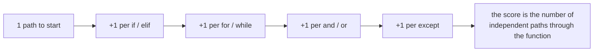

import Quiz from "../../../../components/Quiz.astro";

## What Radon measures

- **Cyclomatic complexity** (branches/paths)
- **Maintainability index**

High complexity often means:

- harder to test
- more bugs
- slower changes

## Run

```bash
radon cc -a your_package
```

Maintainability:

```bash
radon mi your_package
```

## How to use results

- identify hotspots
- refactor into smaller functions
- add tests around risky logic first

## One file, six tools

Every measurement on this page — and on the other five tools in this phase — comes from
running the tool against this deliberately flawed file:

```python title="sample.py" showLineNumbers{1}
import os
import subprocess
import hashlib


def process(items, user_input, flag = False):
    unused_var = 42
    result=[]
    for i in items:
        if i > 0:
            if flag:
                if i % 2 == 0:
                    result.append(i*2)
                else:
                    result.append(i)
            else:
                result.append(i)
    password = "hunter2"
    h = hashlib.md5(password.encode()).hexdigest()
    os.system("echo " + user_input)
    subprocess.call("ls " + user_input, shell=True)
    return result


def add(a: int, b: int) -> int:
    return a + b


x = add("1", 2)
```

| tool | what it reported on `sample.py` |
|:--|:--|
| **flake8** | 5 style and dead-code issues. **No security findings.** |
| **pylint** | 4 issues, score **8.10/10** |
| **mypy** | 1 type error, which neither linter saw |
| **bandit** | 5 security issues, **3 of them HIGH** |
| **radon** | complexity **A (5)**, maintainability **A (56.30)** |

The headline is that **no tool subsumes another**. flake8 read the whole file and reported
nothing about the shell injection on line 20. bandit read the same file and said nothing
about the type error on line 29. Running one and concluding the code is clean is the
mistake this phase exists to prevent.

```p5 title="Six tools, one file, almost no overlap" desc="Each tool was run against the same 29-line file. Click a tool to see what it found and, more importantly, what it did not." height="340"
let sel = 0;
const T = [
  { n: 'flake8', found: ['E251 spaces around keyword equals x2', 'F841 unused variable x2', 'E225 missing whitespace'],
    missed: 'every security issue, and the type error', c: [75, 139, 190] },
  { n: 'pylint', found: ['C0114 missing module docstring', 'C0116 missing docstrings x2', 'W0612 unused variable h'],
    missed: "unused_var - its name matches the dummy-variable regex", c: [120, 190, 130] },
  { n: 'mypy', found: ['arg-type: str passed where int expected'],
    missed: 'style, dead code, and security', c: [255, 211, 67] },
  { n: 'bandit', found: ['B324 HIGH weak MD5 hash', 'B605 HIGH shell injection via os.system', 'B602 HIGH subprocess shell=True', 'B105 LOW hardcoded password'],
    missed: 'style, typing, complexity', c: [232, 110, 110] },
  { n: 'black', found: ['reformats spacing and commas', 'exit 1 before, exit 0 after'],
    missed: 'everything semantic - complexity stayed C(15)', c: [200, 140, 220] },
  { n: 'radon', found: ['cyclomatic complexity A (5)', 'maintainability A (56.30)'],
    missed: 'correctness, style and security entirely', c: [140, 190, 200] },
];

function setup() {
  createCanvas(600, 340);
  textFont('monospace');
}

function draw() {
  background(13, 17, 23);
  const t = T[sel];

  noStroke();
  fill(230);
  textSize(13);
  textAlign(LEFT, TOP);
  text('one 29-line file, six tools', 24, 16);

  for (let i = 0; i < T.length; i++) {
    const col = i % 3;
    const row = floor(i / 3);
    const x = 24 + col * 186;
    const y = 42 + row * 40;
    const on = i === sel;
    const c = T[i].c;
    stroke(on ? color(c[0], c[1], c[2]) : color(48, 56, 68));
    strokeWeight(on ? 2 : 1);
    fill(on ? color(c[0] * 0.18, c[1] * 0.18, c[2] * 0.18) : color(17, 22, 29));
    rect(x, y, 174, 32, 4);
    noStroke();
    fill(on ? color(c[0], c[1], c[2]) : 110);
    textSize(12);
    textAlign(CENTER, CENTER);
    text(T[i].n, x + 87, y + 16);
  }

  stroke(t.c[0], t.c[1], t.c[2]);
  strokeWeight(1);
  fill(18, 23, 30);
  rect(24, 132, 552, 118, 5);
  noStroke();
  fill(110);
  textSize(10);
  textAlign(LEFT, TOP);
  text('what it found', 38, 142);
  for (let i = 0; i < t.found.length; i++) {
    fill(t.c[0], t.c[1], t.c[2]);
    textSize(11);
    text('- ' + t.found[i], 38, 162 + i * 20);
  }

  stroke(60, 70, 84);
  strokeWeight(1);
  fill(24, 20, 20);
  rect(24, 260, 552, 46, 5);
  noStroke();
  fill(110);
  textSize(10);
  textAlign(LEFT, TOP);
  text('what it did NOT look for', 38, 268);
  fill(232, 110, 110);
  textSize(11);
  text(t.missed, 38, 286);

  fill(90);
  textSize(10);
  textAlign(LEFT, TOP);
  text('no tool subsumes another - they answer different questions', 24, 316);
}

function mousePressed() {
  for (let i = 0; i < T.length; i++) {
    const col = i % 3;
    const row = floor(i / 3);
    const x = 24 + col * 186;
    const y = 42 + row * 40;
    if (mouseX > x && mouseX < x + 174 && mouseY > y && mouseY < y + 32) sel = i;
  }
}
```

## Cyclomatic complexity counts decisions

Every `if`, `for`, `while`, `and`, `or`, `except` and comprehension adds one path through
a function. Radon counts them:

```text title="radon cc -s sample.py"
F 6:0  process - A (5)
F 25:0 add     - A (1)
```

`add` has a single path. `process` has five, from one loop and three nested conditions.
Measured on a deliberately tangled grading function:

```text title="radon cc -s messy.py"
F 1:0 grade - C (15)
```



| rank | complexity | reading |
|:--|:--|:--|
| **A** | 1-5 | simple |
| **B** | 6-10 | fine |
| **C** | 11-20 | worth a look |
| **D** | 21-30 | hard to test |
| **E / F** | 31+ | rewrite it |

The practical value is testing: **a function with complexity 15 needs roughly 15 test
cases to cover its paths.** That is the honest cost of leaving it alone, and it is a better
argument for splitting it than any appeal to elegance.

## Maintainability index is a different number

```text title="radon mi -s messy.py"
messy.py - A (48.99)
```

The same file whose function scored **C** scored **A** for maintainability, because MI
combines complexity with volume and lines of code — and the file is short. A small tangled
function and a long simple one can land in the same place.

Read them together: MI for a file-level trend over time, CC to find the specific function
worth splitting.

## Formatting does not change either

```text title="radon cc, before and after black"
before:  F 1:0 grade - C (15)
after :  F 1:0 grade - C (15)
```

Measured. This is the most useful thing radon tells you about the rest of the toolchain:
black makes code readable, radon measures whether it is *simple*, and those are different
properties.

## Using it in practice

```bash title="commands"
radon cc -s -a myapp/           # per-function scores, plus the average
radon cc -s -nc myapp/          # only rank C and worse
radon mi -s myapp/              # maintainability per file
xenon --max-absolute C myapp/   # fail CI above a threshold
```

`radon cc -nc` is the one to run on an unfamiliar codebase: it lists only the functions
that are actually complicated, which is usually a short and very informative list.

:::caution[Complexity is a smell, not a verdict]
A parser or a state machine may legitimately score D. A five-line function with complexity
2 can still be wrong. Use the number to find candidates for splitting and to argue for the
tests they need — not as a rule to be satisfied.
:::

## What to do with a C

The usual fix is to extract the branches into named functions. The total complexity across
the module barely changes; what changes is that each piece can be tested and named
independently, and the top-level function reads as a description of the decision rather
than an implementation of it.

## Check yourself

<Quiz
  questions={[
    {
      q: "A function scores C (15) for cyclomatic complexity. What is the most concrete consequence?",
      options: [
        "it runs slowly",
        "it has about 15 independent paths, so covering it properly takes roughly 15 test cases",
        "it uses too much memory",
        "it will fail static type checking",
      ],
      answer: 1,
      explain:
        "That testing cost is the honest argument for splitting it, and a better one than an appeal to elegance.",
    },
    {
      q: "The same file scored C for a function's complexity and A (48.99) for maintainability. How can both be true?",
      options: [
        "one of the measurements is wrong",
        "they measure different things: MI combines complexity with volume and line count, and the file is short",
        "MI only considers comments",
        "MI ignores functions",
      ],
      answer: 1,
      explain:
        "Use MI as a file-level trend and CC to find the specific function worth splitting. A small tangled function and a long simple one can score alike.",
    },
    {
      q: "Running black over the messy function left its complexity at C (15). What follows?",
      options: [
        "radon caches results",
        "formatting and complexity are independent properties; readable is not the same as simple",
        "black only formats files below a complexity threshold",
        "complexity is measured before formatting",
      ],
      answer: 1,
      explain:
        "Black removes an argument from code review. It does nothing about how many paths run through a function.",
    },
  ]}
/>
