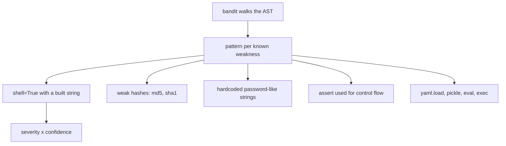

## What Bandit checks

Bandit scans for patterns like:

- use of `eval`
- `subprocess` calls without safety
- hardcoded passwords
- insecure temporary files

## Run

```bash
bandit -r your_package
```

## Example finding

```python title="danger_eval.py" showLineNumbers{1}
# Bandit will warn about eval usage
user_input = "2 + 2"
result = eval(user_input)
```

## Tip

- Treat Bandit warnings as “review required”, not always “bug”.
- Combine with dependency scanning in CI.

## One file, six tools

Every measurement on this page — and on the other five tools in this phase — comes from
running the tool against this deliberately flawed file:

```python title="sample.py" showLineNumbers{1}
import os
import subprocess
import hashlib


def process(items, user_input, flag = False):
    unused_var = 42
    result=[]
    for i in items:
        if i > 0:
            if flag:
                if i % 2 == 0:
                    result.append(i*2)
                else:
                    result.append(i)
            else:
                result.append(i)
    password = "hunter2"
    h = hashlib.md5(password.encode()).hexdigest()
    os.system("echo " + user_input)
    subprocess.call("ls " + user_input, shell=True)
    return result


def add(a: int, b: int) -> int:
    return a + b


x = add("1", 2)
```

| tool | what it reported on `sample.py` |
|:--|:--|
| **flake8** | 5 style and dead-code issues. **No security findings.** |
| **pylint** | 4 issues, score **8.10/10** |
| **mypy** | 1 type error, which neither linter saw |
| **bandit** | 5 security issues, **3 of them HIGH** |
| **radon** | complexity **A (5)**, maintainability **A (56.30)** |

The headline is that **no tool subsumes another**. flake8 read the whole file and reported
nothing about the shell injection on line 20. bandit read the same file and said nothing
about the type error on line 29. Running one and concluding the code is clean is the
mistake this phase exists to prevent.

```p5 title="Six tools, one file, almost no overlap" desc="Each tool was run against the same 29-line file. Click a tool to see what it found and, more importantly, what it did not." height="340"
let sel = 0;
const T = [
  { n: 'flake8', found: ['E251 spaces around keyword equals x2', 'F841 unused variable x2', 'E225 missing whitespace'],
    missed: 'every security issue, and the type error', c: [75, 139, 190] },
  { n: 'pylint', found: ['C0114 missing module docstring', 'C0116 missing docstrings x2', 'W0612 unused variable h'],
    missed: "unused_var - its name matches the dummy-variable regex", c: [120, 190, 130] },
  { n: 'mypy', found: ['arg-type: str passed where int expected'],
    missed: 'style, dead code, and security', c: [255, 211, 67] },
  { n: 'bandit', found: ['B324 HIGH weak MD5 hash', 'B605 HIGH shell injection via os.system', 'B602 HIGH subprocess shell=True', 'B105 LOW hardcoded password'],
    missed: 'style, typing, complexity', c: [232, 110, 110] },
  { n: 'black', found: ['reformats spacing and commas', 'exit 1 before, exit 0 after'],
    missed: 'everything semantic - complexity stayed C(15)', c: [200, 140, 220] },
  { n: 'radon', found: ['cyclomatic complexity A (5)', 'maintainability A (56.30)'],
    missed: 'correctness, style and security entirely', c: [140, 190, 200] },
];

function setup() {
  createCanvas(600, 340);
  textFont('monospace');
}

function draw() {
  background(13, 17, 23);
  const t = T[sel];

  noStroke();
  fill(230);
  textSize(13);
  textAlign(LEFT, TOP);
  text('one 29-line file, six tools', 24, 16);

  for (let i = 0; i < T.length; i++) {
    const col = i % 3;
    const row = floor(i / 3);
    const x = 24 + col * 186;
    const y = 42 + row * 40;
    const on = i === sel;
    const c = T[i].c;
    stroke(on ? color(c[0], c[1], c[2]) : color(48, 56, 68));
    strokeWeight(on ? 2 : 1);
    fill(on ? color(c[0] * 0.18, c[1] * 0.18, c[2] * 0.18) : color(17, 22, 29));
    rect(x, y, 174, 32, 4);
    noStroke();
    fill(on ? color(c[0], c[1], c[2]) : 110);
    textSize(12);
    textAlign(CENTER, CENTER);
    text(T[i].n, x + 87, y + 16);
  }

  stroke(t.c[0], t.c[1], t.c[2]);
  strokeWeight(1);
  fill(18, 23, 30);
  rect(24, 132, 552, 118, 5);
  noStroke();
  fill(110);
  textSize(10);
  textAlign(LEFT, TOP);
  text('what it found', 38, 142);
  for (let i = 0; i < t.found.length; i++) {
    fill(t.c[0], t.c[1], t.c[2]);
    textSize(11);
    text('- ' + t.found[i], 38, 162 + i * 20);
  }

  stroke(60, 70, 84);
  strokeWeight(1);
  fill(24, 20, 20);
  rect(24, 260, 552, 46, 5);
  noStroke();
  fill(110);
  textSize(10);
  textAlign(LEFT, TOP);
  text('what it did NOT look for', 38, 268);
  fill(232, 110, 110);
  textSize(11);
  text(t.missed, 38, 286);

  fill(90);
  textSize(10);
  textAlign(LEFT, TOP);
  text('no tool subsumes another - they answer different questions', 24, 316);
}

function mousePressed() {
  for (let i = 0; i < T.length; i++) {
    const col = i % 3;
    const row = floor(i / 3);
    const x = 24 + col * 186;
    const y = 42 + row * 40;
    if (mouseX > x && mouseX < x + 174 && mouseY > y && mouseY < y + 32) sel = i;
  }
}
```

## What bandit found that nothing else did

```text title="bandit sample.py"
LOW      B404  line 2:  Consider possible security implications of the subprocess module
LOW      B105  line 18: Possible hardcoded password: 'hunter2'
HIGH     B324  line 19: Use of weak MD5 hash for security
HIGH     B605  line 20: Starting a process with a shell, possible injection detected
HIGH     B602  line 21: subprocess call with shell=True identified
```

**Three HIGH severity findings.** flake8 reported five style issues on the same file and
none of these. pylint scored it 8.10/10. mypy found an unrelated type error. Only bandit
was asking whether the code was dangerous.



## The three HIGH findings, and why they are HIGH

```python title="injection.py" showLineNumbers{1}
os.system("echo " + user_input)                        # B605
subprocess.call("ls " + user_input, shell=True)        # B602
```

A user sending `; rm -rf ~` runs their command, not yours. The fix removes the shell
entirely — pass a list and no shell is involved, so there is nothing to inject into:

```python title="safe.py" showLineNumbers{1}
subprocess.run(["ls", user_input], check=True)         # no shell, no injection
```

```python title="hashing.py" showLineNumbers{1}
hashlib.md5(password.encode()).hexdigest()             # B324
```

MD5 is fast and broken. For passwords, use a deliberately slow function — `scrypt` via
`werkzeug.security.generate_password_hash`, or `argon2`. For a non-security checksum, say
so explicitly and bandit stops complaining:

```python title="not_security.py" showLineNumbers{1}
hashlib.md5(data, usedforsecurity=False).hexdigest()
```

## Severity and confidence are separate axes

```bash title="filtering"
bandit -r . -ll        # only MEDIUM and HIGH severity
bandit -r . -iii       # only HIGH confidence
bandit -r . -ll -ii    # a sensible CI gate
```

`B404` above is LOW severity — importing `subprocess` is not a vulnerability, just a hint
to look closer. Gating CI on every finding trains people to ignore the tool; gating on
medium-and-above keeps it credible.

## False positives are expected, and should be justified in the code

```python title="nosec.py" showLineNumbers{1}
password = "not-a-real-secret"  # nosec B105 - fixture value used only in tests
```

Always name the test id and give a reason. A bare `# nosec` disables **everything** on that
line, including a genuine issue introduced later.

```toml title="pyproject.toml" showLineNumbers{1}
[tool.bandit]
exclude_dirs = ["tests", ".venv"]
skips = ["B101"]        # assert_used — asserts are the point in tests
```

:::danger[Bandit finds known patterns, not vulnerabilities]
It matches shapes in the AST. It will not find your broken authorisation check, your
missing ownership test, or a logic flaw that lets one user read another's data. A clean
bandit run means none of the catalogued patterns are present — nothing about whether the
application is secure.
:::

## Check yourself

<Quiz
  questions={[
    {
      q: "Bandit reported three HIGH severity issues in a file that flake8 and pylint both passed with only style complaints. What does that tell you?",
      options: [
        "flake8 and pylint were misconfigured",
        "the tools ask different questions; linters look at style and dead code, not at dangerous patterns",
        "bandit produces false positives",
        "the file has two different problems in the same lines",
      ],
      answer: 1,
      explain:
        "Measured B324, B605 and B602 as HIGH. pylint scored the same file 8.10/10. Running one tool and concluding the code is clean is the mistake.",
    },
    {
      q: "What is the fix for subprocess.call('ls ' + user_input, shell=True)?",
      options: [
        "escape the quotes in user_input",
        "pass a list of arguments and drop shell=True, so no shell is involved and there is nothing to inject into",
        "validate that user_input contains no semicolons",
        "use os.system instead",
      ],
      answer: 1,
      explain:
        "subprocess.run(['ls', user_input]) executes the program directly. Escaping and validation are attempts to outguess a shell you do not need.",
    },
    {
      q: "Why should CI gate on medium-and-above rather than on every bandit finding?",
      options: [
        "low findings are always false positives",
        "low findings such as B404 are hints rather than vulnerabilities, and failing on everything trains people to ignore the tool",
        "bandit runs faster with a filter",
        "high findings are the only real ones",
      ],
      answer: 1,
      explain:
        "B404 simply notes that subprocess was imported. Keeping the gate credible is what makes people act on the findings that matter.",
    },
    {
      q: "What does a clean bandit run NOT tell you?",
      options: [
        "that no catalogued dangerous pattern was matched",
        "that the application's authorisation logic is correct",
        "that shell=True is absent",
        "that no weak hash was used",
      ],
      answer: 1,
      explain:
        "Bandit matches shapes in the AST. A broken ownership check or a logic flaw that leaks one user's data to another is invisible to it.",
    },
  ]}
/>
