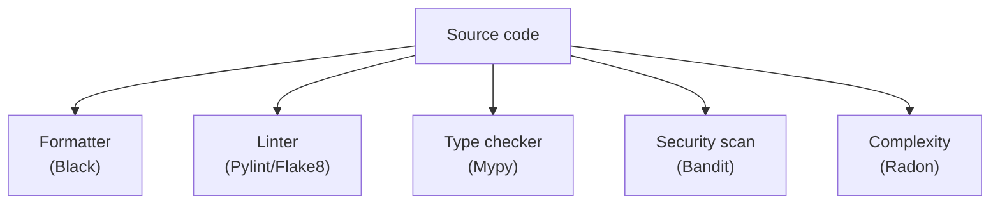

## What linting is

Linting is **static analysis** that flags issues like:

- unused imports/variables
- suspicious logic
- inconsistent style
- complexity / maintainability issues

Linting runs without executing your code.

## Linting vs formatting vs type checking

- **Linting**: “this looks wrong / risky / inconsistent”
- **Formatting**: “make code look consistent” (e.g., Black)
- **Type checking**: “types don’t match” (e.g., Mypy)

## Diagram: quality tools overview



## Why linting matters

- catches bugs before runtime
- keeps large codebases consistent
- makes PR reviews faster

## Visualize it

Source code typically passes through a formatter, a linter, and a type checker before a commit is allowed through the quality gate.

```mermaid title="Code Quality Gate" desc="Source code passes through formatting, linting, and type checking before a commit is allowed."
flowchart LR
A["Source code"] --> B["Formatter (black)"]
B --> C["Linter (flake8/pylint)"]
C --> D["Type checker (mypy)"]
D --> E["Pass"]
D --> F["Block commit"]
```

## What a linter actually finds

A linter parses your code into a syntax tree and applies rules. It does not run the program, so it finds problems in code paths your tests never reach. Here is a function with several issues that Python itself accepts:

```python title="lint_demo.py" showLineNumbers{1}
import os
import sys


def add_item(item, items=[]):
    items.append(item)
    total = len(items)
    return items
```

Flake8 or Ruff would report:

- `F401` `os` and `sys` imported but unused.
- `F841` local variable `total` is assigned but never used.
- `B006` (with the bugbear plugin) mutable default argument, a real bug, because the list is shared between calls.

The last one is the reason linting matters. The function works the first time you call it and misbehaves on the second.

## Running a linter

```bash
pip install ruff
ruff check .
ruff check . --fix
```

`--fix` applies the safe automatic fixes, such as removing unused imports. Flake8 and Pylint run the same way with `flake8 .` and `pylint your_package`. The following lessons cover Flake8 and Pylint in detail.

## Configuration

Adopt rules gradually. In `pyproject.toml`:

```toml
[tool.ruff.lint]
select = ["E", "F", "B"]
ignore = ["E501"]
```

Start with a small rule set on new code. Turning on every rule for an old project produces thousands of warnings and everybody ignores them. If a specific line is a justified exception, silence just that line with `# noqa: F401` and a reason.

## Where linting sits with the other tools

A formatter (Black) settles layout so nobody argues about it. A linter finds suspicious code. A type checker (Mypy) checks types. A security scanner (Bandit) looks for dangerous patterns. They overlap a little but answer different questions, and you usually run all of them.

## What goes wrong

- **Warnings piling up.** Fix them or configure them out, since a permanent list of 400 warnings hides the new ones.
- **Treating lint as tests.** A clean lint report does not mean the code is correct.
- **Blanket `# noqa`** with no code and no reason.
- **Running only on developer machines.** Add it to pre-commit and CI so it applies to everyone.

## Connections

Linting is verification without running code, as the verification versus validation lesson describes. Pre-commit hooks and GitHub Actions, in Phase 7, are where you enforce it.

## 🧪 Try It Yourself

### Exercise 1 – Write a unittest TestCase

<DataCampExercise
  lang="python"
  hint={`Subclass \`unittest.TestCase\` and use \`assertEqual\` to assert values.`}
  code={`# Task: Exercise 1 – Write a unittest TestCase
import unittest

def add(a, b):
    return a + b

class TestAdd(unittest.___):    # replace ___ with TestCase
    def test_positive(self):
        self.___(add(2, 3), 5)  # replace ___ with assertEqual

# Run inline
suite = unittest.TestLoader().loadTestsFromTestCase(TestAdd)
runner = unittest.TextTestRunner(verbosity=0)
result = runner.run(suite)
print("Tests run:", result.testsRun)
print("Failures:", len(result.failures))

# ── Expected Output ───────────────────────────────────────────
# Tests run: 1
# Failures: 0
# ──────────────────────────────────────────────────────────────`}
  solution={`import unittest

def add(a, b):
    return a + b

class TestAdd(unittest.TestCase):
    def test_positive(self):
        self.assertEqual(add(2, 3), 5)

suite = unittest.TestLoader().loadTestsFromTestCase(TestAdd)
runner = unittest.TextTestRunner(verbosity=0)
result = runner.run(suite)
print("Tests run:", result.testsRun)
print("Failures:", len(result.failures))`}
  sct={`test_output_contains("Tests run: 1")
test_output_contains("Failures: 0")
success_msg("unittest TestCase working!")`}
  height={160}
/>

### Exercise 2 – assertRaises

<DataCampExercise
  lang="python"
  hint={`Use \`self.assertRaises(ExceptionType)\` as a context manager.`}
  code={`# Task: Exercise 2 – assertRaises
import unittest

def divide(a, b):
    if b == 0:
        raise ValueError("Cannot divide by zero")
    return a / b

class TestDivide(unittest.TestCase):
    def test_zero(self):
        # Hint: use assertRaises to expect a ValueError
        with self.___(___):          # replace blanks: assertRaises, ValueError
            divide(10, 0)

suite = unittest.TestLoader().loadTestsFromTestCase(TestDivide)
result = unittest.TextTestRunner(verbosity=0).run(suite)
print("Passed:", result.wasSuccessful())

# ── Expected Output ───────────────────────────────────────────
# Passed: True
# ──────────────────────────────────────────────────────────────`}
  solution={`import unittest

def divide(a, b):
    if b == 0:
        raise ValueError("Cannot divide by zero")
    return a / b

class TestDivide(unittest.TestCase):
    def test_zero(self):
        with self.assertRaises(ValueError):
            divide(10, 0)

suite = unittest.TestLoader().loadTestsFromTestCase(TestDivide)
result = unittest.TextTestRunner(verbosity=0).run(suite)
print("Passed:", result.wasSuccessful())`}
  sct={`test_output_contains("Passed: True")
success_msg("assertRaises verifies exceptions!")`}
  height={160}
/>

### Exercise 3 – setUp and tearDown

<DataCampExercise
  lang="python"
  hint={`Override \`setUp\` to run before each test and \`tearDown\` after.`}
  code={`# Task: Exercise 3 – setUp and tearDown
import unittest

class TestLifecycle(unittest.TestCase):
    def ___(self):              # replace ___ with setUp
        self.data = [1, 2, 3]
        print("setUp called")

    def test_length(self):
        self.assertEqual(len(self.data), 3)

    def ___(self):              # replace ___ with tearDown
        print("tearDown called")

suite = unittest.TestLoader().loadTestsFromTestCase(TestLifecycle)
unittest.TextTestRunner(verbosity=0).run(suite)

# ── Expected Output includes ──────────────────────────────────
# setUp called
# tearDown called
# ──────────────────────────────────────────────────────────────`}
  solution={`import unittest

class TestLifecycle(unittest.TestCase):
    def setUp(self):
        self.data = [1, 2, 3]
        print("setUp called")

    def test_length(self):
        self.assertEqual(len(self.data), 3)

    def tearDown(self):
        print("tearDown called")

suite = unittest.TestLoader().loadTestsFromTestCase(TestLifecycle)
unittest.TextTestRunner(verbosity=0).run(suite)`}
  sct={`test_output_contains("setUp called")
test_output_contains("tearDown called")
success_msg("setUp/tearDown lifecycle works!")`}
  height={162}
/>

