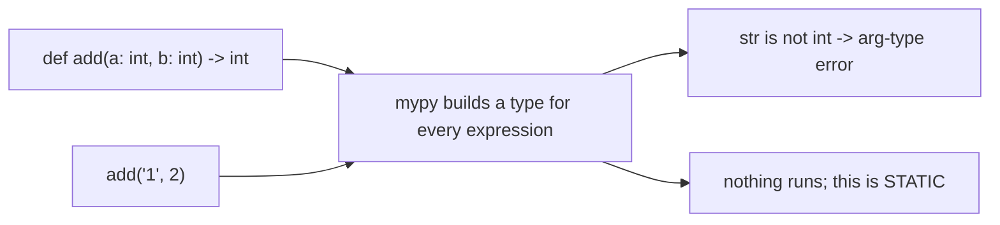

import Quiz from "../../../../components/Quiz.astro";

## Why type checking

Type hints help you:

- catch bugs before runtime
- improve editor autocomplete
- document function contracts

## Minimal example

```python title="types_example.py" showLineNumbers{1}
from typing import Iterable


def total(values: Iterable[int]) -> int:
    return sum(values)
```

## Running mypy

```bash
mypy your_package
```

## Example config (pyproject.toml)

```toml
[tool.mypy]
python_version = "3.11"
ignore_missing_imports = true
warn_unused_ignores = true
warn_redundant_casts = true
strict_optional = true
```

## Tip

Start with non-strict, then tighten gradually.

## One file, six tools

Every measurement on this page — and on the other five tools in this phase — comes from
running the tool against this deliberately flawed file:

```python title="sample.py" showLineNumbers{1}
import os
import subprocess
import hashlib


def process(items, user_input, flag = False):
    unused_var = 42
    result=[]
    for i in items:
        if i > 0:
            if flag:
                if i % 2 == 0:
                    result.append(i*2)
                else:
                    result.append(i)
            else:
                result.append(i)
    password = "hunter2"
    h = hashlib.md5(password.encode()).hexdigest()
    os.system("echo " + user_input)
    subprocess.call("ls " + user_input, shell=True)
    return result


def add(a: int, b: int) -> int:
    return a + b


x = add("1", 2)
```

| tool | what it reported on `sample.py` |
|:--|:--|
| **flake8** | 5 style and dead-code issues. **No security findings.** |
| **pylint** | 4 issues, score **8.10/10** |
| **mypy** | 1 type error, which neither linter saw |
| **bandit** | 5 security issues, **3 of them HIGH** |
| **radon** | complexity **A (5)**, maintainability **A (56.30)** |

The headline is that **no tool subsumes another**. flake8 read the whole file and reported
nothing about the shell injection on line 20. bandit read the same file and said nothing
about the type error on line 29. Running one and concluding the code is clean is the
mistake this phase exists to prevent.

```p5 title="Six tools, one file, almost no overlap" desc="Each tool was run against the same 29-line file. Click a tool to see what it found and, more importantly, what it did not." height="340"
let sel = 0;
const T = [
  { n: 'flake8', found: ['E251 spaces around keyword equals x2', 'F841 unused variable x2', 'E225 missing whitespace'],
    missed: 'every security issue, and the type error', c: [75, 139, 190] },
  { n: 'pylint', found: ['C0114 missing module docstring', 'C0116 missing docstrings x2', 'W0612 unused variable h'],
    missed: "unused_var - its name matches the dummy-variable regex", c: [120, 190, 130] },
  { n: 'mypy', found: ['arg-type: str passed where int expected'],
    missed: 'style, dead code, and security', c: [255, 211, 67] },
  { n: 'bandit', found: ['B324 HIGH weak MD5 hash', 'B605 HIGH shell injection via os.system', 'B602 HIGH subprocess shell=True', 'B105 LOW hardcoded password'],
    missed: 'style, typing, complexity', c: [232, 110, 110] },
  { n: 'black', found: ['reformats spacing and commas', 'exit 1 before, exit 0 after'],
    missed: 'everything semantic - complexity stayed C(15)', c: [200, 140, 220] },
  { n: 'radon', found: ['cyclomatic complexity A (5)', 'maintainability A (56.30)'],
    missed: 'correctness, style and security entirely', c: [140, 190, 200] },
];

function setup() {
  createCanvas(600, 340);
  textFont('monospace');
}

function draw() {
  background(13, 17, 23);
  const t = T[sel];

  noStroke();
  fill(230);
  textSize(13);
  textAlign(LEFT, TOP);
  text('one 29-line file, six tools', 24, 16);

  for (let i = 0; i < T.length; i++) {
    const col = i % 3;
    const row = floor(i / 3);
    const x = 24 + col * 186;
    const y = 42 + row * 40;
    const on = i === sel;
    const c = T[i].c;
    stroke(on ? color(c[0], c[1], c[2]) : color(48, 56, 68));
    strokeWeight(on ? 2 : 1);
    fill(on ? color(c[0] * 0.18, c[1] * 0.18, c[2] * 0.18) : color(17, 22, 29));
    rect(x, y, 174, 32, 4);
    noStroke();
    fill(on ? color(c[0], c[1], c[2]) : 110);
    textSize(12);
    textAlign(CENTER, CENTER);
    text(T[i].n, x + 87, y + 16);
  }

  stroke(t.c[0], t.c[1], t.c[2]);
  strokeWeight(1);
  fill(18, 23, 30);
  rect(24, 132, 552, 118, 5);
  noStroke();
  fill(110);
  textSize(10);
  textAlign(LEFT, TOP);
  text('what it found', 38, 142);
  for (let i = 0; i < t.found.length; i++) {
    fill(t.c[0], t.c[1], t.c[2]);
    textSize(11);
    text('- ' + t.found[i], 38, 162 + i * 20);
  }

  stroke(60, 70, 84);
  strokeWeight(1);
  fill(24, 20, 20);
  rect(24, 260, 552, 46, 5);
  noStroke();
  fill(110);
  textSize(10);
  textAlign(LEFT, TOP);
  text('what it did NOT look for', 38, 268);
  fill(232, 110, 110);
  textSize(11);
  text(t.missed, 38, 286);

  fill(90);
  textSize(10);
  textAlign(LEFT, TOP);
  text('no tool subsumes another - they answer different questions', 24, 316);
}

function mousePressed() {
  for (let i = 0; i < T.length; i++) {
    const col = i % 3;
    const row = floor(i / 3);
    const x = 24 + col * 186;
    const y = 42 + row * 40;
    if (mouseX > x && mouseX < x + 174 && mouseY > y && mouseY < y + 32) sel = i;
  }
}
```

## The error nothing else found

```text title="mypy sample.py"
sample.py:29: error: Argument 1 to "add" has incompatible type "str"; expected "int"  [arg-type]
Found 1 error in 1 file (checked 1 source file)
```

That is a genuine bug — `add("1", 2)` returns `"12"` if the annotation is a lie, or raises
if it is not — and **flake8, pylint and bandit all read the same line and said nothing**.
Type checking is a different question from style, and the answer is only available to a
tool that follows the types.



Nothing was executed to find it. That is the point: the bug is reported for a line that
may only run in an unusual branch, months from now.

## Annotations do nothing at runtime

```python title="runtime.py" showLineNumbers{1}
def add(a: int, b: int) -> int:
    return a + b

add("1", "2")        # '12'  — Python does not check, and does not care
```

Annotations are metadata. The checker is a separate program you have to run — which is why
type errors reach production in codebases that annotate but never run mypy.

## Adopting it on code that already exists

Turning mypy on strict against a large untyped codebase produces thousands of errors and
gets switched off the same afternoon. Start permissive and tighten:

```toml title="pyproject.toml" showLineNumbers{1}
[tool.mypy]
python_version = "3.13"
warn_unused_ignores = true
warn_return_any = true

# start here, then remove these as modules get typed
ignore_missing_imports = true

[[tool.mypy.overrides]]
module = "myapp.core.*"        # one package at a time
disallow_untyped_defs = true
strict = true
```

The pattern that works is per-module strictness: pick the code that matters most, make it
strict, and grow the boundary.

| setting | effect |
|:--|:--|
| `ignore_missing_imports` | stop errors from third-party packages without stubs |
| `disallow_untyped_defs` | require annotations on every function |
| `warn_unused_ignores` | flag `# type: ignore` comments that no longer apply |
| `strict` | all of the strict flags at once |

`warn_unused_ignores` is the one people forget. Without it, `# type: ignore` comments
accumulate long after the errors they silenced were fixed.

## What mypy cannot tell you

- Nothing about **style** — that is flake8's job.
- Nothing about **security** — bandit flagged three HIGH issues in this file that mypy read
  straight past.
- Nothing about values: `divide(1, 0)` type-checks perfectly.
- Nothing about untyped code — an unannotated function is largely invisible, which is why
  a growing `disallow_untyped_defs` boundary matters.

:::caution[A passing type check is not a passing test]
Types constrain the shape of your data, not its correctness. `add(2, 2) -> 5` satisfies
every annotation on the page.
:::

## Check yourself

<Quiz
  questions={[
    {
      q: "mypy reported an incompatible argument type on line 29. What did flake8, pylint and bandit report about that line?",
      options: [
        "the same error, in different words",
        "nothing; none of them follow types",
        "a style warning about the call",
        "an unused-variable warning",
      ],
      answer: 1,
      explain:
        "Type checking is a different question. Only a tool that builds a type for every expression can see that a str was passed where an int was declared.",
    },
    {
      q: "What happens at runtime when you call add('1', '2') on a function annotated a: int, b: int?",
      options: [
        "a TypeError is raised because of the annotation",
        "it returns '12'; annotations are metadata and Python does not enforce them",
        "mypy raises at import time",
        "the arguments are coerced to int",
      ],
      answer: 1,
      explain:
        "The checker is a separate program you have to run. That is why type errors reach production in codebases that annotate but never run mypy.",
    },
    {
      q: "What is the workable way to adopt mypy on a large untyped codebase?",
      options: [
        "enable strict mode everywhere immediately",
        "start permissive with ignore_missing_imports, then make one module strict at a time using per-module overrides",
        "annotate every function before running it at all",
        "run it only on new files",
      ],
      answer: 1,
      explain:
        "Strict-everywhere produces thousands of errors and gets switched off the same day. Growing a strict boundary keeps the signal actionable.",
    },
  ]}
/>
