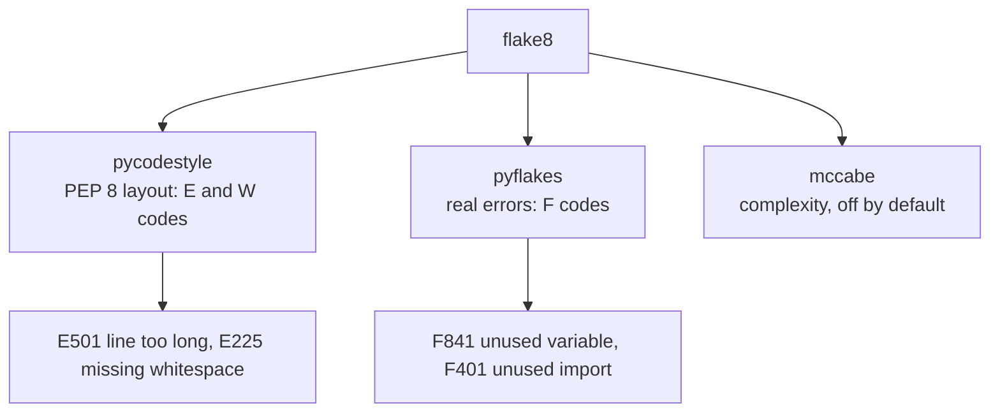

## What Flake8 checks

- style (PEP8-ish)
- unused imports
- simple logical issues

## Run

```bash
flake8 .
```

## Example configuration

In `.flake8`:

```ini
[flake8]
max-line-length = 88
extend-ignore = E203,W503
exclude = .git,__pycache__,.venv,build,dist
```

## Plugins (popular)

- `flake8-bugbear`
- `flake8-comprehensions`
- `flake8-docstrings`

## Tip

If you use Black, align flake8 ignores with Black defaults.


## 🧪 Try It Yourself

### Exercise 1 – Write a unittest TestCase

<DataCampExercise
  lang="python"
  hint={`Subclass \`unittest.TestCase\` and use \`assertEqual\` to assert values.`}
  code={`# Task: Exercise 1 – Write a unittest TestCase
import unittest

def add(a, b):
    return a + b

class TestAdd(unittest.___):    # replace ___ with TestCase
    def test_positive(self):
        self.___(add(2, 3), 5)  # replace ___ with assertEqual

# Run inline
suite = unittest.TestLoader().loadTestsFromTestCase(TestAdd)
runner = unittest.TextTestRunner(verbosity=0)
result = runner.run(suite)
print("Tests run:", result.testsRun)
print("Failures:", len(result.failures))

# ── Expected Output ───────────────────────────────────────────
# Tests run: 1
# Failures: 0
# ──────────────────────────────────────────────────────────────`}
  solution={`import unittest

def add(a, b):
    return a + b

class TestAdd(unittest.TestCase):
    def test_positive(self):
        self.assertEqual(add(2, 3), 5)

suite = unittest.TestLoader().loadTestsFromTestCase(TestAdd)
runner = unittest.TextTestRunner(verbosity=0)
result = runner.run(suite)
print("Tests run:", result.testsRun)
print("Failures:", len(result.failures))`}
  sct={`test_output_contains("Tests run: 1")
test_output_contains("Failures: 0")
success_msg("unittest TestCase working!")`}
  height={160}
/>

### Exercise 2 – assertRaises

<DataCampExercise
  lang="python"
  hint={`Use \`self.assertRaises(ExceptionType)\` as a context manager.`}
  code={`# Task: Exercise 2 – assertRaises
import unittest

def divide(a, b):
    if b == 0:
        raise ValueError("Cannot divide by zero")
    return a / b

class TestDivide(unittest.TestCase):
    def test_zero(self):
        # Hint: use assertRaises to expect a ValueError
        with self.___(___):          # replace blanks: assertRaises, ValueError
            divide(10, 0)

suite = unittest.TestLoader().loadTestsFromTestCase(TestDivide)
result = unittest.TextTestRunner(verbosity=0).run(suite)
print("Passed:", result.wasSuccessful())

# ── Expected Output ───────────────────────────────────────────
# Passed: True
# ──────────────────────────────────────────────────────────────`}
  solution={`import unittest

def divide(a, b):
    if b == 0:
        raise ValueError("Cannot divide by zero")
    return a / b

class TestDivide(unittest.TestCase):
    def test_zero(self):
        with self.assertRaises(ValueError):
            divide(10, 0)

suite = unittest.TestLoader().loadTestsFromTestCase(TestDivide)
result = unittest.TextTestRunner(verbosity=0).run(suite)
print("Passed:", result.wasSuccessful())`}
  sct={`test_output_contains("Passed: True")
success_msg("assertRaises verifies exceptions!")`}
  height={160}
/>

### Exercise 3 – setUp and tearDown

<DataCampExercise
  lang="python"
  hint={`Override \`setUp\` to run before each test and \`tearDown\` after.`}
  code={`# Task: Exercise 3 – setUp and tearDown
import unittest

class TestLifecycle(unittest.TestCase):
    def ___(self):              # replace ___ with setUp
        self.data = [1, 2, 3]
        print("setUp called")

    def test_length(self):
        self.assertEqual(len(self.data), 3)

    def ___(self):              # replace ___ with tearDown
        print("tearDown called")

suite = unittest.TestLoader().loadTestsFromTestCase(TestLifecycle)
unittest.TextTestRunner(verbosity=0).run(suite)

# ── Expected Output includes ──────────────────────────────────
# setUp called
# tearDown called
# ──────────────────────────────────────────────────────────────`}
  solution={`import unittest

class TestLifecycle(unittest.TestCase):
    def setUp(self):
        self.data = [1, 2, 3]
        print("setUp called")

    def test_length(self):
        self.assertEqual(len(self.data), 3)

    def tearDown(self):
        print("tearDown called")

suite = unittest.TestLoader().loadTestsFromTestCase(TestLifecycle)
unittest.TextTestRunner(verbosity=0).run(suite)`}
  sct={`test_output_contains("setUp called")
test_output_contains("tearDown called")
success_msg("setUp/tearDown lifecycle works!")`}
  height={162}
/>

## One file, six tools

Every measurement on this page — and on the other five tools in this phase — comes from
running the tool against this deliberately flawed file:

```python title="sample.py" showLineNumbers{1}
import os
import subprocess
import hashlib


def process(items, user_input, flag = False):
    unused_var = 42
    result=[]
    for i in items:
        if i > 0:
            if flag:
                if i % 2 == 0:
                    result.append(i*2)
                else:
                    result.append(i)
            else:
                result.append(i)
    password = "hunter2"
    h = hashlib.md5(password.encode()).hexdigest()
    os.system("echo " + user_input)
    subprocess.call("ls " + user_input, shell=True)
    return result


def add(a: int, b: int) -> int:
    return a + b


x = add("1", 2)
```

| tool | what it reported on `sample.py` |
|:--|:--|
| **flake8** | 5 style and dead-code issues. **No security findings.** |
| **pylint** | 4 issues, score **8.10/10** |
| **mypy** | 1 type error, which neither linter saw |
| **bandit** | 5 security issues, **3 of them HIGH** |
| **radon** | complexity **A (5)**, maintainability **A (56.30)** |

The headline is that **no tool subsumes another**. flake8 read the whole file and reported
nothing about the shell injection on line 20. bandit read the same file and said nothing
about the type error on line 29. Running one and concluding the code is clean is the
mistake this phase exists to prevent.

```p5 title="Six tools, one file, almost no overlap" desc="Each tool was run against the same 29-line file. Click a tool to see what it found and, more importantly, what it did not." height="340"
let sel = 0;
const T = [
  { n: 'flake8', found: ['E251 spaces around keyword equals x2', 'F841 unused variable x2', 'E225 missing whitespace'],
    missed: 'every security issue, and the type error', c: [75, 139, 190] },
  { n: 'pylint', found: ['C0114 missing module docstring', 'C0116 missing docstrings x2', 'W0612 unused variable h'],
    missed: "unused_var - its name matches the dummy-variable regex", c: [120, 190, 130] },
  { n: 'mypy', found: ['arg-type: str passed where int expected'],
    missed: 'style, dead code, and security', c: [255, 211, 67] },
  { n: 'bandit', found: ['B324 HIGH weak MD5 hash', 'B605 HIGH shell injection via os.system', 'B602 HIGH subprocess shell=True', 'B105 LOW hardcoded password'],
    missed: 'style, typing, complexity', c: [232, 110, 110] },
  { n: 'black', found: ['reformats spacing and commas', 'exit 1 before, exit 0 after'],
    missed: 'everything semantic - complexity stayed C(15)', c: [200, 140, 220] },
  { n: 'radon', found: ['cyclomatic complexity A (5)', 'maintainability A (56.30)'],
    missed: 'correctness, style and security entirely', c: [140, 190, 200] },
];

function setup() {
  createCanvas(600, 340);
  textFont('monospace');
}

function draw() {
  background(13, 17, 23);
  const t = T[sel];

  noStroke();
  fill(230);
  textSize(13);
  textAlign(LEFT, TOP);
  text('one 29-line file, six tools', 24, 16);

  for (let i = 0; i < T.length; i++) {
    const col = i % 3;
    const row = floor(i / 3);
    const x = 24 + col * 186;
    const y = 42 + row * 40;
    const on = i === sel;
    const c = T[i].c;
    stroke(on ? color(c[0], c[1], c[2]) : color(48, 56, 68));
    strokeWeight(on ? 2 : 1);
    fill(on ? color(c[0] * 0.18, c[1] * 0.18, c[2] * 0.18) : color(17, 22, 29));
    rect(x, y, 174, 32, 4);
    noStroke();
    fill(on ? color(c[0], c[1], c[2]) : 110);
    textSize(12);
    textAlign(CENTER, CENTER);
    text(T[i].n, x + 87, y + 16);
  }

  stroke(t.c[0], t.c[1], t.c[2]);
  strokeWeight(1);
  fill(18, 23, 30);
  rect(24, 132, 552, 118, 5);
  noStroke();
  fill(110);
  textSize(10);
  textAlign(LEFT, TOP);
  text('what it found', 38, 142);
  for (let i = 0; i < t.found.length; i++) {
    fill(t.c[0], t.c[1], t.c[2]);
    textSize(11);
    text('- ' + t.found[i], 38, 162 + i * 20);
  }

  stroke(60, 70, 84);
  strokeWeight(1);
  fill(24, 20, 20);
  rect(24, 260, 552, 46, 5);
  noStroke();
  fill(110);
  textSize(10);
  textAlign(LEFT, TOP);
  text('what it did NOT look for', 38, 268);
  fill(232, 110, 110);
  textSize(11);
  text(t.missed, 38, 286);

  fill(90);
  textSize(10);
  textAlign(LEFT, TOP);
  text('no tool subsumes another - they answer different questions', 24, 316);
}

function mousePressed() {
  for (let i = 0; i < T.length; i++) {
    const col = i % 3;
    const row = floor(i / 3);
    const x = 24 + col * 186;
    const y = 42 + row * 40;
    if (mouseX > x && mouseX < x + 174 && mouseY > y && mouseY < y + 32) sel = i;
  }
}
```

## What flake8 actually is



flake8 is a wrapper. That matters because the codes tell you which underlying tool spoke,
and how much to care:

- **E / W** come from `pycodestyle` and are **layout opinions**. A formatter can fix all
  of them.
- **F** come from `pyflakes` and are **real problems** — an unused import, a name that is
  never used, an undefined name. These deserve attention.

Measured on `sample.py`:

```text title="flake8 sample.py"
sample.py:6:36: E251 unexpected spaces around keyword / parameter equals
sample.py:6:38: E251 unexpected spaces around keyword / parameter equals
sample.py:7:5:  F841 local variable 'unused_var' is assigned to but never used
sample.py:8:11: E225 missing whitespace around operator
sample.py:19:5: F841 local variable 'h' is assigned to but never used
```

Note what is **absent**: nothing about `os.system` with concatenated user input on line 20,
and nothing about the type error on line 29. flake8 was never looking for either.

## The line-length clash with black

This is the most common configuration problem in Python tooling, and it is measurable:

```text title="after running black, then flake8"
fmt.py:1:80: E501 line too long (84 > 79 characters)
```

**black formats to 88 columns; flake8 defaults to 79.** Run both with default settings and
correctly formatted code fails the linter forever. The fix is to tell flake8 the number
black uses:

```ini title="setup.cfg" showLineNumbers{1}
[flake8]
max-line-length = 88
extend-ignore = E203, W503
```

`E203` and `W503` are the two other rules black deliberately violates — whitespace before
`:` in slices, and line breaks before binary operators. Ignoring them is the documented
combination, not a workaround.

## Making it useful rather than noisy

```ini title="setup.cfg" showLineNumbers{1}
[flake8]
max-line-length = 88
extend-ignore = E203, W503
exclude = .git,__pycache__,build,dist,migrations,.venv
per-file-ignores =
    __init__.py:F401          # re-exports are intentional there
    tests/*:S101              # asserts are the point of a test
```

`per-file-ignores` is what stops a team from disabling a rule globally because of two
files. Blanket `# noqa` on a line is the last resort — and a bare `# noqa` silences
*everything* on that line, so write `# noqa: F401` with the specific code.

:::caution[A clean flake8 run means the layout is consistent]
It does not mean the code is correct, safe, typed, or simple. Four of the five things
wrong with `sample.py` — the MD5 hash, the two shell injections, the type error — passed
flake8 without comment.
:::

## Check yourself

<Quiz
  questions={[
    {
      q: "flake8 reports E, W and F codes. What is the difference?",
      options: [
        "they indicate error, warning and fatal severity",
        "E and W come from pycodestyle and are layout opinions a formatter can fix; F comes from pyflakes and marks real problems such as unused or undefined names",
        "F codes are formatting and E codes are errors",
        "the letters are arbitrary",
      ],
      answer: 1,
      explain:
        "flake8 is a wrapper around pycodestyle, pyflakes and mccabe. The prefix tells you which tool spoke and how much the finding is worth.",
    },
    {
      q: "Code formatted by black fails flake8 with E501 line too long. Why?",
      options: [
        "black produces invalid Python",
        "black formats to 88 columns while flake8 defaults to 79, so the two disagree until flake8 is configured",
        "flake8 cannot parse formatted code",
        "the file has trailing whitespace",
      ],
      answer: 1,
      explain:
        "Measured 84 > 79 on a black-formatted line. Set max-line-length = 88 and extend-ignore = E203, W503, which are the rules black deliberately violates.",
    },
    {
      q: "What did flake8 report about the os.system call built from user input in the sample?",
      options: [
        "a high-severity security warning",
        "nothing at all; it does not look for security issues",
        "an E501 line-length error",
        "an F821 undefined name",
      ],
      answer: 1,
      explain:
        "flake8 read the line and had nothing to say. Bandit flagged the same line B605 HIGH. A clean flake8 run says the layout is consistent, nothing more.",
    },
  ]}
/>
