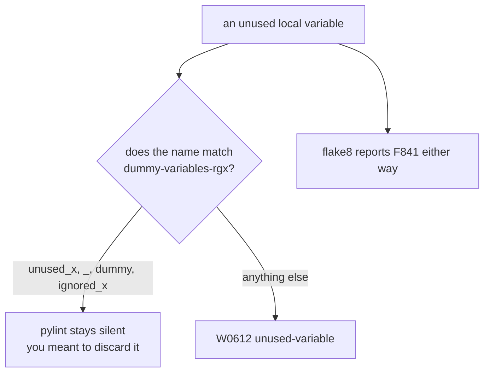

import Quiz from "../../../../components/Quiz.astro";

## What Pylint is good at

- naming conventions
- missing docstrings
- too many branches/arguments
- potential errors

## Example run

```bash
pylint your_package
```

## Typical config (pyproject.toml)

```toml
tool.pylint."MESSAGES CONTROL"
disable = ["C0114", "C0115", "C0116"]

[tool.pylint.format]
max-line-length = 88
```

## How to read Pylint output

- `C` convention
- `W` warning
- `E` error
- `R` refactor

## Tip

Don’t enable every rule at once in a legacy project.

Adopt gradually.

## One file, six tools

Every measurement on this page — and on the other five tools in this phase — comes from
running the tool against this deliberately flawed file:

```python title="sample.py" showLineNumbers{1}
import os
import subprocess
import hashlib


def process(items, user_input, flag = False):
    unused_var = 42
    result=[]
    for i in items:
        if i > 0:
            if flag:
                if i % 2 == 0:
                    result.append(i*2)
                else:
                    result.append(i)
            else:
                result.append(i)
    password = "hunter2"
    h = hashlib.md5(password.encode()).hexdigest()
    os.system("echo " + user_input)
    subprocess.call("ls " + user_input, shell=True)
    return result


def add(a: int, b: int) -> int:
    return a + b


x = add("1", 2)
```

| tool | what it reported on `sample.py` |
|:--|:--|
| **flake8** | 5 style and dead-code issues. **No security findings.** |
| **pylint** | 4 issues, score **8.10/10** |
| **mypy** | 1 type error, which neither linter saw |
| **bandit** | 5 security issues, **3 of them HIGH** |
| **radon** | complexity **A (5)**, maintainability **A (56.30)** |

The headline is that **no tool subsumes another**. flake8 read the whole file and reported
nothing about the shell injection on line 20. bandit read the same file and said nothing
about the type error on line 29. Running one and concluding the code is clean is the
mistake this phase exists to prevent.

```p5 title="Six tools, one file, almost no overlap" desc="Each tool was run against the same 29-line file. Click a tool to see what it found and, more importantly, what it did not." height="340"
let sel = 0;
const T = [
  { n: 'flake8', found: ['E251 spaces around keyword equals x2', 'F841 unused variable x2', 'E225 missing whitespace'],
    missed: 'every security issue, and the type error', c: [75, 139, 190] },
  { n: 'pylint', found: ['C0114 missing module docstring', 'C0116 missing docstrings x2', 'W0612 unused variable h'],
    missed: "unused_var - its name matches the dummy-variable regex", c: [120, 190, 130] },
  { n: 'mypy', found: ['arg-type: str passed where int expected'],
    missed: 'style, dead code, and security', c: [255, 211, 67] },
  { n: 'bandit', found: ['B324 HIGH weak MD5 hash', 'B605 HIGH shell injection via os.system', 'B602 HIGH subprocess shell=True', 'B105 LOW hardcoded password'],
    missed: 'style, typing, complexity', c: [232, 110, 110] },
  { n: 'black', found: ['reformats spacing and commas', 'exit 1 before, exit 0 after'],
    missed: 'everything semantic - complexity stayed C(15)', c: [200, 140, 220] },
  { n: 'radon', found: ['cyclomatic complexity A (5)', 'maintainability A (56.30)'],
    missed: 'correctness, style and security entirely', c: [140, 190, 200] },
];

function setup() {
  createCanvas(600, 340);
  textFont('monospace');
}

function draw() {
  background(13, 17, 23);
  const t = T[sel];

  noStroke();
  fill(230);
  textSize(13);
  textAlign(LEFT, TOP);
  text('one 29-line file, six tools', 24, 16);

  for (let i = 0; i < T.length; i++) {
    const col = i % 3;
    const row = floor(i / 3);
    const x = 24 + col * 186;
    const y = 42 + row * 40;
    const on = i === sel;
    const c = T[i].c;
    stroke(on ? color(c[0], c[1], c[2]) : color(48, 56, 68));
    strokeWeight(on ? 2 : 1);
    fill(on ? color(c[0] * 0.18, c[1] * 0.18, c[2] * 0.18) : color(17, 22, 29));
    rect(x, y, 174, 32, 4);
    noStroke();
    fill(on ? color(c[0], c[1], c[2]) : 110);
    textSize(12);
    textAlign(CENTER, CENTER);
    text(T[i].n, x + 87, y + 16);
  }

  stroke(t.c[0], t.c[1], t.c[2]);
  strokeWeight(1);
  fill(18, 23, 30);
  rect(24, 132, 552, 118, 5);
  noStroke();
  fill(110);
  textSize(10);
  textAlign(LEFT, TOP);
  text('what it found', 38, 142);
  for (let i = 0; i < t.found.length; i++) {
    fill(t.c[0], t.c[1], t.c[2]);
    textSize(11);
    text('- ' + t.found[i], 38, 162 + i * 20);
  }

  stroke(60, 70, 84);
  strokeWeight(1);
  fill(24, 20, 20);
  rect(24, 260, 552, 46, 5);
  noStroke();
  fill(110);
  textSize(10);
  textAlign(LEFT, TOP);
  text('what it did NOT look for', 38, 268);
  fill(232, 110, 110);
  textSize(11);
  text(t.missed, 38, 286);

  fill(90);
  textSize(10);
  textAlign(LEFT, TOP);
  text('no tool subsumes another - they answer different questions', 24, 316);
}

function mousePressed() {
  for (let i = 0; i < T.length; i++) {
    const col = i % 3;
    const row = floor(i / 3);
    const x = 24 + col * 186;
    const y = 42 + row * 40;
    if (mouseX > x && mouseX < x + 174 && mouseY > y && mouseY < y + 32) sel = i;
  }
}
```

## Pylint is opinionated, and scores you

```text title="pylint sample.py"
sample.py:1:0:  C0114: Missing module docstring (missing-module-docstring)
sample.py:6:0:  C0116: Missing function or method docstring (missing-function-docstring)
sample.py:19:4: W0612: Unused variable 'h' (unused-variable)
sample.py:25:0: C0116: Missing function or method docstring (missing-function-docstring)

Your code has been rated at 8.10/10
```

The message categories are worth learning, because they decide what you act on:

| prefix | meaning | act on it? |
|:--|:--|:--|
| `E` | error — likely a bug | always |
| `W` | warning — suspicious | usually |
| `C` | convention — style | team choice |
| `R` | refactor — structural smell | judgement |
| `F` | fatal — pylint could not proceed | always |

Three of the four findings above are `C` docstring conventions. The score of **8.10/10** is
mostly a comment on documentation, not on the shell injection two lines below.

## The finding that explains how linters differ

flake8 reported `unused_var` on line 7. Pylint did **not** — and forcing the check made no
difference:

```text title="pylint --disable=all --enable=W0612 sample.py"
sample.py:19:4: W0612: Unused variable 'h' (unused-variable)
```

Only `h`. The cause is a default setting:

```ini title="pylint's default"
dummy-variables-rgx = "_+$|(_[a-zA-Z0-9_]*[a-zA-Z0-9]+?$)|dummy|^ignored_|^unused_"
```

`^unused_` matches the name, so pylint treats it as a **deliberate discard**. Renaming
proves it:

```text title="after renaming unused_var to spare_value"
sample2.py:7:4:  W0612: Unused variable 'spare_value' (unused-variable)
sample2.py:19:4: W0612: Unused variable 'h' (unused-variable)
```



:::note[This is a convention, not a bug in either tool]
Pylint offers a way to say "I know, that is intentional" through naming. flake8 does not,
so it reports both. Neither is wrong — but if you rely on a linter's silence as proof,
know which conventions it is honouring.
:::

## Configuring it so people do not disable it

Pylint's defaults are stricter than most teams want, and the usual failure mode is a
blanket disable. Configure it deliberately instead:

```toml title="pyproject.toml" showLineNumbers{1}
[tool.pylint.main]
ignore-paths = ["migrations/", ".venv/"]

[tool.pylint."messages control"]
disable = [
  "missing-module-docstring",
  "missing-function-docstring",
]

[tool.pylint.format]
max-line-length = 88          # match black
```

For a targeted exception, disable by **name** and scope it as narrowly as possible:

```python title="scoped.py" showLineNumbers{1}
def handler(request, context):  # pylint: disable=unused-argument
    return "ok"
```

`# pylint: disable=unused-argument` on the signature covers that function only. A
file-level disable at the top covers everything below it, which is almost never what you
meant a week later.

## Pylint against flake8

| | flake8 | pylint |
|:--|:--|:--|
| speed | fast | noticeably slower — it infers types |
| defaults | permissive | strict |
| scope | style plus dead code | style, structure, some real bugs |
| score | none | 0-10, useful as a trend |

Many teams run both: flake8 in a pre-commit hook where speed matters, pylint in CI where
thoroughness does. Neither one looks for the security issues in this file.

## Check yourself

<Quiz
  questions={[
    {
      q: "flake8 reported an unused variable named unused_var; pylint did not, even with W0612 explicitly enabled. Why?",
      options: [
        "pylint only checks the first ten lines",
        "the name matches pylint's default dummy-variables-rgx, which includes ^unused_, so it is treated as a deliberate discard",
        "pylint cannot detect unused variables",
        "the variable was actually used",
      ],
      answer: 1,
      explain:
        "Renaming it to spare_value made pylint report W0612 immediately. It is a configured convention for saying the discard is intentional, not a gap in the tool.",
    },
    {
      q: "Pylint rated the sample 8.10/10. What does that number mostly reflect here?",
      options: [
        "that the code is nearly production ready",
        "mostly missing docstrings; three of the four findings were C convention messages, and the shell injection was not among them",
        "the ratio of comments to code",
        "test coverage",
      ],
      answer: 1,
      explain:
        "The score is a useful trend line, not a safety verdict. Bandit found three HIGH severity issues in the same file that pylint never looked for.",
    },
    {
      q: "What is the right way to silence a pylint message you have judged acceptable?",
      options: [
        "disable it globally in pyproject.toml",
        "add a scoped comment naming the message, such as # pylint: disable=unused-argument on that line or function",
        "add a bare # noqa",
        "delete the code",
      ],
      answer: 1,
      explain:
        "Disable by name and at the narrowest scope. A file-level disable at the top covers everything below it, which is rarely what was intended later.",
    },
  ]}
/>
