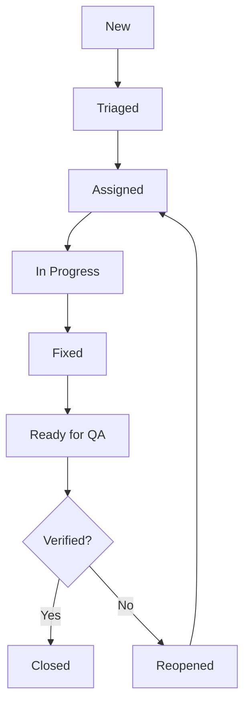

## Why bug statuses exist

They help teams:

- track ownership
- prioritize work
- ensure QA verification

## Common statuses

- **New**: reported
- **Triaged**: severity/priority assigned
- **Assigned**: owner picked
- **In Progress**: being fixed
- **Fixed**: dev completed
- **Ready for QA**: waiting for verification
- **Verified**: QA confirmed fix
- **Closed**: done

Optional statuses:

- **Reopened** (still failing)
- **Won’t Fix**
- **Duplicate**
- **Cannot Reproduce**

## Diagram: defect lifecycle

## Tip

Always include:

- severity
- priority
- reproducibility
