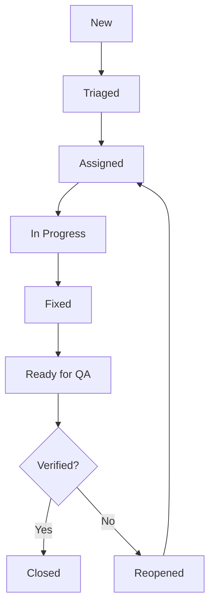

## Why bug statuses exist

They help teams:

- track ownership
- prioritize work
- ensure QA verification

## Common statuses

- **New**: reported
- **Triaged**: severity/priority assigned
- **Assigned**: owner picked
- **In Progress**: being fixed
- **Fixed**: dev completed
- **Ready for QA**: waiting for verification
- **Verified**: QA confirmed fix
- **Closed**: done

Optional statuses:

- **Reopened** (still failing)
- **Won’t Fix**
- **Duplicate**
- **Cannot Reproduce**

## Diagram: defect lifecycle

```mermaid
graph TD
A[New] --> B[Triaged]
B --> C[Assigned]
C --> D[In Progress]
D --> E[Fixed]
E --> F[Ready for QA]
F --> G{Verified?}
G -- Yes --> H[Closed]
G -- No --> I[Reopened]
I --> C
```

## Tip

Always include:

- severity
- priority
- reproducibility

## A status is a promise about who acts next

The value of a life cycle is not the labels but the handoffs. At every status exactly one person or role should be responsible: the triager for New, a developer for Assigned and In Progress, and QA for Ready for QA. A ticket where nobody knows whose turn it is stays open for months.

## Following one bug through

1. QA reports "Checkout returns 500 when the coupon contains a space". Status: **New**.
2. In triage, the team sets severity High (blocks purchases with some coupons) and priority P1 (fix this sprint). Status: **Triaged**, then **Assigned** to a developer.
3. The developer reproduces it, finds no whitespace handling, writes a failing test, fixes it. Status: **In Progress**, then **Fixed**.
4. The fix is deployed to staging. Status: **Ready for QA**.
5. QA repeats the original steps and a few variants, such as a tab or a trailing space. If the bug is gone: **Verified**, then **Closed**. If it still fails: **Reopened**, with the new evidence added.

The failing test the developer wrote in step 3 is your regression test, and it is what stops this bug returning.

## Severity and priority are different

**Severity** is how bad the impact is: a crash or data loss is high, a misaligned icon is low. **Priority** is how soon it must be fixed, which depends on business context. A typo in the company name on the home page has low severity and possibly high priority. A crash in a feature used by one customer per year has high severity and possibly low priority. Keep both fields, because each answers a separate question.

## Closing without fixing

Not every report ends in a fix, and the tracker should say why:

- **Duplicate**: link to the original.
- **Cannot reproduce**: ask for more detail before closing, and close only after a defined wait.
- **Won't fix / by design**: record who decided and why, so it is not reported again.
- **Deferred**: move to a future release with a target.

## What goes wrong

- **Skipping verification.** Developers close their own tickets, and fixes that do not work reach users.
- **Too many statuses.** Fifteen states nobody can remember mean people ignore them. Small teams often use New, In Progress, Ready for QA and Done.
- **Vague reports** that bounce between Cannot Reproduce and Reopened. The next lesson explains how to write reports that avoid this.
- **Reopening with no new information.**

## Connections

Verification by QA is the same idea as retesting in the regression lesson. A tracker such as Jira or GitHub Issues just implements this flow with labels or a workflow.

## Check your understanding

<Quiz
  questions={[
    {
      q: "A typo in the company name on the home page is reported. What are its likely severity and priority?",
      options: [
        "High severity, low priority",
        "Low severity, possibly high priority",
        "High severity, high priority",
        "Low severity, low priority always",
      ],
      answer: 1,
      explain: "The technical impact is small, but the business may want it fixed fast, which is why the two fields are separate.",
    },
    {
      q: "QA repeats the original steps after a fix and the error still occurs. What status should follow?",
      options: [
        "Closed",
        "Verified",
        "Reopened, with the new evidence",
        "Won't fix",
      ],
      answer: 2,
      explain: "A failed verification sends the bug back to the developer with the new details.",
    },
    {
      q: "Why should developers not close their own tickets?",
      options: [
        "It is against Git rules",
        "Independent verification catches fixes that do not actually work",
        "Developers cannot edit tickets",
        "It makes tickets duplicate",
      ],
      answer: 1,
      explain: "The Ready for QA step exists so someone other than the author confirms the fix.",
    },
  ]}
/>
