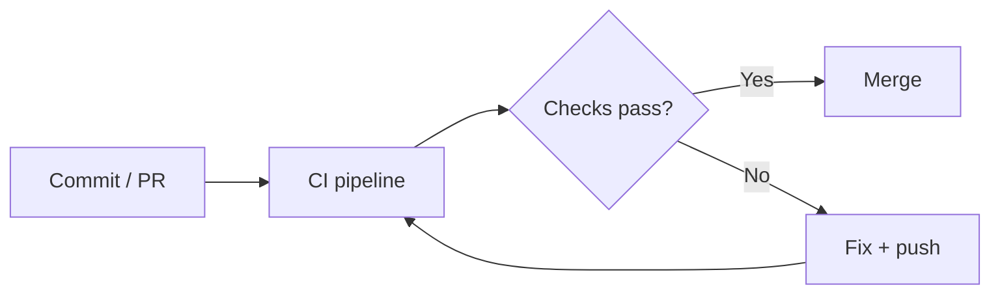

## What CI means

**Continuous Integration** is the practice of:

- merging changes frequently
- automatically running checks on every change

Typical checks:

- unit tests
- linting
- type checks
- security scans

## Why CI matters

CI prevents:

- “works on my machine”
- long-lived branches
- late discovery of integration issues

## Diagram: CI feedback loop

## Good CI characteristics

- fast (minutes, not hours)
- deterministic
- provides clear failure messages
- runs on PRs before merge
