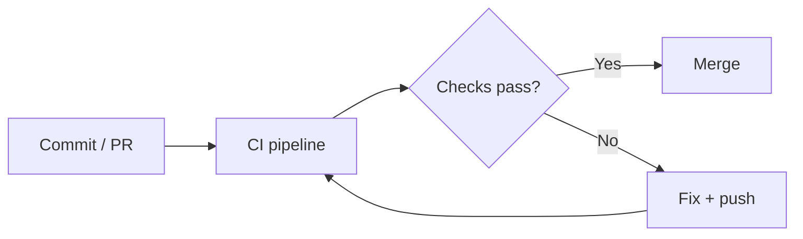

## What CI means

**Continuous Integration** is the practice of:

- merging changes frequently
- automatically running checks on every change

Typical checks:

- unit tests
- linting
- type checks
- security scans

## Why CI matters

CI prevents:

- “works on my machine”
- long-lived branches
- late discovery of integration issues

## Diagram: CI feedback loop


```mermaid
graph LR
A[Commit / PR] --> B[CI pipeline]
B --> C{Checks pass?}
C -- Yes --> D[Merge]
C -- No --> E[Fix + push]
E --> B
```

## Good CI characteristics

- fast (minutes, not hours)
- deterministic
- provides clear failure messages
- runs on PRs before merge

## Visualize it

A typical CI pipeline runs a chain of automated checks after every push, and only deploys once all of them pass.

```mermaid title="CI Pipeline" desc="A CI pipeline runs automated checks and builds after every push, deploying only if everything passes."
flowchart LR
A["git push"] --> B["CI triggers"]
B --> C["Install deps"]
C --> D["Run linters"]
D --> E["Run tests"]
E --> F["Build"]
F --> G["Deploy (if all pass)"]
```

## The problem CI removes

Without CI, developers work on separate branches for weeks. On merge day, their changes conflict in code and in behaviour, and nobody knows whose change broke what. Integration becomes an event to dread. CI makes it routine: merge small changes at least daily, and let a server check every one automatically.

## What a CI run does

1. A push or pull request triggers the pipeline.
2. A clean machine checks out the code and installs dependencies.
3. Fast checks run first: formatting, lint, type check.
4. Tests run, usually unit tests before slower integration tests.
5. The result is reported back on the pull request.

The order matters. A lint failure takes seconds to report, whereas waiting ten minutes for tests first wastes everyone's time.

## A project that is CI-ready

CI is easiest when a single command runs your checks. Put them in one script, so developers and the server run the same thing:

```python title="check.py" showLineNumbers{1}
import subprocess
import sys

STEPS = [
    ["black", "--check", "."],
    ["flake8", "."],
    ["mypy", "."],
    ["pytest", "-q"],
]

for cmd in STEPS:
    print("running:", " ".join(cmd))
    if subprocess.run(cmd).returncode != 0:
        sys.exit(1)
print("all checks passed")
```

The CI file then only has to install dependencies and call `python check.py`. When CI is red, a developer can reproduce it by running the same command on their laptop.

## Practices that make CI worth having

- **Keep the main branch green.** If it breaks, fixing it is the top priority, since everybody else's work is now blocked or misleading.
- **Keep it fast.** Ten minutes is a common upper limit. Beyond that, people stop waiting and start stacking changes, and you lose the benefit.
- **Make it deterministic.** Pin dependencies and remove flaky tests. A pipeline that fails at random is ignored.
- **Fail with a clear message.** The log should say which check failed and how to run it locally.

## CI, delivery and deployment

CI checks changes. **Continuous delivery** goes further and keeps every passing change in a state where it could be released. **Continuous deployment** releases it automatically. Many teams have CI and manual release approval, which is a perfectly good place to stop.

## What goes wrong

Long-lived branches defeat the practice even when a server is running. A pipeline that only runs tests, ignoring lint and security scans, catches less than it could. Treating a red build as normal noise means the team has stopped using it.

## Connections

The next lesson, GitHub Actions, is a concrete implementation, and pre-commit hooks give the same checks before a commit. The test pyramid tells you which tests belong early in the pipeline.

## Check your understanding

<Quiz
  questions={[
    {
      q: "A CI pipeline takes 50 minutes and developers batch several changes per push. What is the main problem?",
      options: [
        "The tests are too accurate",
        "Slow feedback encourages big batches, so failures are harder to trace",
        "CI cannot run pytest",
        "Linting is disabled",
      ],
      answer: 1,
      explain: "Small frequent changes are what make CI useful, and slowness pushes people the other way.",
    },
    {
      q: "Why run lint and formatting checks before the test suite?",
      options: [
        "They are more important",
        "They finish in seconds, so cheap failures are reported early",
        "Tests need lint to pass",
        "It is required by Git",
      ],
      answer: 1,
      explain: "Cheap fast checks should fail first to save waiting time.",
    },
    {
      q: "The main branch is red. What should the team do first?",
      options: [
        "Continue merging",
        "Fix or revert the breaking change quickly",
        "Disable CI",
        "Wait for the next release",
      ],
      answer: 1,
      explain: "A broken main blocks everyone and makes later failures ambiguous.",
    },
  ]}
/>
