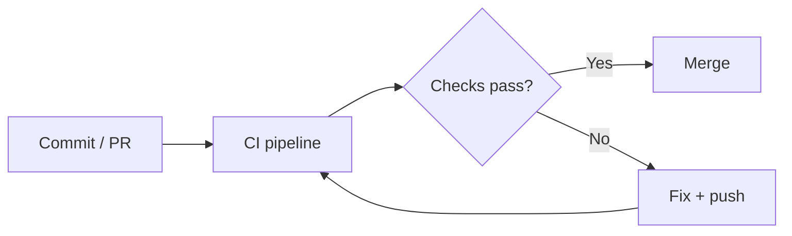

## What CI means

**Continuous Integration** is the practice of:

- merging changes frequently
- automatically running checks on every change

Typical checks:

- unit tests
- linting
- type checks
- security scans

## Why CI matters

CI prevents:

- “works on my machine”
- long-lived branches
- late discovery of integration issues

## Diagram: CI feedback loop


```mermaid
graph LR
A[Commit / PR] --> B[CI pipeline]
B --> C{Checks pass?}
C -- Yes --> D[Merge]
C -- No --> E[Fix + push]
E --> B
```

## Good CI characteristics

- fast (minutes, not hours)
- deterministic
- provides clear failure messages
- runs on PRs before merge

## Visualize it

A typical CI pipeline runs a chain of automated checks after every push, and only deploys once all of them pass.

```mermaid title="CI Pipeline" desc="A CI pipeline runs automated checks and builds after every push, deploying only if everything passes."
flowchart LR
A["git push"] --> B["CI triggers"]
B --> C["Install deps"]
C --> D["Run linters"]
D --> E["Run tests"]
E --> F["Build"]
F --> G["Deploy (if all pass)"]
```
